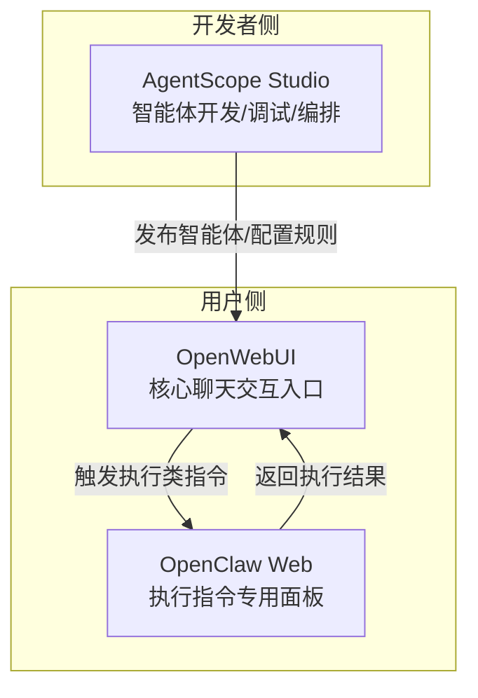
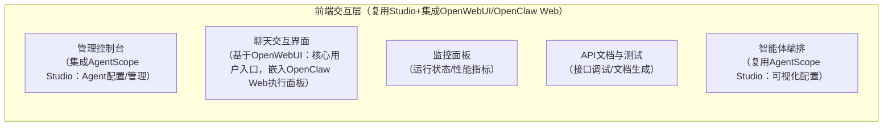

# OpenClaw 集成方案：前端交互层最优架构设计

## 核心结论
你架构中「前端交互层-聊天交互界面」的最优方案是：**以 OpenWebUI 作为最终用户的核心聊天交互载体，AgentScope Studio 聚焦开发者侧的智能体调试/编排，OpenClaw Web 作为"系统执行类指令的专用面板"嵌入到 OpenWebUI 中**。三者并非平行关系，而是「开发者端工具 + 用户端主入口 + 用户端功能扩展」的分层互补关系，无需独立平行部署。

## 一、工具定位与能力分析

### 1. 核心工具对比表
| 工具 | 核心定位 | 目标用户 | 核心能力 | 适配架构模块 | 局限性 |
|------|----------|----------|----------|--------------|--------|
| AgentScope Studio | 智能体开发/调试工具 | 平台开发者/运维人员 | 智能体配置、工作流编排、调试、日志查看 | 管理控制台、智能体编排模块 | 面向开发者，交互体验简单，不适合最终用户日常聊天 |
| OpenClaw Web | 系统执行交互面板 | 平台用户（执行系统指令） | 下发文件操作、Shell命令、数据抓取等执行类指令，查看执行结果 | 聊天交互界面的"执行工具子面板" | 仅聚焦系统执行，无通用AI聊天、多角色管理能力 |
| OpenWebUI | 通用型AI聊天交互门户 | 平台最终用户 | 类ChatGPT的聊天体验、多模型支持、文件上传、上下文管理、插件扩展 | 聊天交互界面（核心载体） | 无智能体开发/调试能力，需对接AgentScope Studio |

### 2. 工具关系分析

- **层级关系**：AgentScope Studio（开发者端）→ OpenWebUI（用户端主入口）→ OpenClaw Web（用户端功能扩展）
- **互补关系**：
  - AgentScope Studio 解决"智能体怎么建、怎么调"的问题
  - OpenWebUI 解决"用户怎么用、怎么聊"的问题
  - OpenClaw Web 解决"用户怎么让智能体执行系统级任务"的问题
- **非平行原因**：若平行部署，会导致用户需要切换多个界面，体验割裂，且违背"分层解耦+体验一致性"的设计原则

## 二、架构适配与整合方案

### 1. 前端交互层角色分配
| 架构前端模块 | 整合方案 | 核心价值 |
|--------------|----------|----------|
| 管理控制台 | 整合 AgentScope Studio 的智能体生命周期管理、权限配置能力 | 开发者一站式管理智能体，无需切换工具 |
| 聊天交互界面 | 基于 OpenWebUI 搭建，作为最终用户的唯一聊天入口 | 提供成熟的通用聊天体验（上下文、文件上传、多角色） |
| 监控面板 | 保留原有定位，整合 OpenClaw 执行日志、AgentScope 运行指标 | 统一监控所有模块运行状态 |
| API文档与测试 | 保留原有定位，补充 OpenWebUI/OpenClaw Web 的接口说明 | 降低开发者接入成本 |
| 智能体编排 | 复用 AgentScope Studio 的可视化编排能力，嵌入到管理控制台 | 开发者无需学习新工具，保持体验一致 |
| （新增子模块） | 在聊天交互界面中嵌入 OpenClaw Web 作为"执行工具面板" | 用户无需切换界面，聊天中直接发起执行类指令 |

### 2. 技术整合流程

#### 开发者侧流程
1. 通过「管理控制台（集成 AgentScope Studio）」开发/调试/编排智能体
2. 配置智能体的权限、执行规则（如哪些指令触发 OpenClaw）
3. 将配置好的智能体发布到「聊天交互界面（OpenWebUI）」

#### 用户侧流程
1. 在 OpenWebUI 中发起自然语言指令（如"帮我爬取XX网页数据并保存到本地"）
2. 应用服务层的「业务逻辑」模块识别指令类型：
   - 普通聊天指令：直接通过智能体返回结果
   - 执行类指令：自动唤起嵌入的 OpenClaw Web 面板，完成系统执行后，将结果返回至 OpenWebUI 聊天界面
3. 「权限控制」模块确保用户仅能执行授权范围内的 OpenClaw 操作（如仅允许爬取指定域名、读写指定目录）

### 3. 架构图调整建议

## 三、落地实施建议

### 1. 优先选型策略
- 放弃"平行部署"思路，避免用户体验割裂
- OpenWebUI 作为用户交互核心（成熟、易扩展、用户体验接近主流AI聊天工具）
- AgentScope Studio 仅对开发者开放，不暴露给最终用户
- OpenClaw Web 以"插件/子面板"形式嵌入 OpenWebUI，而非独立页面

### 2. 集成成本控制
- OpenWebUI 支持 Docker 部署，可快速对接 API 网关
- OpenClaw Web 提供 iframe 嵌入能力，无需改造源码即可集成到 OpenWebUI
- AgentScope Studio 的能力可通过 API 对接至管理控制台，无需迁移代码

### 3. 体验一致性保障
- 基于架构中的「设计规范层（AgentScope-Spark Design）」统一 OpenWebUI/OpenClaw Web 的 UI 样式
- 所有模块的权限校验统一对接「应用服务层-权限控制」，避免重复鉴权

## 四、方案价值总结

1. **分层互补**：三者形成「开发者端（AgentScope Studio）→ 用户端主入口（OpenWebUI）→ 功能扩展（OpenClaw Web）」的完整生态
2. **体验一致**：用户无需在多个界面间切换，所有功能通过统一入口访问
3. **成本优化**：充分复用现有工具能力，避免重复开发，降低集成成本
4. **架构合规**：符合"分层解耦、体验一致、避免重复造轮子"的架构设计原则

---

**附**：如需补充「OpenWebUI+OpenClaw Web 嵌入集成的极简代码示例」，或修改完整的 Mermaid 架构图，请告知。