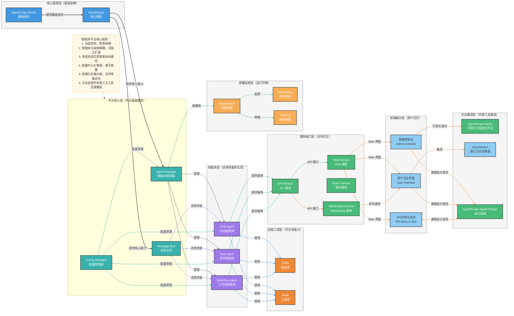

# 基于 AgentScope 框架的智能体平台项目设计

## 一、项目架构 Mermaid 图


## 二、项目目录结构
TODO

## 三、项目架构详细说明

### 1. 核心框架层

- **AgentScope 核心框架**：提供智能体定义与管理、多智能体消息通信/协作机制、大模型适配与调用、环境管理等核心能力。
- **AgentScope-Bricks**：提供基础组件，如消息解析、模型适配器、配置管理器、日志/监控工具等，为核心框架提供支持。

### 2. 平台核心层

- **Agent Manager**：负责智能体的生命周期管理，包括创建、启动、停止、监控等。
- **Message Bus**：实现智能体之间的消息传递，支持同步和异步通信。
- **Config Manager**：集中管理平台配置，包括智能体配置、模型配置、服务配置等。

### 3. 智能体层

- **Chat Agent**：专注于对话交互的智能体，处理用户的自然语言输入并生成响应。
- **Task Agent**：专注于任务执行的智能体，能够分解任务、执行子任务并汇总结果。
- **Workflow Agent**：专注于工作流管理的智能体，能够协调多个智能体完成复杂任务。

### 4. 技能工具层

- **Skills**：可复用的智能体能力，如代码生成、文本总结、网络搜索等。
- **Tools**：通用工具，如文件处理、数据获取、模型推理等。

### 5. 服务接口层

- **API Service**：提供 RESTful API 接口，支持外部系统与平台交互。
- **Web Service**：提供 Web 界面，支持用户通过浏览器与智能体交互。
- **Event Service**：处理平台内的事件，支持事件驱动的架构。
- **WebSocket Service**：提供实时通信接口，支持智能体交互的实时响应。

### 6. 前端展示层

- **管理控制台**：基于 agentscope-studio 扩展，提供智能体管理、监控和调试功能。
- **用户交互界面**：提供用户与智能体交互的 Web 界面，支持多种交互模式（对话、任务提交、工作流配置等）。
- **API 文档与测试界面**：方便开发者使用平台 API。

### 7. 生态集成层

- **AgentScope-Studio**：集成 AgentScope 生态中的可视化开发/调试平台，提供图形化配置智能体、定义协作逻辑、实时调试多智能体交互过程等功能。
- **OpenWebUI**：集成第三方对话界面，提供更丰富的对话体验。
- **AgentScope-Spark-Design**：采用 AgentScope 生态的设计体系，提供统一的 UI 组件库和视觉风格，确保平台前端与 AgentScope 生态产品的一致性。

### 8. 部署运维层

- **Deployment**：负责平台的部署配置，支持容器化部署。
- **Monitoring**：监控平台运行状态，包括智能体健康状态、资源使用情况等。
- **Scaling**：根据负载自动调整资源，支持弹性伸缩。

## 四、开发和部署建议

### 1. 环境搭建

1. **Python 环境**：使用 Python 3.10+，建议使用虚拟环境。
2. **依赖管理**：使用 `pyproject.toml` 或 `requirements.txt` 管理依赖。
3. **AgentScope 安装**：
   ```bash
   pip install agentscope[full]
   ```

### 2. 开发流程

1. **核心服务开发**：
   - 实现 `Agent Manager`、`Message Bus`、`Config Manager` 等核心服务。
   - 定义智能体基类和接口。

2. **智能体开发**：
   - 继承 AgentScope 的 `AgentBase` 类，实现具体智能体。
   - 为智能体配置合适的模型和工具。

3. **技能和工具开发**：
   - 开发可复用的技能和工具。
   - 注册技能和工具到智能体。

4. **服务接口开发**：
   - 实现 API 接口、Web 界面和 WebSocket 服务。
   - 集成事件服务。

5. **前端开发**：
   - 基于 `agentscope-spark-design` 设计规范，开发管理控制台、用户交互界面和 API 文档界面。
   - 集成 `agentscope-studio` 和 `OpenWebUI` 等前端工具。
   - 实现前端与后端的通信，包括 RESTful API 和 WebSocket。

### 3. 测试策略

1. **单元测试**：测试各个模块的功能。
2. **集成测试**：测试模块之间的交互。
3. **端到端测试**：测试整个平台的功能。

### 4. 部署方案

1. **本地开发**：
   - 使用 `python -m my_agent_platform` 启动平台后端服务。
   - 使用 `agentscope-studio` 进行可视化调试。
   - 前端开发可使用本地开发服务器（如 Vite、Create React App 等）。

2. **容器化部署**：
   - 创建 Dockerfile，构建后端服务镜像。
   - 前端应用打包为静态资源，可使用 Nginx 或其他静态资源服务器。
   - 使用 Docker Compose 管理服务，包括后端服务、前端静态资源服务器、数据库等。

3. **云服务部署**：
   - 部署到 Kubernetes 集群，使用 Helm 或 Kustomize 管理部署配置。
   - 前端静态资源可部署到 CDN，提高访问速度。
   - 使用云服务提供商的容器服务和负载均衡器。

4. **监控和维护**：
   - 集成 Prometheus 和 Grafana 进行后端服务监控。
   - 前端性能监控，如页面加载速度、响应时间等。
   - 设置日志收集和分析系统，包括后端服务日志和前端错误日志。

### 5. 扩展建议

1. **智能体扩展**：
   - 基于业务需求，开发特定领域的智能体。
   - 实现智能体之间的协作机制。

2. **技能和工具扩展**：
   - 根据业务需求，开发特定领域的技能和工具。
   - 集成第三方服务和 API。

3. **服务接口扩展**：
   - 开发更多的服务接口，如 gRPC、GraphQL 等。
   - 优化 WebSocket 服务，支持更多实时通信场景。

4. **前端扩展**：
   - 开发移动端应用，支持多端访问。
   - 实现主题切换和品牌定制功能。
   - 集成更多第三方前端工具，如低代码平台等。
   - 实现国际化支持，适应全球用户需求。

## 五、总结

基于 AgentScope 框架构建智能体平台，采用分层架构设计，将核心框架、平台服务、智能体、技能工具、服务接口、前端展示、生态集成和部署运维等组件清晰分离，实现了高度的模块化和可扩展性。通过 Mermaid 架构图，我们可以直观地看到各组件之间的关系和交互方式，为开发和维护提供了清晰的指导。

这种架构设计不仅便于开发和测试，也便于部署和运维，能够支持从简单的单智能体应用到复杂的多智能体系统的各种场景。同时，通过合理的前端架构设计和生态集成，为用户提供了直观、高效的智能体交互体验。

平台设计充分考虑了可扩展性，支持智能体、技能、服务接口和前端的独立扩展，同时与 AgentScope 生态和第三方工具无缝集成。通过合理的目录结构和代码组织，提高了代码的可读性和可维护性，为平台的长期发展奠定了基础。