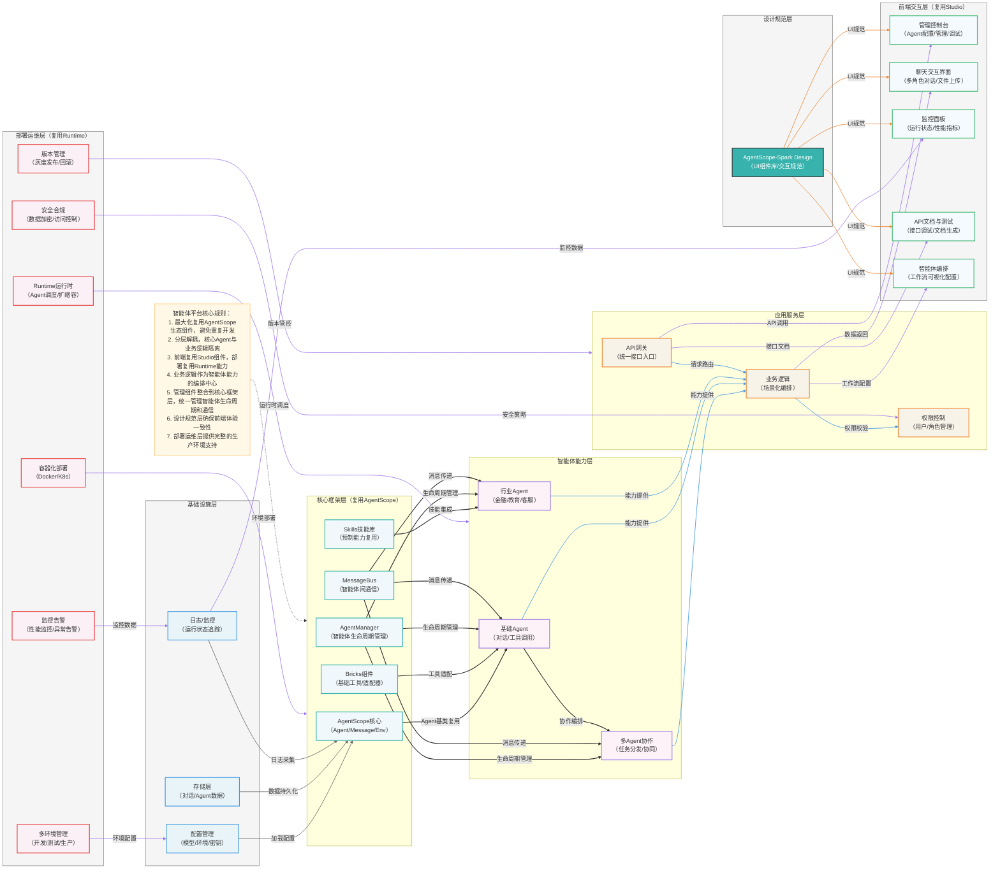

```mermaid
flowchart LR
    %% 样式定义（沿用参考配色体系，适配智能体平台场景）
    classDef infraStyle fill:#e8f4f8,stroke:#4299e1,stroke-width:2px
    classDef coreStyle fill:#f0f8fb,stroke:#38b2ac,stroke-width:2px
    classDef agentStyle fill:#fdf2f8,stroke:#9f7aea,stroke-width:2px
    classDef serviceStyle fill:#f7f3e9,stroke:#ed8936,stroke-width:2px
    classDef frontendStyle fill:#f5fafe,stroke:#48bb78,stroke-width:2px
    classDef deployStyle fill:#faf0f5,stroke:#e53e3e,stroke-width:2px
    classDef designStyle fill:#38b2ac,stroke:#333,stroke-width:2px,color:#fff
    classDef subgraphStyle fill:#f5f5f5,stroke:#666,stroke-width:1px,rounded:10px
    classDef ruleNoteStyle fill:#fff8e6,stroke:#ffb74d,stroke-width:1px,rounded:8px

    %% 1. 基础设施层（底层支撑）
    subgraph infraLayer["基础设施层"]
        A[配置管理<br/>（模型/环境/密钥）]:::infraStyle
        B[存储层<br/>（对话/Agent数据）]:::infraStyle
        C[日志/监控<br/>（运行状态追踪）]:::infraStyle
    end
    class infraLayer subgraphStyle

    %% 2. 核心框架层（AgentScope生态复用）
    subgraph coreLayer["核心框架层（复用AgentScope）"]
        D[AgentScope核心<br/>（Agent/Message/Env）]:::coreStyle
        E[Bricks组件<br/>（基础工具/适配器）]:::coreStyle
        F[Skills技能库<br/>（预制能力复用）]:::coreStyle
        G[AgentManager<br/>（智能体生命周期管理）]:::coreStyle
        H[MessageBus<br/>（智能体间通信）]:::coreStyle
    end
    class coreLayer subgraphStyle

    %% 3. 智能体能力层（平台核心Agent）
    subgraph agentLayer["智能体能力层"]
        I[基础Agent<br/>（对话/工具调用）]:::agentStyle
        J[行业Agent<br/>（金融/教育/客服）]:::agentStyle
        K[多Agent协作<br/>（任务分发/协同）]:::agentStyle
    end
    class agentLayer subgraphStyle

    %% 4. 应用服务层（接口/业务逻辑）
    subgraph serviceLayer["应用服务层"]
        L[API网关<br/>（统一接口入口）]:::serviceStyle
        M[业务逻辑<br/>（场景化编排）]:::serviceStyle
        N[权限控制<br/>（用户/角色管理）]:::serviceStyle
    end
    class serviceLayer subgraphStyle

    %% 5. 前端交互层（可视化操作）
    subgraph frontendLayer["前端交互层（复用Studio）"]
        O[管理控制台<br/>（Agent配置/管理/调试）]:::frontendStyle
        P[聊天交互界面<br/>（多角色对话/文件上传）]:::frontendStyle
        Q[监控面板<br/>（运行状态/性能指标）]:::frontendStyle
        R[API文档与测试<br/>（接口调试/文档生成）]:::frontendStyle
        S[智能体编排<br/>（工作流可视化配置）]:::frontendStyle
    end
    class frontendLayer subgraphStyle

    %% 6. 部署运维层（生产落地）
    subgraph deployLayer["部署运维层（复用Runtime）"]
        T[容器化部署<br/>（Docker/K8s）]:::deployStyle
        U[Runtime运行时<br/>（Agent调度/扩缩容）]:::deployStyle
        V[版本管理<br/>（灰度发布/回滚）]:::deployStyle
        W[监控告警<br/>（性能监控/异常告警）]:::deployStyle
        X[多环境管理<br/>（开发/测试/生产）]:::deployStyle
        Y[安全合规<br/>（数据加密/访问控制）]:::deployStyle
    end
    class deployLayer subgraphStyle

    %% 7. 设计规范层（体验一致性）
    subgraph designLayer["设计规范层"]
        Z[AgentScope-Spark Design<br/>（UI组件库/交互规范）]:::designStyle
    end
    class designLayer subgraphStyle

    %% 核心流转逻辑（共34条连接线，索引0-33）
    %% 基础设施支撑核心框架
    A -->|加载配置| D
    B -->|数据持久化| D
    C -->|日志采集| D
    %% 核心框架支撑智能体层
    D -->|Agent基类复用| I
    E -->|工具适配| I
    F -->|技能集成| J
    G -->|生命周期管理| I
    G -->|生命周期管理| J
    G -->|生命周期管理| K
    H -->|消息传递| I
    H -->|消息传递| J
    H -->|消息传递| K
    I -->|协作编排| K
    %% 智能体层对接应用服务
    K -->|能力提供| M
    I -->|能力提供| M
    J -->|能力提供| M
    L -->|请求路由| M
    M -->|权限校验| N
    %% 应用服务对接前端
    L -->|API调用| O
    M -->|数据返回| P
    C -->|监控数据| Q
    L -->|接口文档| R
    M -->|工作流配置| S
    %% 部署层支撑整体运行
    T -->|环境部署| coreLayer
    U -->|运行时调度| agentLayer
    V -->|版本管控| serviceLayer
    W -->|监控数据| C
    X -->|环境配置| A
    Y -->|安全策略| N
    %% 设计规范层支撑前端
    Z -->|UI规范| O
    Z -->|UI规范| P
    Z -->|UI规范| Q
    Z -->|UI规范| R
    Z -->|UI规范| S

    %% 修复：仅使用实际存在的连接线索引（0-33），移除越界索引
    linkStyle 0,1,2 stroke:#666,stroke-width:1.5px,arrowheadStyle:filled
    linkStyle 3,4,5,6,7,8,9,10,11,12 stroke:#333,stroke-width:2px,arrowheadStyle:filled
    linkStyle 13,14,15,16,17 stroke:#4299e1,stroke-width:1.5px,arrowheadStyle:filled
    linkStyle 18,19,20,21,22,23,24,25,26,27,28 stroke:#9f7aea,stroke-width:1.5px,arrowheadStyle:filled
    linkStyle 29,30,31,32,33 stroke:#ed8936,stroke-width:1.5px,arrowheadStyle:filled

    %% 核心规则说明
    Note[智能体平台核心规则：<br/>1. 最大化复用AgentScope生态组件，避免重复开发<br/>2. 分层解耦，核心Agent与业务逻辑隔离<br/>3. 前端复用Studio组件，部署复用Runtime能力<br/>4. 业务逻辑作为智能体能力的编排中心<br/>5. 管理组件整合到核心框架层，统一管理智能体生命周期和通信<br/>6. 设计规范层确保前端体验一致性<br/>7. 部署运维层提供完整的生产环境支持]:::ruleNoteStyle
    Note -.-> coreLayer
```