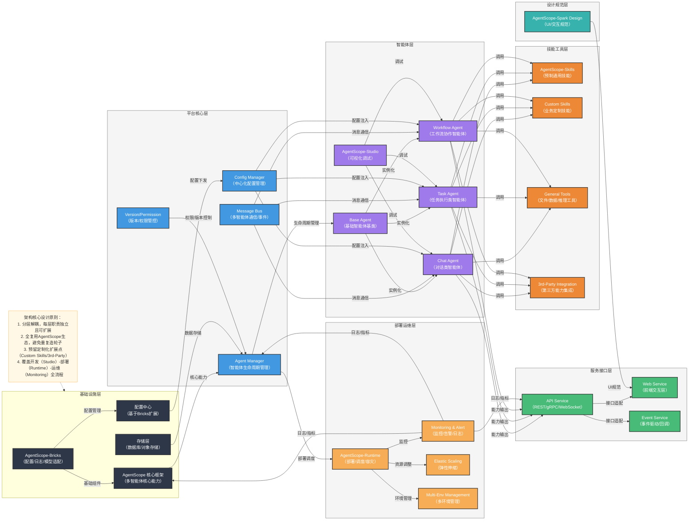

```mermaid
flowchart LR
    %% 统一样式定义（适配生态+平台特性，易扩展）
    classDef infraStyle fill:#2d3748,stroke:#333,stroke-width:2px,color:#fff
    classDef coreStyle fill:#4299e1,stroke:#333,stroke-width:2px,color:#fff
    classDef agentStyle fill:#9f7aea,stroke:#333,stroke-width:2px,color:#fff
    classDef skillStyle fill:#ed8936,stroke:#333,stroke-width:2px,color:#fff
    classDef serviceStyle fill:#48bb78,stroke:#333,stroke-width:2px,color:#fff
    classDef deployStyle fill:#f6ad55,stroke:#333,stroke-width:2px,color:#fff
    classDef designStyle fill:#38b2ac,stroke:#333,stroke-width:2px,color:#fff
    classDef subgraphStyle fill:#f5f5f5,stroke:#666,stroke-width:1px,rounded:10px
    classDef noteStyle fill:#fff8e6,stroke:#ffb74d,stroke-width:1px,rounded:8px

    %% 1. 基础设施层（生态基石+底层资源）
    subgraph infraLayer["基础设施层"]
        A[AgentScope 核心框架<br/>（多智能体核心能力）]:::infraStyle
        B[AgentScope-Bricks<br/>（配置/日志/模型适配）]:::infraStyle
        C[存储层<br/>（数据库/对象存储）]:::infraStyle
        D[配置中心<br/>（基于Bricks扩展）]:::infraStyle
    end
    class infraLayer subgraphStyle

    %% 2. 平台核心层（平台管控能力）
    subgraph platformCoreLayer["平台核心层"]
        E[Agent Manager<br/>（智能体生命周期管理）]:::coreStyle
        F[Message Bus<br/>（多智能体通信/事件）]:::coreStyle
        G[Config Manager<br/>（中心化配置管理）]:::coreStyle
        H[Version/Permission<br/>（版本/权限管控）]:::coreStyle
    end
    class platformCoreLayer subgraphStyle

    %% 3. 智能体层（能力载体）
    subgraph agentLayer["智能体层"]
        I[Base Agent<br/>（基础智能体基类）]:::agentStyle
        J[Chat Agent<br/>（对话类智能体）]:::agentStyle
        K[Task Agent<br/>（任务执行类智能体）]:::agentStyle
        L[Workflow Agent<br/>（工作流协作智能体）]:::agentStyle
        M[AgentScope-Studio<br/>（可视化调试）]:::agentStyle
    end
    class agentLayer subgraphStyle

    %% 4. 技能工具层（可复用能力）
    subgraph skillToolLayer["技能工具层"]
        N[AgentScope-Skills<br/>（预制通用技能）]:::skillStyle
        O[Custom Skills<br/>（业务定制技能）]:::skillStyle
        P[General Tools<br/>（文件/数据/推理工具）]:::skillStyle
        Q[3rd-Party Integration<br/>（第三方能力集成）]:::skillStyle
    end
    class skillToolLayer subgraphStyle

    %% 5. 服务接口层（对外交互）
    subgraph serviceLayer["服务接口层"]
        R[API Service<br/>（REST/gRPC/WebSocket）]:::serviceStyle
        S[Web Service<br/>（前端交互层）]:::serviceStyle
        T[Event Service<br/>（事件驱动/回调）]:::serviceStyle
    end
    class serviceLayer subgraphStyle

    %% 6. 部署运维层（生产落地）
    subgraph deployLayer["部署运维层"]
        U[AgentScope-Runtime<br/>（部署/调度/容灾）]:::deployStyle
        V[Monitoring & Alert<br/>（监控/告警/日志）]:::deployStyle
        W[Elastic Scaling<br/>（弹性伸缩）]:::deployStyle
        X[Multi-Env Management<br/>（多环境管理）]:::deployStyle
    end
    class deployLayer subgraphStyle

    %% 7. 设计规范层（体验一致性）
    subgraph designLayer["设计规范层"]
        Y[AgentScope-Spark Design<br/>（UI/交互规范）]:::designStyle
    end
    class designLayer subgraphStyle

    %% 核心交互逻辑（体现依赖+协作）
    %% 基础设施层支撑平台核心
    A -->|核心能力| E
    B -->|基础组件| A
    B -->|配置管理| D
    D -->|配置下发| G
    C -->|数据存储| E

    %% 平台核心层管控智能体
    E -->|生命周期管理| I
    I -->|实例化| J & K & L
    F -->|消息通信| J & K & L
    G -->|配置注入| J & K & L
    H -->|权限/版本控制| E

    %% 智能体复用技能工具
    J & K & L -->|调用| N & O & P & Q
    M -->|调试| J & K & L

    %% 智能体能力对外暴露
    J & K & L -->|能力输出| R
    R -->|接口适配| S & T
    Y -->|UI规范| S

    %% 部署运维支撑全平台
    E -->|部署调度| U
    U -->|监控| V
    U -->|资源调整| W
    U -->|环境管理| X
    V -->|日志/指标| A & E & R

    %% 注释：核心设计原则
    Note[架构核心设计原则：<br/>1. 分层解耦，每层职责独立且可扩展<br/>2. 全复用AgentScope生态，避免重复造轮子<br/>3. 预留定制化扩展点（Custom Skills/3rd-Party）<br/>4. 覆盖开发（Studio）-部署（Runtime）-运维（Monitoring）全流程]:::noteStyle
    Note -.-> infraLayer
```