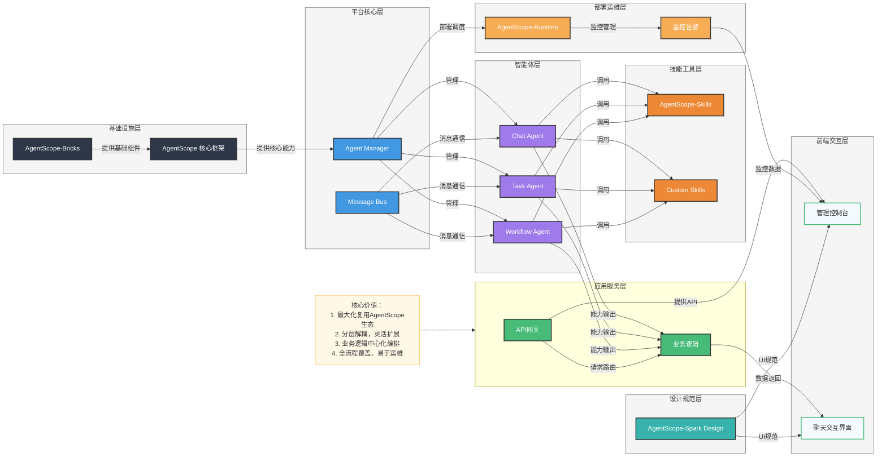

# 智能体平台架构设计 - PPT汇报版

## 架构图

## 汇报要点

### 1. 架构概述
- 基于 AgentScope 生态构建的智能体平台
- 8层分层架构，职责清晰，易于扩展
- 全流程覆盖：开发、部署、运维

### 2. 核心组件
- **基础设施**：AgentScope 核心框架 + Bricks 基础组件
- **平台核心**：Agent Manager + Message Bus，实现智能体管理和通信
- **智能体**：Chat Agent、Task Agent、Workflow Agent
- **技能工具**：AgentScope-Skills + 定制技能
- **应用服务**：API网关 + 业务逻辑编排
- **前端**：管理控制台 + 聊天界面
- **部署运维**：AgentScope-Runtime + 监控告警
- **设计规范**：AgentScope-Spark Design

### 3. 关键优势
- **生态复用**：充分利用 AgentScope 生态组件，避免重复开发
- **分层解耦**：各层职责独立，便于单独扩展
- **业务编排**：业务逻辑作为智能体能力的编排中心
- **全流程覆盖**：从开发到部署运维的完整支持
- **前端一致性**：统一的设计规范，保证用户体验

### 4. 应用场景
- 企业级智能客服系统
- 多智能体协作任务处理
- 智能工作流自动化
- 个性化智能助手

### 5. 实施建议
- 分阶段实施，先核心后扩展
- 充分利用 AgentScope 生态组件
- 建立完善的监控体系
- 重视安全合规

## 总结

基于 AgentScope 生态的智能体平台架构设计，通过分层解耦和生态复用，实现了高度模块化和可扩展性。该架构不仅便于开发和维护，也为企业级智能体应用的落地提供了坚实基础。