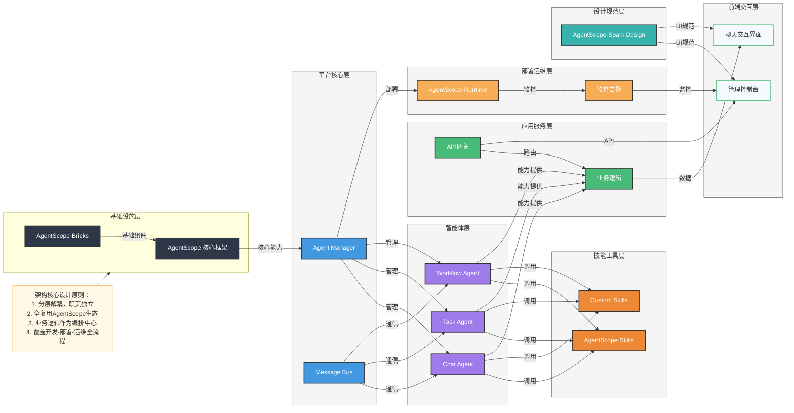

# 智能体平台架构设计 - 精简版

## 架构图

## 架构说明

### 1. 基础设施层
- **AgentScope 核心框架**：生态基石，提供智能体核心能力
- **AgentScope-Bricks**：提供基础组件支持

### 2. 平台核心层
- **Agent Manager**：智能体生命周期管理
- **Message Bus**：智能体间通信

### 3. 智能体层
- **Chat Agent**：对话交互
- **Task Agent**：任务执行
- **Workflow Agent**：工作流协作

### 4. 技能工具层
- **AgentScope-Skills**：预制通用技能
- **Custom Skills**：业务定制技能

### 5. 应用服务层
- **API网关**：统一接口入口
- **业务逻辑**：场景化编排

### 6. 前端交互层
- **管理控制台**：智能体管理与调试
- **聊天交互界面**：用户对话交互

### 7. 部署运维层
- **AgentScope-Runtime**：运行时环境
- **监控告警**：性能监控与告警

### 8. 设计规范层
- **AgentScope-Spark Design**：UI组件库与交互规范