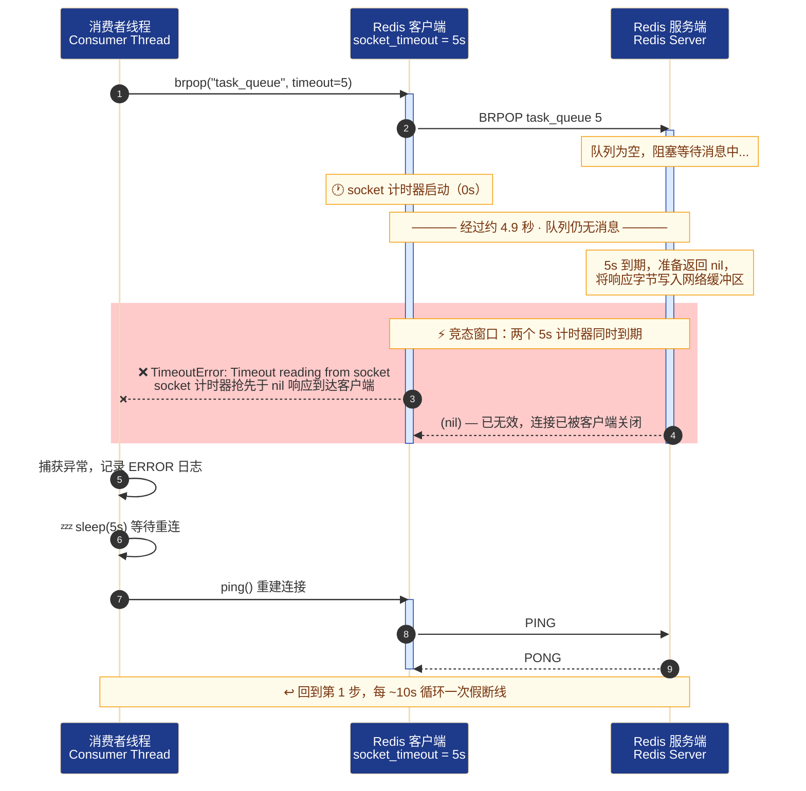
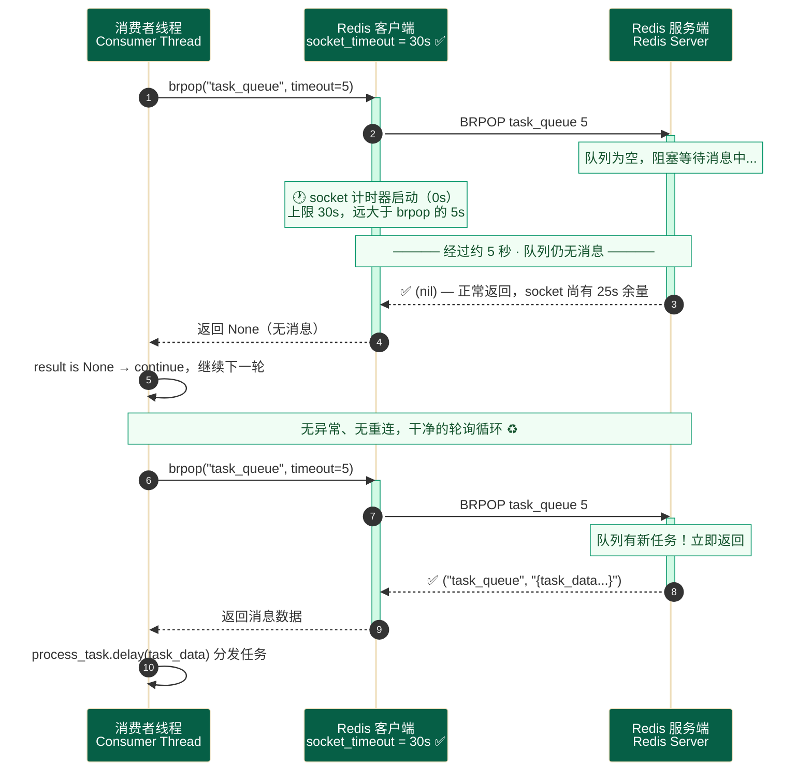
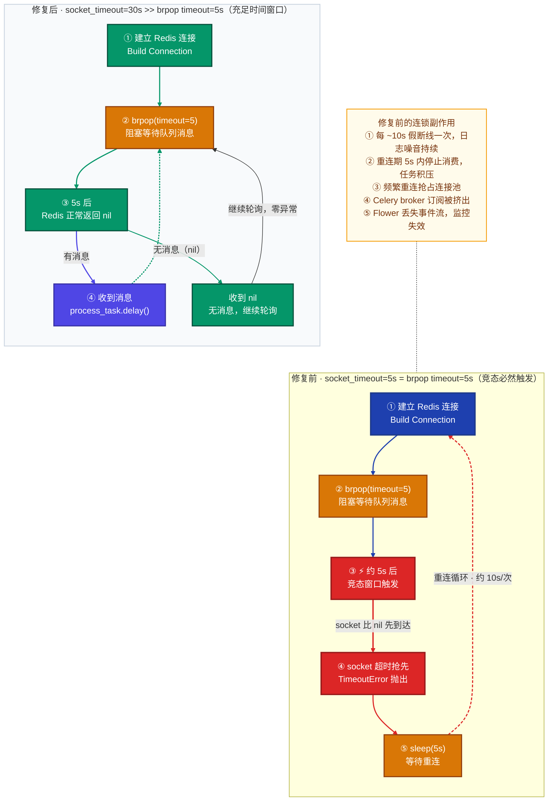
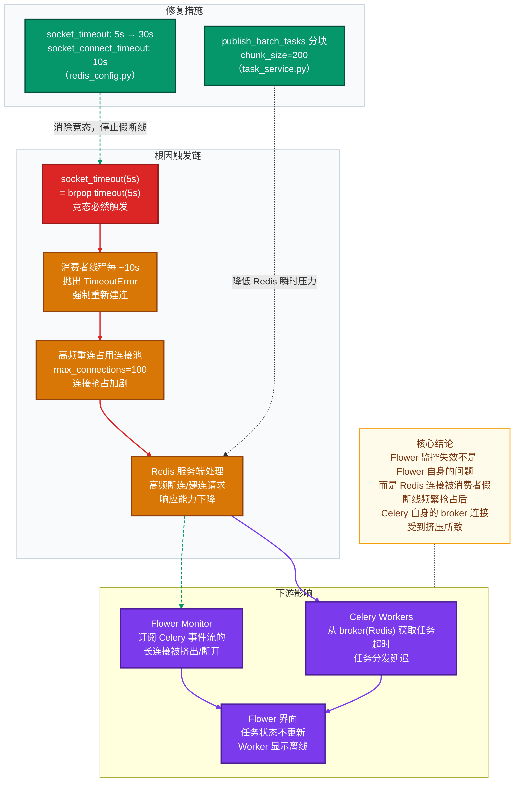

# Redis 假断线问题深度分析

> 本文通过时序图和流程图，逐层解析 `brpop timeout` 与 `socket_timeout` 的超时竞态根因、对 Flower 监控的影响链路，以及大批量 Pipeline 的冲击机制与修复方案。

---

## 一、什么是「假断线」

「假断线」指的是：**Redis 连接在物理上从未中断，但客户端因超时参数配置不当，在正常的阻塞等待结束前就抛出异常，进而触发重连的现象。**

日志中的特征表现（每约 10 秒循环一次）：

```
ERROR [subscriber_tasks.py:54] - [消费者] Redis 连接异常，5s 后重连：Timeout reading from socket
INFO  [subscriber_tasks.py:31] - [消费者] Redis 连接就绪，监听队列：task_queue
```

两条日志相差约 5 秒——不是真正的网络故障，而是两个超时参数的值完全相等所引发的**竞态条件**。

---

## 二、竞态条件：两个 5s 的碰撞

### 参数对照表

| 参数 | 位置 | 修复前 | 含义 |
|------|------|--------|------|
| `_BRPOP_TIMEOUT` | `subscriber_tasks.py` | `5` 秒 | 告知 **Redis 服务端**：最多等 5 秒，无消息则返回 nil |
| `socket_timeout` | `redis_config.py` | `5` 秒 | 告知 **客户端 socket**：5 秒内未收到任何字节则抛异常 |

两者从**同一时刻**开始计时，但作用方向相反。

### 时序图 1：修复前的竞态过程



**关键细节**：`nil` 响应从服务端写出到客户端读取，存在网络传输延迟。当传输延迟 + 服务端处理时间 ≥ 5s 时，客户端 socket 的 5s 计时器就会**抢先触发**，在 nil 字节到达前抛出 `TimeoutError`。

---

## 三、修复后的正常工作时序

将 `socket_timeout` 调大到 30s，给 nil 响应充足的"到达时间窗口"：

### 时序图 2：修复后的正常轮询



---

## 四、消费者循环状态机对比



---

## 五、大批量 Pipeline 冲击链路

当 `limit=10000` 时，`publish_batch_tasks` 将所有任务打包成**一次** `pipeline.execute()`，这在修复前的 `socket_timeout=5s` 下极易触发超时，并影响其他所有连接。

```mermaid
flowchart LR
    %% ── 配色定义 ────────────────────────────────────────────────────────────
    classDef apiStyle    fill:#1e40af,stroke:#1e3a8a,stroke-width:2.5px,color:#fff
    classDef pipeStyle   fill:#d97706,stroke:#92400e,stroke-width:2px,color:#fff
    classDef redisStyle  fill:#374151,stroke:#111827,stroke-width:2px,color:#fff
    classDef errorStyle  fill:#dc2626,stroke:#991b1b,stroke-width:2.5px,color:#fff
    classDef fixStyle    fill:#059669,stroke:#064e3b,stroke-width:2px,color:#fff
    classDef chunkStyle  fill:#4f46e5,stroke:#3730a3,stroke-width:2px,color:#fff
    classDef noteStyle   fill:#fffbeb,stroke:#f59e0b,stroke-width:1.5px,color:#78350f
    classDef layerStyle  fill:#f8fafc,stroke:#cbd5e0,stroke-width:1.5px

    %% ── 修复前：一次性 pipeline ──────────────────────────────────────────────
    subgraph PROBLEM["修复前：单次 pipeline 推送 10000 条"]
        direction LR
        P_API["POST /refresh-data<br>limit=10000"]:::apiStyle
        P_PIPE["pipeline.execute()<br>10000 × rpush<br>单次网络往返"]:::pipeStyle
        P_REDIS[("Redis<br>List 队列")]:::redisStyle
        P_ERR1["socket_timeout(5s) 超时<br>pipeline 执行失败<br>TimeoutError"]:::errorStyle
        P_ERR2["Redis 短暂阻塞<br>Celery broker 响应变慢<br>Flower 事件订阅断流"]:::errorStyle
        P_API --> P_PIPE
        P_PIPE -->|"数据量大 · 耗时 > 5s"| P_ERR1
        P_PIPE -->|"侥幸 < 5s 时"| P_REDIS
        P_REDIS --> P_ERR2
    end
    class PROBLEM layerStyle

    %% ── 修复后：分块 pipeline ────────────────────────────────────────────────
    subgraph SOLUTION["修复后：分块 pipeline · chunk_size=200"]
        direction LR
        S_API["POST /refresh-data<br>limit=10000"]:::apiStyle
        S_BG["FastAPI BackgroundTask<br>后台执行，立即返回 HTTP 200"]:::fixStyle
        S_CHUNK["分块迭代<br>50 块 × 200 条/块"]:::chunkStyle
        S_PIPE["pipeline.execute()<br>每块 < 1s"]:::fixStyle
        S_REDIS[("Redis<br>List 队列")]:::redisStyle
        S_API --> S_BG
        S_BG --> S_CHUNK
        S_CHUNK --> S_PIPE
        S_PIPE --> S_REDIS
        S_PIPE -.->|"下一块"| S_CHUNK
    end
    class SOLUTION layerStyle

    %% ── 注记 ─────────────────────────────────────────────────────────────────
    NOTE_S["分块策略收益<br>① 每块耗时 << socket_timeout(30s)，不触发超时<br>② Redis 内存平滑增长，无突刺<br>③ 连接池不被长时间占用<br>④ Celery broker / Flower 连接不受干扰"]:::noteStyle
    NOTE_S -.- SOLUTION

    %% 边索引：0-8，共 9 条
    linkStyle 0   stroke:#1e40af,stroke-width:2px
    linkStyle 1   stroke:#dc2626,stroke-width:2.5px
    linkStyle 2   stroke:#d97706,stroke-width:1.5px,stroke-dasharray:4 3
    linkStyle 3   stroke:#dc2626,stroke-width:2px
    linkStyle 4   stroke:#1e40af,stroke-width:2px
    linkStyle 5   stroke:#059669,stroke-width:2px
    linkStyle 6,7 stroke:#059669,stroke-width:2px
    linkStyle 8   stroke:#4f46e5,stroke-width:1.5px,stroke-dasharray:4 3
```



---

## 六、Flower 监控失效的原因链路



---

## 七、修复方案汇总

### 参数修改对照

| 文件 | 参数 | 修改前 | 修改后 | 原因 |
|------|------|--------|--------|------|
| `redis_config.py` | `socket_timeout` | `5s` | `30s` | 必须 > `_BRPOP_TIMEOUT(5s)`，消除竞态 |
| `redis_config.py` | `socket_connect_timeout` | 无 | `10s` | 独立控制 TCP 建连超时，不影响读写 |
| `task_service.py` | `publish_batch_tasks` | 单次 pipeline | 分块 pipeline（200条/块）| 降低单次执行时间，避免超时 |

### 超时参数选取原则

```
socket_timeout  ≥  brpop_timeout × 3（安全倍数，留足网络往返余量）

本项目：brpop_timeout = 5s  →  socket_timeout = 30s  ✅
```

### 分块大小选取建议

```
chunk_size 上限估算：
  每条任务 JSON 约 500 Bytes
  200 条/块 = 100 KB/次 pipeline
  Redis 处理 100 KB << 1s（远小于 socket_timeout=30s）

建议范围：100 ~ 500 条/块，根据单条 payload 大小调整
```

---

> **记忆口诀**：socket 要给 brpop 足够的"等待空间"——brpop 问服务端"有没有消息"，socket 要比 brpop 晚超时，否则 socket 会在服务端回答前就"挂断电话"。
