# Homebrew、Node.js、npm 安装与使用指南（macOS）

> **目标读者**：第一次在 Mac 上搭建前端 / Node 工具链的新用户。  
> **环境**：macOS（Apple Silicon 与 Intel 均适用；路径以 Apple Silicon 为主说明）。  
> **图表风格**：与 [mermaid-A-系统认知层.md](./mermaid-A-系统认知层.md) 一致——分层架构图（`flowchart TB`）+ 端到端安装流程图（`flowchart LR`），按职责配色、`subgraph` 分组、注记节点补充要点。

---

## 目录

- [1. 先建立整体认知](#1-先建立整体认知)
- [2. 安装 Homebrew](#2-安装-homebrew)
- [3. 配置 Shell（~/.zshrc）](#3-配置-shellzshrc)
- [4. 安装 Node.js 与 npm](#4-安装-nodejs-与-npm)
- [5. 验证与日常使用](#5-验证与日常使用)
- [6. 国内镜像加速](#6-国内镜像加速)
- [7. 常见问题](#7-常见问题)

---

## 1. 先建立整体认知

### 1.1 三者分别做什么？

| 名称 | 角色（一句话） |
|------|----------------|
| **Homebrew** | Mac 上的「应用商店」式包管理器，用命令行安装 `node`、`git` 等软件。 |
| **Node.js** | 让 JavaScript 能在本机运行的**运行时**（执行 `node xxx.js`、跑构建工具等）。 |
| **npm** | **Node 自带的包管理器**，随 Node 一起安装；用来装依赖（`npm install`）、发布包等。 |

关系可以记：**先装 Homebrew → 用 brew 装 Node → npm 随 Node 自动可用**。

### 1.2 系统架构图（组件与层级）

下图从上到下表示：**你在终端里操作 → Shell 加载配置 → Homebrew 提供软件 → Node/npm 提供运行与装包能力 → 可选国内镜像加速下载**。

```mermaid
flowchart LR
    %% ── 配色：按职责分层（对齐「系统认知层」指南）────────────────────
    classDef userStyle   fill:#1e40af,stroke:#1e3a8a,stroke-width:2.5px,color:#fff
    classDef shellStyle  fill:#4f46e5,stroke:#3730a3,stroke-width:2px,color:#fff
    classDef brewStyle   fill:#1d4ed8,stroke:#1e3a8a,stroke-width:2.5px,color:#fff
    classDef nodeStyle   fill:#0891b2,stroke:#155e75,stroke-width:2px,color:#fff
    classDef mirrorStyle fill:#d97706,stroke:#92400e,stroke-width:2px,color:#fff
    classDef noteStyle   fill:#fffbeb,stroke:#f59e0b,stroke-width:1.5px,color:#78350f
    classDef layerStyle  fill:#f8fafc,stroke:#cbd5e1,stroke-width:1.5px

    subgraph L1["使用者与终端层 User & Terminal"]
        direction LR
        YOU["你<br>Developer"]:::userStyle
        TERM["终端 app<br>Terminal / iTerm / IDE"]:::userStyle
    end
    class L1 layerStyle

    subgraph L2["Shell 配置层 Shell Config"]
        ZSH["~/.zshrc<br>PATH + 可选镜像环境变量"]:::shellStyle
    end
    class L2 layerStyle

    subgraph L3["包管理层 Package Manager"]
        BREW["Homebrew<br>/opt/homebrew（Apple Silicon）"]:::brewStyle
    end
    class L3 layerStyle

    subgraph L4["运行时与包管理 Runtime"]
        direction LR
        NODE["Node.js<br>JavaScript Runtime"]:::nodeStyle
        NPM["npm<br>Node Package Manager"]:::nodeStyle
    end
    class L4 layerStyle

    subgraph L5["网络与镜像 Network（可选）"]
        HM["Homebrew 镜像<br>TUNA / USTC API & Bottles"]:::mirrorStyle
        NR["npm 镜像<br>npmmirror 等"]:::mirrorStyle
    end
    class L5 layerStyle

    YOU --> TERM
    TERM --> ZSH
    ZSH --> BREW
    BREW --> NODE
    NODE --> NPM
    BREW -.->|"brew install 拉取 bottle"| HM
    NPM -.->|"npm install 拉取 tarball"| NR

    NOTE["架构要点<br>① PATH 由 brew shellenv 注入，须在交互 shell 中加载 ~/.zshrc<br>② npm 随 Node 安装，无需单独 brew install npm<br>③ 镜像变量建议在 eval brew shellenv 之前 export"]:::noteStyle
    NOTE -.- BREW

    %% 边索引：0-7，共 8 条（独立行，便于核对）
    linkStyle 0,1,2,3,4 stroke:#374151,stroke-width:2px
    linkStyle 5,6 stroke:#d97706,stroke-width:1.5px,stroke-dasharray:4 3
    linkStyle 7 stroke:#cbd5e1,stroke-width:1px,stroke-dasharray:2 4
```



### 1.3 端到端流程图（从「零基础」到「能跑 npm」）

按时间顺序：**装 brew → 配 zshrc →（可选）镜像 → 装 node → 验证 → 日常装包**。

```mermaid
flowchart LR
    %% ── 配色：阶段职责分色 ─────────────────────────────────────────
    classDef startStyle  fill:#1e40af,stroke:#1e3a8a,stroke-width:2.5px,color:#fff
    classDef stepStyle   fill:#4f46e5,stroke:#3730a3,stroke-width:2px,color:#fff
    classDef brewStyle   fill:#1d4ed8,stroke:#1e3a8a,stroke-width:2px,color:#fff
    classDef nodeStyle   fill:#0891b2,stroke:#155e75,stroke-width:2px,color:#fff
    classDef okStyle     fill:#059669,stroke:#064e3b,stroke-width:2.5px,color:#fff
    classDef noteStyle   fill:#fffbeb,stroke:#f59e0b,stroke-width:1.5px,color:#78350f
    classDef layerStyle  fill:#f8fafc,stroke:#cbd5e1,stroke-width:1.5px

    START["打开终端<br>Open Terminal"]:::startStyle

    subgraph S1["阶段 A：Homebrew"]
        direction LR
        A1["执行官方安装脚本<br>install.sh"]:::brewStyle
        A2["按提示完成<br>sudo / 回车"]:::brewStyle
    end
    class S1 layerStyle

    subgraph S2["阶段 B：Shell"]
        direction LR
        B1["编辑 ~/.zshrc<br>镜像 + brew shellenv"]:::stepStyle
        B2["source ~/.zshrc<br>或重开终端"]:::stepStyle
    end
    class S2 layerStyle

    subgraph S3["阶段 C：Node"]
        direction LR
        C1["brew install node"]:::nodeStyle
        C2["node -v / npm -v"]:::nodeStyle
    end
    class S3 layerStyle

    OK["可日常使用<br>npm install / npx"]:::okStyle

    START --> A1
    A1 --> A2
    A2 --> B1
    B1 --> B2
    B2 --> C1
    C1 --> C2
    C2 --> OK

    N2["若 brew update 失败多为网络问题<br>见 §6 国内镜像"]:::noteStyle
    N2 -.- A2

    %% 边索引：0-7，共 8 条（0-6 主链路，7 为注记虚线）
    linkStyle 0,1,2,3,4,5 stroke:#4f46e5,stroke-width:2px
    linkStyle 6 stroke:#059669,stroke-width:2.5px
    linkStyle 7 stroke:#cbd5e1,stroke-width:1px,stroke-dasharray:2 4
```



> **注意**：若你本地 Mermaid 渲染器对边索引统计不一致，可删除整块 `linkStyle` 段落，图仍可正常显示。

---

## 2. 安装 Homebrew

### 2.1 官方安装（需能访问 GitHub）

在终端执行：

```bash
/bin/bash -c "$(curl -fsSL https://raw.githubusercontent.com/Homebrew/install/HEAD/install.sh)"
```

- 按提示输入本机密码（`sudo`）。
- **Apple Silicon**：结束后终端会提示把 Homebrew 加入 PATH，请照做；若你统一用 `~/.zshrc` 维护，可直接进入 [§3](#3-配置-shellzshrc) 写入 `eval "$(/opt/homebrew/bin/brew shellenv)"`。

### 2.2 国内网络备选

若 `raw.githubusercontent.com` 不可用，可使用国内镜像提供的 **Homebrew 安装脚本**（以镜像站当前说明为准），例如 Gitee 上的常用安装脚本（请自行核对来源可信度后再执行）。

安装完成后，**先确认** `brew` 能否运行（未配 zshrc 前可用完整路径）：

```bash
/opt/homebrew/bin/brew --version
```

---

## 3. 配置 Shell（~/.zshrc）

新用户常见错误：安装成功但输入 `brew` 提示 `command not found`，原因是 **PATH 里没有 `/opt/homebrew/bin`**。

在 **`~/.zshrc`** 中加入（**建议把国内镜像 export 写在 `brew shellenv` 之前**，见 §6）：

```bash
# Homebrew 国内镜像（可选，见 §6）
export HOMEBREW_API_DOMAIN="https://mirrors.tuna.tsinghua.edu.cn/homebrew-bottles/api"
export HOMEBREW_BOTTLE_DOMAIN="https://mirrors.tuna.tsinghua.edu.cn/homebrew-bottles"

# Homebrew 注入 PATH（Apple Silicon）
eval "$(/opt/homebrew/bin/brew shellenv)"

# npm 国内镜像（可选）
export npm_config_registry="https://registry.npmmirror.com"
```

保存后执行：

```bash
source ~/.zshrc
brew --version
```

**说明**：`eval "$(brew shellenv)"` 本质是执行 Homebrew 生成的一组 **`export`**（PATH、MANPATH 等），与「手写 export」一致，只是由官方命令维护，升级时更省心。

**Intel Mac**：若 Homebrew 装在 `/usr/local`，请把上一段中的路径改为 `/usr/local/bin/brew`（以 `brew --prefix` 为准）。

---

## 4. 安装 Node.js 与 npm

配置好 `brew` 后，**一条命令**安装 Node（**自带 npm**）：

```bash
brew install node
```

无需也不应再执行 `brew install npm`（npm 随 Node 分发）。

---

## 5. 验证与日常使用

### 5.1 验证版本

```bash
node -v
npm -v
which node
which npm
```

### 5.2 常用 npm 命令速查

| 命令 | 作用 |
|------|------|
| `npm init` | 在当前目录初始化 `package.json` |
| `npm install` | 按 `package.json` 安装依赖到 `node_modules` |
| `npm install <包名>` | 安装某个依赖并写入 `package.json`（默认） |
| `npm install -g <包名>` | **全局**安装（命令行工具常用） |
| `npm run <脚本名>` | 运行 `package.json` 里 `scripts` 中的脚本 |
| `npx <包名>` | 临时下载并执行包提供的 CLI（无需先全局安装） |

**示例**（全局安装 Codex CLI，registry 已由 `npm_config_registry` 或 `npm config set` 指向国内时更快）：

```bash
npm install -g @openai/codex
```

---

## 6. 国内镜像加速

### 6.1 Homebrew

在 `~/.zshrc` 中 **`eval "$(/opt/homebrew/bin/brew shellenv)"` 之前** 设置：

```bash
export HOMEBREW_API_DOMAIN="https://mirrors.tuna.tsinghua.edu.cn/homebrew-bottles/api"
export HOMEBREW_BOTTLE_DOMAIN="https://mirrors.tuna.tsinghua.edu.cn/homebrew-bottles"
```

- **清华帮助**：<https://mirrors.tuna.tsinghua.edu.cn/help/homebrew/>  
- **中科大帮助**：<https://mirrors.ustc.edu.cn/help/homebrew.html>  

可缓解 `brew update` 访问 `formulae.brew.sh` 失败、`curl: (35) Connection reset` 等问题。

### 6.2 npm

**环境变量**（推荐与上节一起写在 `~/.zshrc`）：

```bash
export npm_config_registry="https://registry.npmmirror.com"
```

或**持久写入配置文件**：

```bash
npm config set registry https://registry.npmmirror.com
npm config get registry
```

---

## 7. 常见问题

| 现象 | 可能原因 | 处理 |
|------|----------|------|
| `command not found: brew` | 未加载 PATH | `source ~/.zshrc` 或检查 `eval "$(/opt/homebrew/bin/brew shellenv)"` |
| `command not found: npm` | 未安装 Node 或未加载 PATH | `brew install node`，再 `source ~/.zshrc` |
| `brew update` 报错 / 很慢 | 访问官方 API 不稳定 | 使用 §6 Homebrew 镜像后重试；必要时稳定网络环境 |
| 想只用 `export` 不用 `eval` | 个人偏好 | 可运行 `brew shellenv` 将输出**原样复制**进 `~/.zshrc`，效果等价 |
| Cursor 内置终端没有 brew | 非登录 shell 只读 `.zshrc` | 把配置统一放在 `~/.zshrc`（本文做法）即可 |

---

## 附录：与本文配套的 Mermaid 风格说明

本文图表遵循 **mermaid-A-系统认知层** 中的实践：

- **架构图**使用 `flowchart TB`，子图表示层级；**流程图**使用 `flowchart LR` 表示安装先后顺序。
- **配色语义**：深蓝表示用户/终端；靛蓝表示 Shell 配置；亮蓝表示 Homebrew；青蓝表示 Node/npm；琥珀表示镜像；绿色表示成功终点；暖色底表示注记。
- **连接线**：实线箭头表示依赖顺序；虚线箭头表示跨网络的下载关系；注记与核心节点用 `-.-` 弱连接。
- 若需维护带 `linkStyle` 的图，请保持 **每条边单独一行**，并在注释中标明边数量，避免索引错误导致渲染失败。

---

**文档版本**：与当前常见 Homebrew / Node LTS 或最新 brew formula 一致；若你安装的 Node 主版本号与截图/示例不同，以 `node -v` 输出为准。
