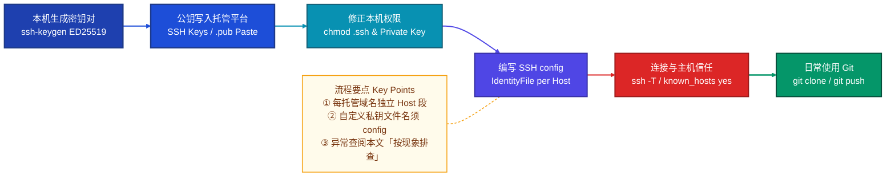

# 用 SSH 连接 Git 远程仓库（从零到能 clone）

本文目标：在本机配置好 SSH，使 `git clone`、`git push` 等走加密连接且无需每次输入网站登录密码。  
阅读方式：**从「步骤一」顺序做到「步骤六」**；中途报错则跳到文末「按现象排查」，不必在文档里来回找章节号。

---

## 全流程示意图



从「步骤一」做到「步骤六」，再按需查阅「按现象排查」，即可完成整套配置。


## 先弄清三件事（避免后面踩坑）

1. **网站里填的是公钥**（`.pub` 文件，一行长字符串）；**绝不能上传私钥**。
2. 克隆地址里的 `git@服务器` 里的 **`git` 是系统账号**，不是你的工号；真正识别你的是 **SSH 公钥是否绑在你的账号上**。
3. 本机私钥若起了**自定义文件名**（例如 `macair_to_git`），OpenSSH **不会**像默认的 `id_ed25519` 那样自动使用它——必须在 `~/.ssh/config` 里写明用哪把钥匙，否则容易误以为是「要输密码」（见文末说明）。

---

## 步骤一：生成密钥对

推荐 **ED25519**。需要兼容很老的环境时再用 RSA：

```bash
ssh-keygen -t ed25519 -C "备注：邮箱或机器名" -f ~/.ssh/你的密钥名
```

- 提示 `Enter passphrase` 时可直接回车（无额外密码），也可设密码（更安全，但后面可能要配合 `ssh-agent`）。
- 生成后会有两个文件：
  - `~/.ssh/你的密钥名` → **私钥**，勿泄露、勿提交到 Git。
  - `~/.ssh/你的密钥名.pub` → **公钥**，下一步要整段复制到网站。

若只想最简单、单密钥场景，可以不写 `-f`，默认得到 `~/.ssh/id_ed25519` 与 `id_ed25519.pub`（下文配置可略简化）。

---

## 步骤二：把公钥加到托管平台

用文本方式打开 **`.pub`**，**全选复制**（一行，以 `ssh-ed25519` 或 `ssh-rsa` 开头），登录对应平台：

| 平台 | 大致位置 |
| --- | --- |
| GitHub | Settings → SSH and GPG keys → New SSH key |
| GitLab / 自建 GitLab | 用户头像/设置 → SSH Keys |
| 华为 CodeHub | 个人设置 → SSH 密钥 |

粘贴后保存。多一个空格、少一行都会导致认证失败。

---

## 步骤三：修正本机权限（不满足会直接失败）

```bash
chmod 700 ~/.ssh
chmod 600 ~/.ssh/你的密钥名
chmod 644 ~/.ssh/你的密钥名.pub
```

若使用默认 `id_ed25519`，则把上面路径改成对应文件名。

---

## 步骤四：编写 `~/.ssh/config`（自定义密钥名时必做）

### 为什么要写这个文件

- 克隆命令形如：`git clone git@gitlab.example.com:组/仓库.git`。服务器用 **`git` 用户**接 SSH，但**用哪把私钥由你电脑决定**。
- 只有默认名字 `id_rsa`、`id_ed25519` 等会被自动尝试；**自定义文件名不会被自动选中**，结果往往是：连不上、或出现假的「请输入 `git@…` 的密码」（其实不是网站密码）。
- **`Host` 只对你写下的那个主机名生效**：例如 `config` 里只有 `Host gitlab.xxx.com` 时，`git clone git@github.com:...` **不会**套用这段配置，SSH 仍按默认规则找钥匙——若你只有自定义文件名私钥，GitHub 就会报 `Permission denied (publickey)`。**每用一个托管域名（GitHub、各家 GitLab、CodeHub 等），就要有对应的一段 `Host`，** 可共用同一把 `IdentityFile`，但块不能省。

### 新建或编辑配置

```bash
# 若不存在则创建；权限必须紧
chmod 700 ~/.ssh
touch ~/.ssh/config
chmod 600 ~/.ssh/config
```

在 `~/.ssh/config` 里为**每个常用 Git 主机**写一段（域名、路径按实际修改）：

```sshconfig
Host github.com
  HostName github.com
  User git
  IdentityFile ~/.ssh/mac_to_git
  IdentitiesOnly yes

Host gitlab.stardustgod.com
  HostName gitlab.stardustgod.com
  User git
  IdentityFile ~/.ssh/macair_to_git
  IdentitiesOnly yes

# 华为 CodeHub 示例：HostName 以控制台/克隆说明为准
Host codehub.huawei.com
  HostName codehub-cn-south-1.devcloud.huaweicloud.com
  User git
  IdentityFile ~/.ssh/wq_linux_215_to_git
  IdentitiesOnly yes
```

- **`Host`**：你之后在 `git@…` 里写的那个主机名要和这里能对上（或与你 `ssh -T` 时一致）。
- **`IdentityFile`**：指向**私钥**路径。
- **`IdentitiesOnly yes`**：只用这里指定的钥匙，减少误试其它密钥带来的奇怪报错。

若你**只用默认** `~/.ssh/id_ed25519` 且只连一个 GitHub，有时不写 `config` 也能工作；一旦多密钥或非默认名，**请老老实实写 `config`**。

---

## 步骤五：首次连接与验证

### 5.1 第一次连某台服务器

可能出现：

```text
The authenticity of host '...' can't be established.
Are you sure you want to continue connecting (yes/no/[fingerprint])?
```

在确认域名属于你要访问的正规服务后，输入 **`yes`**。不要随手 `yes` 不明来源的地址。

### 5.2 测试 SSH（通过后再去 clone）

把下面主机名换成你的（与 `config` 里 `Host` / 克隆地址一致）：

```bash
ssh -T git@gitlab.stardustgod.com
# 或
ssh -T git@github.com
```

成功时常见输出：`Welcome to GitLab, @xxx!` 或 `Hi xxx! You've successfully authenticated...`。

### 5.3 还没写 config 时的临时办法

```bash
ssh -i ~/.ssh/你的密钥名 -T git@服务器域名
```

### 5.4 私钥设了 passphrase（可选）

每次操作 Git 可能反复问密码，可加载到 agent：

```bash
eval "$(ssh-agent -s)"
ssh-add ~/.ssh/你的密钥名
ssh-add -l
```

---

## 步骤六：克隆与日常使用

```bash
git clone git@gitlab.stardustgod.com:组名/仓库名.git
# 或
git clone git@github.com:用户名/仓库名.git
```

每多用一个 `git@主机` 域名，先在步骤四确认 **`config` 里有同名 `Host`**，并对该平台做过步骤二（公钥已上传）。

已有仓库从 HTTPS 改成 SSH：

```bash
git remote -v
git remote set-url origin git@gitlab.stardustgod.com:组名/仓库名.git
git fetch origin
```

---

## 按现象排查（无需对照章节号）

### 出现 `Host key verification failed`

- 第一次连接时在提示里没输入 `yes`，或服务器密钥变更导致本地记录过期。
- 处理（把域名换成你的）：

```bash
ssh-keygen -R gitlab.stardustgod.com
ssh -T git@gitlab.stardustgod.com
```

再按提示输入 `yes`（确认域名可信）。

---

### 出现 `Permission denied (publickey)`（GitHub / GitLab 常见）

含义：服务器**没有接受**你这次连接里提供的任何公钥（或你根本没提供到它认的钥匙）。

常见原因与处理：

1. **网站账号里没加公钥，或加错账号**  
   把当前使用的私钥对应的 **`.pub`** 完整粘贴到该平台「SSH keys」里（步骤二）。

2. **`config` 里缺了当前这个平台的主机段**  
   只配置了 GitLab，去 clone **GitHub** 时不会自动用那把私钥——要为 **`github.com`** 也写一段 `Host`，`IdentityFile` 指向已在 GitHub 添加过的那把私钥（步骤四）。反之亦然。

3. **自定义私钥名但未写 `IdentityFile`**  
   同步骤四；或用临时命令验证：`ssh -i ~/.ssh/你的密钥名 -T git@github.com`。

仍不确定时用 `ssh -v -T git@对应主机` 看是否出现 `Offering public key` 以及是否被拒绝。

---

### 出现 `git@某主机's password:`，怎么输都不对

**这不是** GitLab/GitHub 网页登录密码。  
含义通常是：SSH **没走公钥认证**，退回到「密码登录」；而代码托管方的 `git` 账号**不接受这种密码**，所以必然失败。

请依次检查：

1. 公钥是否已完整粘贴到**当前登录账号**对应网站的 SSH 设置里。
2. 私钥若不是 `id_ed25519` / `id_rsa`，是否在 **`~/.ssh/config`** 里为该主机配置了 `IdentityFile`（步骤四）。
3. 私钥权限是否为 `600`（步骤三）。

深度排查：

```bash
ssh -v -T git@你的主机
```

日志里应能看到 `Offering public key`、`Authentication succeeded` 等。无交互自检：

```bash
ssh -o BatchMode=yes -T git@你的主机
```

---

### 提示私钥权限过宽（Permissions too open）

重新执行步骤三的 `chmod`。

---

### 连接超时或仍失败

- `config` 里 `HostName` 是否与官网「克隆」说明一致（尤其企业内网、CodeHub 等可能有专用域名）。
- 公司网络是否拦截 22 端口（有时需 VPN 或改用 HTTPS + Token）。
- 仍用 `ssh -v -T` 看卡在哪一步。

---

### 临时改用 HTTPS（应急）

```bash
git clone https://gitlab.stardustgod.com/组名/仓库名.git
```

克隆或推送时密码处一般填 **Personal Access Token**（以平台文档为准），不是普通登录密码。

---

## 收尾：习惯建议

- 优先 ED25519；多机器、多公司用**不同密钥文件名**，并在 `config` 里分开。
- 私钥备份在安全位置；换电脑或离职时，在网站上**删掉旧公钥**。
- 定期轮换密钥（例如每半年～一年，视公司规范而定）。

---

