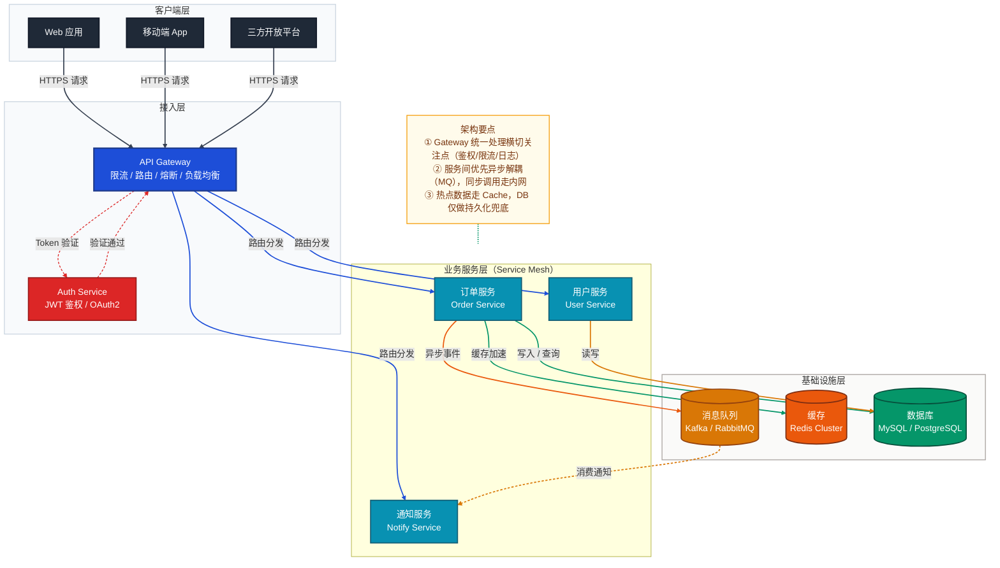
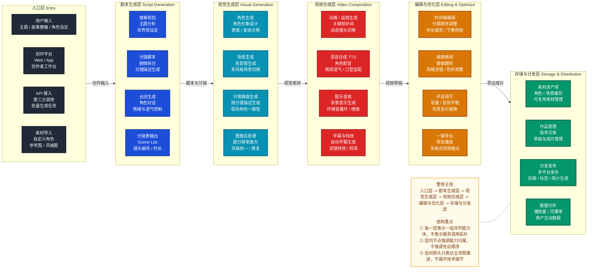
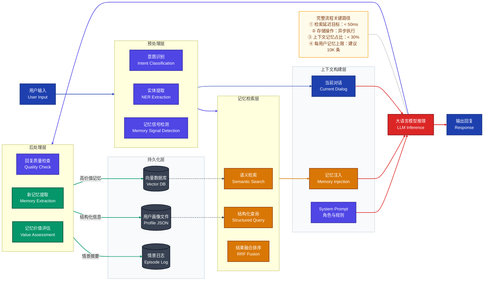

# Mermaid 作图风格指南 · A 系统认知层

> 适用场景：初探项目、架构评审、梳理核心业务链路、还原产品级分层总览图。
> 包含图表：① 系统架构图　② 分层能力结构图　③ 端到端流程图

## 目录

- 一、三种图的区别与选用
- 二、系统架构图
- 三、分层能力结构图
- 四、端到端流程图
- 五、作图规范
- 六、输出契约

---

## 一、三种图的区别与选用

### 1.1 先做速判

如果你只想快速决定该画哪一张，先用这张表：

| 你真正想看什么 | 应优先选择 |
|---------------|-----------|
| 系统里有哪些服务、组件、存储，它们怎么连接 | **系统架构图** |
| 方案按哪些阶段、能力域或生产环节分层展开 | **分层能力结构图** |
| 一个请求或任务从开始到结束怎么同步流转 | **端到端流程图** |

再换成更口语的判断方式：

- 想看“**系统怎么组成**”：
  - 选 **系统架构图**
- 想看“**方案按哪些层或阶段展开**”：
  - 选 **分层能力结构图**
- 想看“**事情怎么一步步发生**”：
  - 选 **端到端流程图**

常见混淆点：

- “分了很多层”不一定就是系统架构图  
  如果重点是“创作层、生成层、合成层、发布层”这类阶段或能力分组，通常更适合 **分层能力结构图**
- “有箭头连接”不一定就是流程图  
  如果箭头只是表达大阶段之间的主线推进，而不是严格步骤顺序，通常仍然是 **分层能力结构图**
- “看起来像系统全景”不一定就是平台分层图  
  如果重点不是职责边界，而是能力模块归组和总览排布，优先考虑 **分层能力结构图**

### 1.2 三种图的差异表

| 维度 | 系统架构图 | 分层能力结构图 | 端到端流程图 |
|------|-----------|---------------|------------|
| **Mermaid 语法** | `flowchart TB` | `flowchart TB` 或 `flowchart LR` | `flowchart LR` |
| **回答的问题** | 系统由哪些组件构成？如何部署和连接？ | 系统按哪些阶段或能力域分层展开？ | 一个请求如何在系统中同步流转？ |
| **视角** | 静态结构视图 | 分层总览视图 | 动态流程视图 |
| **节点代表** | 服务 / 组件 | 层内并列能力块 | 处理步骤 |
| **箭头代表** | 调用 / 部署关系 | 主线推进关系 | 数据流转顺序 |
| **类比** | 建筑平面图（房间布局） | 展厅导览图（按展区分层） | 消防演练路线图（人怎么走） |

```
需要理解"系统长什么样"                 → 系统架构图
需要理解"方案按哪些层或阶段展开"       → 分层能力结构图
需要理解"请求怎么走"（同步）           → 端到端流程图
```

推荐判断顺序：

```
第一步：先判断要看"组件连接"还是"能力分层"还是"处理流程"
    ↓
第二步：系统架构图 / 分层能力结构图 / 端到端流程图 三选一
```

一个系统可以同时有：

- 1 张系统架构图
- 1 张分层能力结构图
- 多张端到端流程图

---

## 二、系统架构图

### 2.1 适用场景

用于回答：这个项目有哪些服务？各层职责是什么？数据存在哪？如何部署？

首次接触一个项目需要理解系统整体构成时，或进行架构设计 / 评审时使用。

### 2.2 完整参考原图

> 展示客户端 → API 网关 → 服务网格 → 数据层的标准分层微服务架构



---

## 三、分层能力结构图

> 适用场景：产品能力总览图、阶段式架构图、原始分层大图 Mermaid 化。

用于回答：一个系统或方案按哪些阶段、能力域或生产环节分层展开？每层中有哪些并列能力块？层与层之间的主线如何推进？

它和常规系统架构图的区别：

- **不是技术架构图**
  - 不强调服务调用拓扑、数据库、消息队列、模型网关等实现细节
- **不完全等于平台分层图**
  - 重点不是职责边界，而是能力分组、阶段组织和整体主线
- **更适合产品级总览**
  - 常见于“创作层 -> 生成层 -> 合成层 -> 发布层”这类结构

推荐 Mermaid 结构模式：

- 语义上采用“分层 + 层内并列 + 主线串联”
- 每一层使用一个 `subgraph`
- 每层内部使用 `direction LR`
- 层内节点表达并列能力块
- 层间只保留主线箭头，不默认展开细碎调用关系

布局方向不要机械写死，按图面密度决定：

- 需要强调“自上而下”的阶段推进时，外层优先 `flowchart TB`
- 需要保留原始产品大图的横向展开感时，外层可以使用 `flowchart LR`

完整参考示例：



这种图的阅读方式是：

- 先按“层”看整体结构
- 再看每层里的并列能力块
- 最后看层与层之间的主线推进

它不适合回答：

- 哪个服务调哪个服务
- 哪个组件读写哪个数据库
- 哪一步发生异步回调

这些问题应改用系统架构图、时序图或异步链路图。

---

## 四、端到端流程图

### 4.1 适用场景

用于回答：一个用户操作从发起到完成，经过了哪些步骤？数据如何被加工和传递？

梳理核心业务功能的完整处理链路、排查请求路径的性能瓶颈、向新成员讲解业务流程时使用。

### 4.2 完整参考原图

> 展示用户输入 → 预处理 → 记忆检索 → 上下文构建 → LLM 推理 → 后处理 → 持久化的完整 AI 对话记忆流程



---

## 五、最佳实践速查

| 设计原则 | 说明 |
|----------|------|
| **配色语义** | 按职责或阶段区分节点颜色：入口/客户端可用深灰（`#1f2937`），平台/编排可用蓝（`#1d4ed8`），生成能力可用青蓝（`#0891b2`）或红（`#dc2626`），治理与编辑可用琥珀（`#d97706`），存储与分发可用绿（`#059669`），注记节点用低饱和暖色（`#fffbeb`） |
| **流程方向** | 系统架构图常用 `TB`；端到端流程图常用 `LR`；分层能力结构图按图面选择 `TB` 或 `LR`，但层内统一 `direction LR` 横排 |
| **分层能力结构图** | 优先表达“层”和“层内并列能力块”；层间只保留主线箭头，不默认补技术调用边 |
| **分层 subgraph** | 用 `subgraph` 将同职责节点归组；每个子图对应一个处理层级；`class SubgraphName layerStyle` 统一背景色区分层级 |
| **起止节点突出** | 起始节点（用户输入）和终止节点（输出回复）使用最高对比度颜色（`#1e40af` 深蓝），与中间处理节点形成视觉区分 |
| **连接线语义** | `-->` 表示同步调用；`-.->` 表示异步调用或可选路径；`==>` 表示关键/强制路径；连接线标签简明描述数据内容或操作语义 |
| **`linkStyle` 索引精准计数** | `linkStyle N` 按边的**声明顺序**从 0 开始编号，索引越界会触发渲染崩溃。两条规避守则：① **展开 `&`**：`A & B --> C` 会展开为多条独立边，凡使用 `linkStyle` 的图一律拆成独立行；② **注释标注边总数**：在连接线声明结束后、`linkStyle` 之前插入 `%% 边索引：0-N，共 X 条` 注释强制核对 |
| **节点形状语义** | `["text"]` 矩形表示服务/处理步骤；`[("text")]` 圆柱体表示持久化存储（DB、向量库、文件等） |
| **节点换行** | 换行用 `<br>`；首行写中文业务名，`<br>` 后补英文技术名，兼顾可读性与技术精确性 |
| **NOTE 注记** | 通过 `NOTE` 节点附加关键路径说明；用 `NOTE -.- 核心节点` 悬浮挂载，与主流程连接线视觉隔离 |
| **中英双语** | 节点文本和连接线标签适当中英双语（如 `"语义检索<br>Semantic Search"`） |

## 六、输出契约

| 规则 | 说明 |
|------|------|
| **先问题，后出图** | 每张图输出前，先用一句话说明“这张图回答什么问题” |
| **按需补图** | 不预设固定图数量，按当前问题复杂度决定补 0-N 张图 |
| **一图一职责** | 单张图只回答一个主问题；如果需要同时解释“系统组成”和“请求怎么走”，应拆成两张图 |
| **先选图型，再套风格** | 先判断当前更适合系统架构图、分层能力结构图还是端到端流程图，再复用本 reference 的视觉语言 |
| **避免为完整感硬补图** | 如果文字已经足够清楚，就不要为了显得完整而额外补图 |
| **多图时先列清单** | 如果需要多张图，先列出“第 1 张回答什么、第 2 张回答什么”，再依次输出 |
