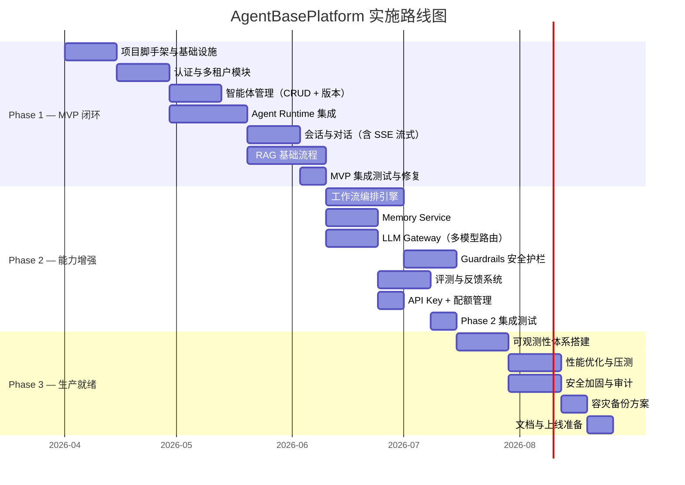
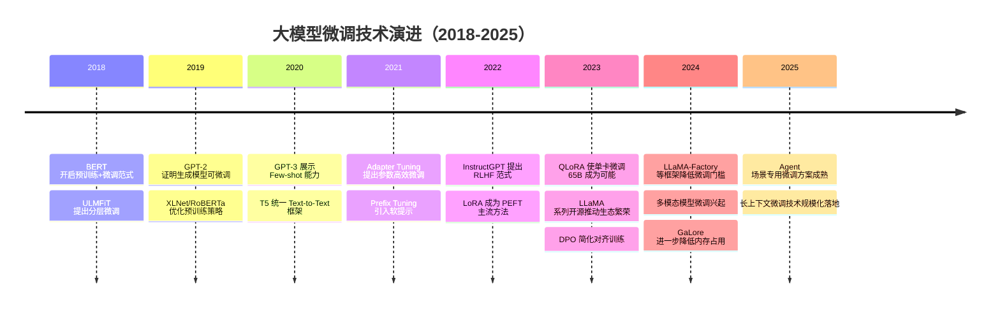

# Mermaid 作图风格指南 · D 规划与演进层

> 适用场景：项目规划、路线图设计、技术或产品演进梳理。
> 包含图表：⑧ 甘特图　⑨ 时间线图

## 目录

- 一、两种图的区别与选用
- 二、甘特图
- 三、时间线图
- 四、输出契约

---

## 一、两种图的区别与选用

| 维度 | 甘特图 | 时间线图 |
|------|-------|---------|
| **Mermaid 语法** | `gantt` | `timeline` |
| **回答的问题** | 任务如何分阶段排期？依赖和并行关系是什么？ | 事件在时间轴上如何分布？关键节点是什么？ |
| **视角** | 时间 × 任务的二维规划视图 | 线性时间轴上的里程碑 |
| **节点代表** | 任务条目（含起止、依赖） | 时间点 + 事件描述 |

```
需要规划项目排期、展示任务依赖   → 甘特图
需要梳理技术演进、历史里程碑     → 时间线图
```

> 这两种图与 A/B/C 的核心区别：A/B/C 用于**技术分析**（系统怎么构成、代码怎么组织、运行时怎么行为）；D 用于**规划与演进可视化**（怎么做、先后顺序是什么、经历了哪些阶段）。

---

## 二、甘特图

### 2.1 适用场景

用于回答：这个项目分几个阶段？各任务的依赖关系是什么？哪些任务可以并行？

展示项目路线图、里程碑排期、多阶段迭代计划时使用。

### 2.2 完整参考原图

> 展示三阶段项目路线图：MVP 闭环 → 能力增强 → 生产就绪，含任务依赖链



### 2.3 作图规范

| 要素 | 规范 |
|------|------|
| **`dateFormat`** | 统一用 `YYYY-MM-DD`，`axisFormat` 用 `%Y-%m` 显示年月，避免坐标轴过密 |
| **`section` 分组** | 按阶段（Phase）或业务域划分 section，每个 section 对应一个交付目标 |
| **任务依赖** | 用 `after 任务ID` 表达前置依赖；并行任务写相同的起始日期或相同的 `after` 前缀 |
| **任务 ID** | 格式 `阶段前缀_序号`（如 `p1_1`），便于被后续任务引用 |
| **工期单位** | 用 `w`（周）表示工期，比具体日期更灵活；关键里程碑可用 `milestone` 标记 |
| **`title`** | 必须填写，说明路线图所属项目或版本 |

---

## 三、时间线图

### 3.1 适用场景

用于回答：这项技术经历了哪些关键节点？每个阶段的代表性事件是什么？

梳理技术发展史、产品迭代历程、行业演进脉络时使用。每个时间点可附加多条事件。

### 3.2 完整参考原图

> 展示大模型微调技术演进（2018-2025），每年列出 2-3 个代表性事件



### 3.3 作图规范

| 要素 | 规范 |
|------|------|
| **`title`** | 必须填写，注明主题和时间跨度（如 `大模型微调技术演进（2018-2025）`） |
| **时间点格式** | 年份直接写数字（`2023`），事件之间用 `:` 分隔；同一年多个事件在同一行用多个 `:` 追加 |
| **每个时间点的事件数** | 建议 1-3 条，超过 3 条拆为独立时间线或合并描述，避免单行过长 |
| **事件描述** | 简明扼要，15 字以内；突出技术名称或产品名，而非解释性文字 |
| **时间跨度控制** | 单张图建议 5-15 个时间点；跨度过大时按子领域拆分为多张图 |

---

## 四、输出契约

| 规则 | 说明 |
|------|------|
| **先问题，后出图** | 每张图输出前，先用一句话说明“这张图回答什么问题” |
| **按需补图** | 不预设固定图数量，按当前问题复杂度决定补 0-N 张图 |
| **一图一职责** | 甘特图回答“怎么排期”；时间线图回答“关键事件如何沿时间展开”；不要把规划依赖和历史演进硬塞进同一张图 |
| **先选语义图型** | 先判断当前更适合甘特图还是时间线图，再复用本 reference 的风格 |
| **多图时先列清单** | 如果需要多张图，先列出每张图分别回答的规划问题，再依次输出 |
| **避免堆砌信息** | 如果单张图内容过满，应拆图而不是把所有规划信息塞进一张图里 |
