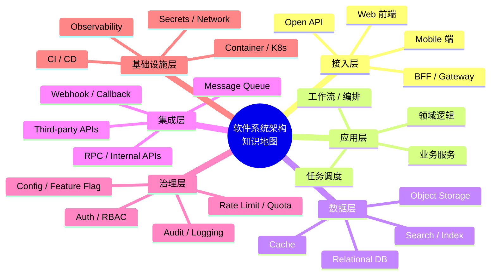

# Mermaid 作图风格指南 · E 知识结构层

> 适用场景：技术栈总览、模块归类、能力地图、概念体系梳理。
> 包含图表：⑩ 思维导图

## 目录

- 一、图型定位与适用边界
- 二、思维导图
- 三、输出契约

---

## 一、图型定位与适用边界

| 维度 | 思维导图 |
|------|---------|
| **Mermaid 语法** | `mindmap` |
| **回答的问题** | 一个主题如何向外展开？各子域如何归类？ |
| **视角** | 以中心主题向外辐射的层级结构 |
| **节点代表** | 概念节点 / 模块节点 / 技术节点 |
| **典型触发场景** | 技术栈分析、模块构成总览、能力地图、概念分类 |

```
需要总览技术栈、模块构成、概念分类 → 思维导图
```

和其他文件的边界：

- 与 `A` 的区别：
  `A` 回答“系统怎么组成、主链路怎么走”；`E` 回答“主题如何分层归类”
- 与 `B` 的区别：
  `B` 回答“表和类怎么设计”；`E` 回答“模块和概念如何归组”
- 与 `D` 的区别：
  `D` 回答“怎么排期、怎么演进”；`E` 不表达时间和依赖，只表达分类结构

---

## 二、思维导图

### 2.1 适用场景

用于回答：这个系统 / 项目 / 领域由哪些部分构成？各部分如何归类？

总览技术栈组成、项目模块分类、概念体系梳理时使用。适合作为分析入口，建立初步认知后，再决定是否补 `A` 的架构图或 `B` 的类/表关系图。

### 2.2 完整参考原图

> 展示一个多渠道 AI Agent 平台的完整技术栈，从核心运行时到各端 SDK




### 2.3 作图规范

| 要素 | 规范 |
|------|------|
| **根节点** | 用 `root((文本))` 圆形节点表示中心主题；文本简短，2-6 字；可用 `<br/>` 换行 |
| **缩进层级** | 用空格缩进表示层级（每级 2 个空格）；建议最多 4 级，超过 4 级说明分类需要合并 |
| **第一层分类** | 按业务职责、技术域或能力域划分（如接入层、AI 核心、数据层）；4-8 个分类为宜 |
| **叶子节点** | 写具体的库名、模块名、协议名或概念名；同类项放在同一父节点下 |
| **命名粒度** | 同一层节点保持粒度一致，不要同时混用“业务域”和“具体函数名” |
| **换行** | `mindmap` 节点中换行用 `<br/>`，不要沿用 `flowchart` 的 `<br>` |
| **聚焦原则** | 一张图聚焦一个系统或一个业务域；依赖过多时按主题拆为多张图，如“后端技术栈图”“前端技术栈图”“基础设施图” |

### 2.4 配色约束（工程评审风格）

| 要素 | 约束 |
|------|------|
| **整体风格** | 稳重、专业、克制，符合技术评审材料的正式感，强调结构清晰和信息优先 |
| **配色基调** | 整体低饱和，背景接近白色或浅暖灰 |
| **主色选择** | 偏墨绿、深青、灰蓝中的一种，作为核心主题色 |
| **辅助色** | 控制在 2-3 个，用于区分主要分支 |
| **层级表达** | 层次越深颜色越浅，同层节点保持统一色系 |
| **重点处理** | 重点节点可以略深，但不要抢正文 |
| **避免事项** | 花哨渐变、紫色、荧光色、糖果色、强装饰感、颜色过多导致层级混乱 |

## 三、输出契约

| 规则 | 说明 |
|------|------|
| **先问题，后出图** | 每张图输出前，先用一句话说明“这张图回答什么问题” |
| **按需补图** | 不预设固定图数量，按当前问题复杂度决定补 0-N 张图 |
| **一图一职责** | 思维导图回答“主题如何分层归类”；不要把时间顺序、调用链、状态流转塞进同一张图 |
| **优先做归类，不抢结构图职责** | 如果用户要看“技术栈由哪些部分构成”，优先用思维导图；如果要看“这些模块怎么连接”，再补 `A` 的架构图 |
| **多图时先列清单** | 如果需要多张图，先列出每张图分别回答哪个归类问题，再依次输出 |
| **避免叶子节点失控** | 如果某一类节点超过 7-10 个，优先先分组再展开，避免把 mindmap 画成长清单 |
