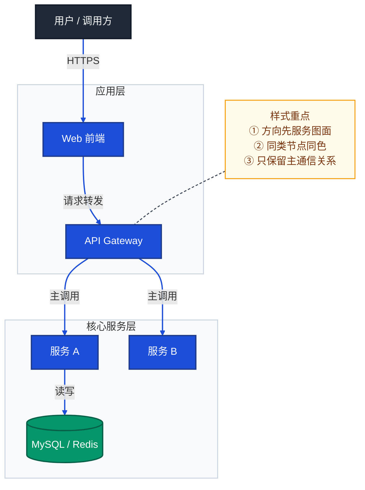
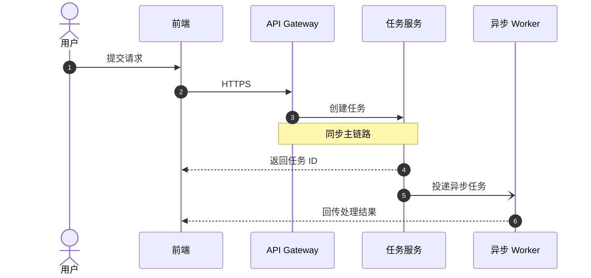
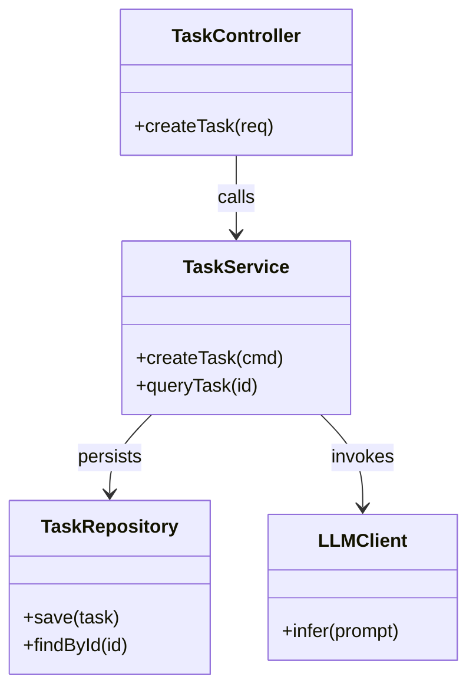
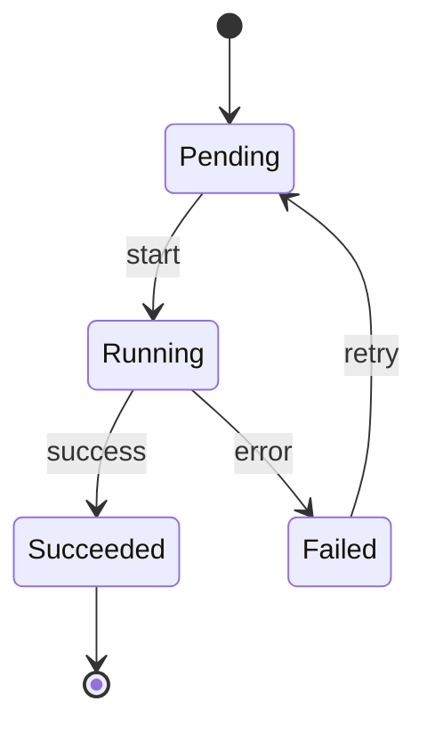
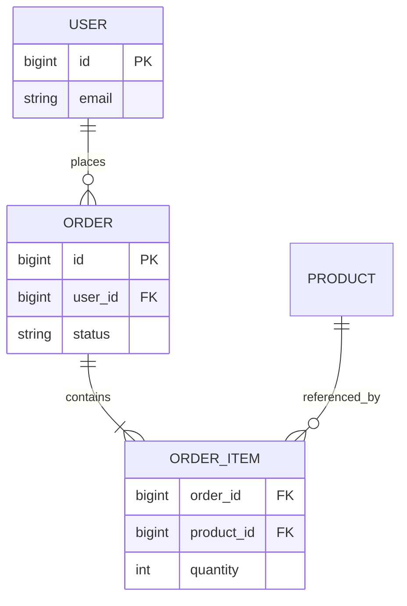
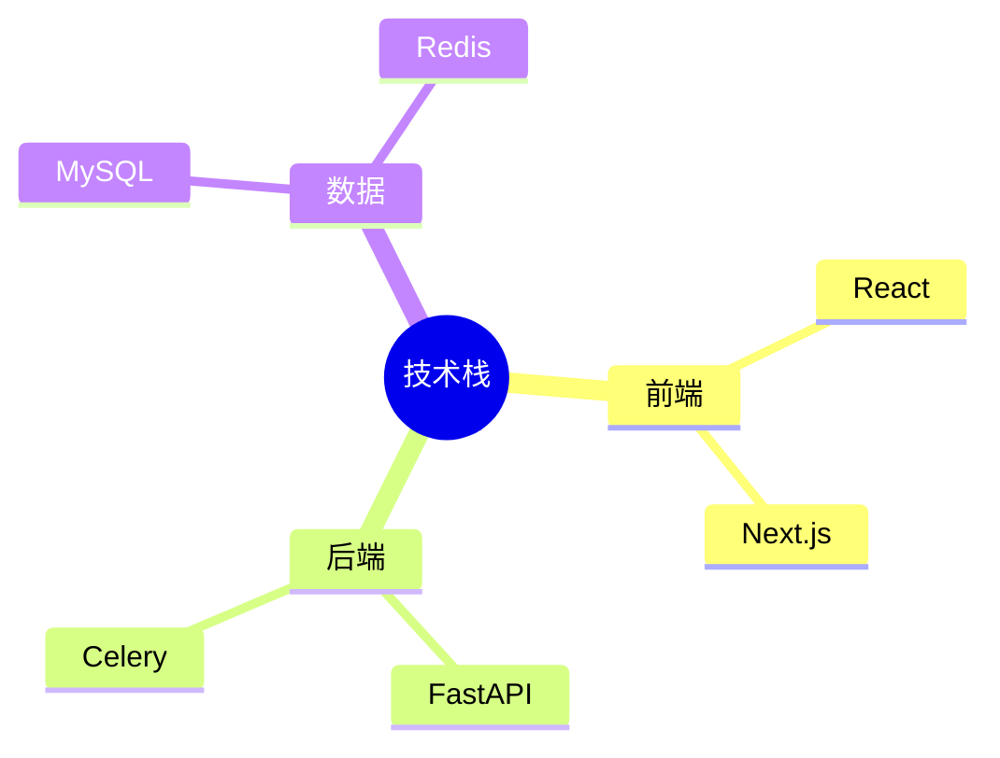
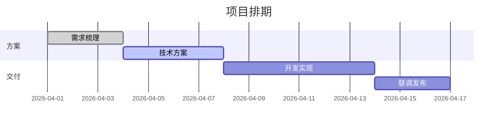
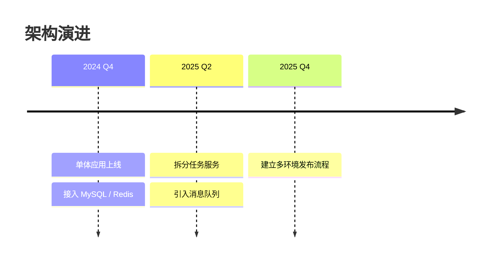

# Mermaid 样式风格速查

> 文档职责：按 Mermaid 语法类型统一维护可复用的样式语言、骨架写法和速查规则。  
> 适用场景：已经确定要画哪一种图，下一步需要快速决定“该用什么 Mermaid 语法、怎么排版、怎么上轻样式”时使用。  
> 阅读目标：把样式从各单图文档中抽离，形成按 Mermaid 类型复用的统一入口。  
> 目标读者：需要维护项目分析出图规范和 Mermaid 风格一致性的人。

## 1. 使用原则

- 图文档负责回答“这张图表达什么、何时使用、不能混入什么”。
- 本文档只回答“用哪种 Mermaid 语法、推荐什么布局、允许哪些轻样式”。
- 同一种 Mermaid 语法可以服务多种图；样式是复用层，不是建模标准本身。
- 单图文档中的样式说明应尽量收敛为一句话或一个短表，详细规则统一回到本文档。

## 2. Mermaid 类型总表

| Mermaid 类型 | 典型适用图 | 主要关注点 |
|--------------|------------|------------|
| `flowchart` | 系统上下文图、整体架构图、接口地图、分层能力结构图、核心组件图、模块依赖图、部署图、构建与发布流程图、核心业务链路图（流程型） | 方向、分组、节点形状、连线语义、`linkStyle` |
| `sequenceDiagram` | 核心业务链路图（时序型） | 参与者数量、同步/异步箭头、`Note`、异常分支 |
| `classDiagram` | 代码图 | 类/接口/实现关系、成员暴露粒度、关系箭头语义 |
| `stateDiagram-v2` | 状态机图 | 状态命名、迁移标签、入口/出口、异常终态 |
| `erDiagram` | 数据模型图 | 实体命名、关系基数、字段粒度、主外键表达 |
| `mindmap` | 技术栈图（总览型） | 根节点、技术域分层、关键词密度 |
| `gantt` | 甘特图 | 时间粒度、阶段分段、依赖、关键路径 |
| `timeline` | 时间线图 | 时间粒度、里程碑密度、阶段标签 |

## 3. `flowchart`

适用：结构图、分层图、部署图、流程图等需要“节点 + 连线”表达的大多数项目分析图。

| 样式项 | 速查规则 |
|--------|----------|
| 方向 | 结构总览常用 `TB` 或 `LR`；分层图优先 `TB`；端到端流程优先 `LR`。 |
| 分组 | 同职责节点用 `subgraph` 归组；层内统一 `direction LR`，不要一层横排、一层竖排。 |
| 颜色语义 | 入口/用户深色，核心服务蓝色，数据资源绿色，外部依赖橙色，注记暖色。 |
| 节点形状 | `["text"]` 表示服务/步骤；`[("text")]` 表示数据库、缓存、队列、文件存储。 |
| 连线语义 | `-->` 主同步链路；`-.->` 异步、弱依赖、回跳；不要把虚线用于主链。 |
| 文本换行 | 统一用 ` ` 或 ` `；第一行优先写中文语义，第二行再补英文或技术名。 |
| `NOTE` 用法 | 只挂关键解释，用 `NOTE -.- 核心节点` 悬挂，不把说明塞进主节点。 |
| `linkStyle` | 仅在需要突出边颜色时使用；必须显式计数并避免 `A & B --> C` 这种隐式展开。 |
| 图面密度 | 单图优先控制在 `8-14` 个节点；超过后应拆图，不靠缩字硬塞。 |

## 4. `sequenceDiagram`

适用：关键请求如何一步步流转、同步与异步怎么分、哪里会失败或回调。

| 样式项 | 速查规则 |
|--------|----------|
| 编号 | `autonumber` 默认开启，方便引用步骤。 |
| 参与者数量 | 优先控制在 `4-6` 个；过多时应拆成两张链路图。 |
| 箭头语义 | `->>` 同步请求；`-->>` 返回； `-)` 或 `--)` 用于异步投递。 |
| 注记 | 用原生 `Note over A,B` 标记关键断点，不写长段背景。 |
| 分支 | `alt / else / opt` 只保留关键异常或可选分支，不展开所有补偿逻辑。 |
| 文本 | 动作名用动宾结构，如“创建任务”“返回结果”“异步回调”。 |

## 5. `classDiagram`

适用：代码图、核心类关系、接口与实现关系、分层代码骨架。

| 样式项 | 速查规则 |
|--------|----------|
| 关注层级 | 优先表达类/接口关系，不把完整实现细节搬进图里。 |
| 成员粒度 | 每类优先保留 `1-3` 个关键方法；字段只写理解关系所必需的部分。 |
| 关系语义 | `-->` 依赖；`..|>` 实现；`--|>` 继承；语义要稳定。 |
| 类数量 | 单图控制在 `5-9` 个类；超过后按模块拆图。 |
| 命名 | 类名保持代码真实命名，方法名保持 API 级别，不写局部变量。 |

## 6. `stateDiagram-v2`

适用：任务状态、订单状态、审批流状态、异步作业生命周期。

| 样式项 | 速查规则 |
|--------|----------|
| 状态命名 | 状态名用名词或过去分词，如 `Pending`、`Running`、`Succeeded`。 |
| 迁移标签 | 标签写触发条件或动作，如 `start`、`timeout`、`retry`。 |
| 起止节点 | 必须显式保留 `[*]` 入口；有终态时补 `[*]` 出口。 |
| 图面复杂度 | 单图优先 `5-8` 个状态；太复杂时按主链和异常链拆分。 |
| 说明方式 | 关键规则优先放迁移标签，补充说明才用 `note`。 |

## 7. `erDiagram`

适用：数据模型图、表关系图、核心实体结构图。

| 样式项 | 速查规则 |
|--------|----------|
| 实体命名 | 表或实体名用系统真实名；必要时统一大写或驼峰，但全图一致。 |
| 字段粒度 | 只保留主键、外键和关键业务字段，不把整表字段清单搬进来。 |
| 关系表达 | 优先用 Mermaid 原生基数语法，不手写“1 对多”文本。 |
| 适用边界 | 如果重点是表关系，优先 `erDiagram`；如果重点是数据流或读写路径，不用它。 |

## 8. `mindmap`

适用：技术栈总览、概念域总览、轻量认知图。

| 样式项 | 速查规则 |
|--------|----------|
| 根节点 | 根节点只保留一个中心主题，不要做多中心。 |
| 层级 | 优先控制在 `2-3` 层，超过后可切回 `flowchart`。 |
| 文本长度 | 每个节点尽量短词化，避免整句。 |
| 适用边界 | 适合总览和盘点，不适合表达依赖、流程和时序。 |

## 9. `gantt`

适用：阶段排期、里程碑、依赖、并行计划。

| 样式项 | 速查规则 |
|--------|----------|
| 时间格式 | 统一设置 `dateFormat`，避免读者自行猜测日期格式。 |
| 分段 | 用 `section` 表达阶段，不要把所有任务堆在一个区块里。 |
| 任务数 | 单图优先控制在 `6-12` 个任务，超出应按阶段拆分。 |
| 状态 | `done`、`active`、`crit` 只标关键任务，不要全图乱用强调色。 |

## 10. `timeline`

适用：架构演进、版本里程碑、产品阶段变化。

| 样式项 | 速查规则 |
|--------|----------|
| 时间粒度 | 年、季度、月份三选一，单图保持一致。 |
| 事件密度 | 每个时间点优先 `1-3` 条事件，避免写成长段说明。 |
| 表达目标 | 只回答“何时发生了什么变化”，不解释完整因果链。 |
| 适用边界 | 如果重点是阶段依赖或排期，用 `gantt`；不是 `timeline`。 |

## 11. 使用建议

- 先去 [README.md](./README.md) 判断“该画哪一种图”，再回本文档决定“该用哪种 Mermaid 类型和样式”。
- 如果某张图的样式规则已经能被本文档覆盖，单图文档里只保留最小必要速查，不重复维护完整样式体系。
- 后续新增 Mermaid 类型时，优先先补本文档，再决定是否在单图文档里加局部特例。
