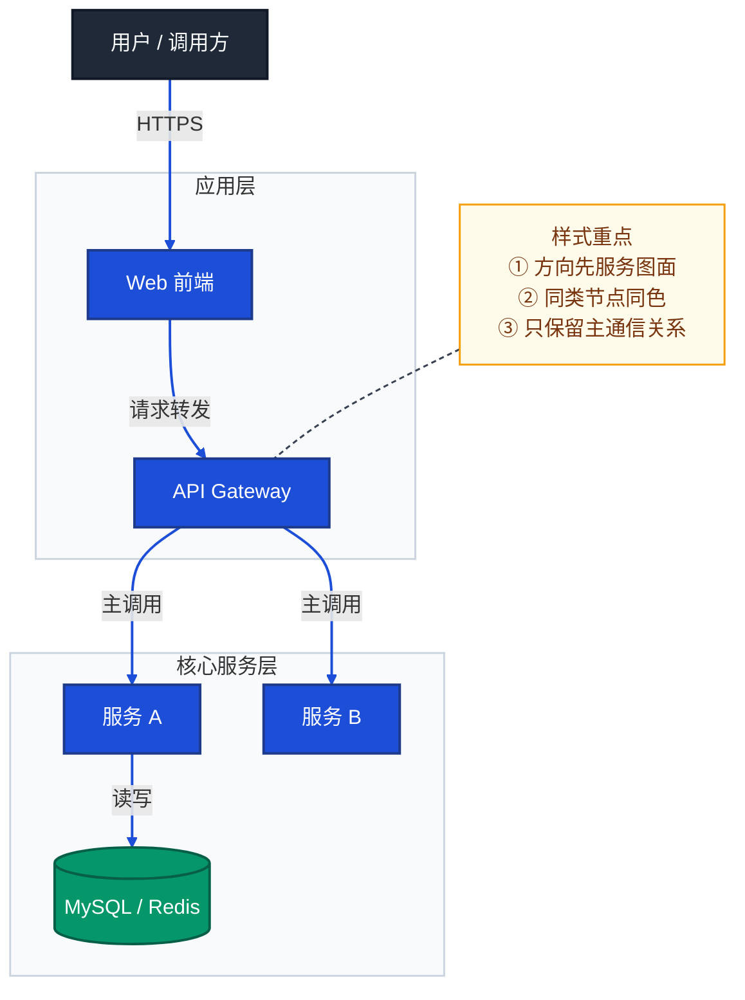
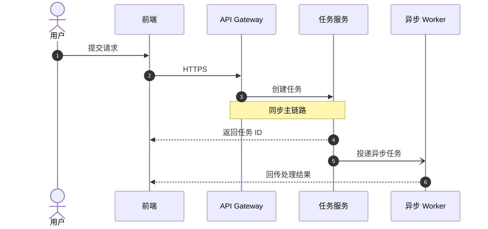
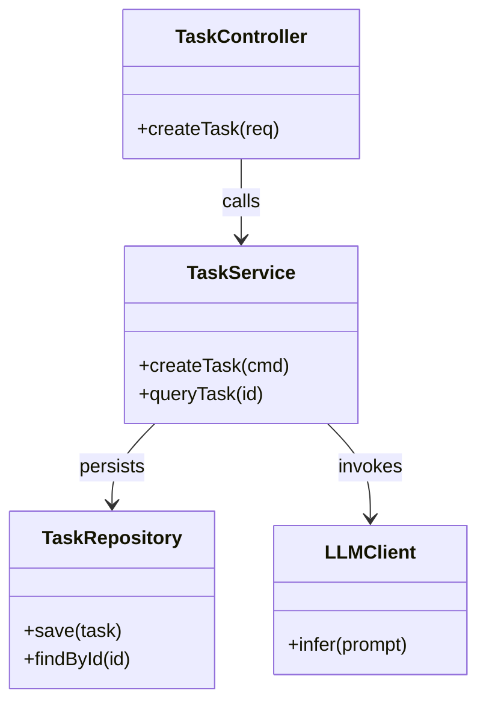
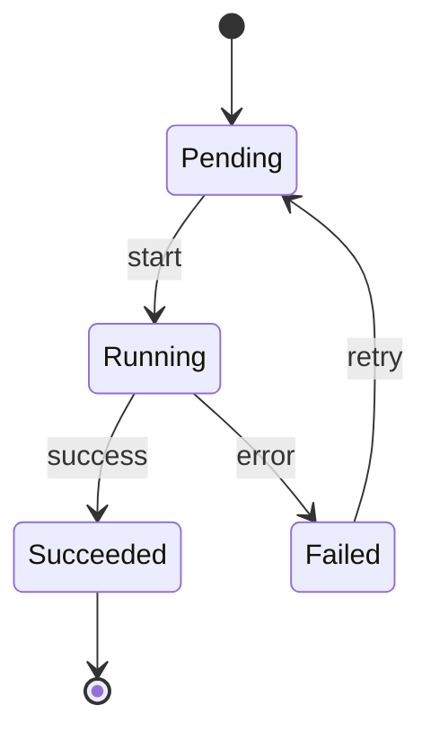
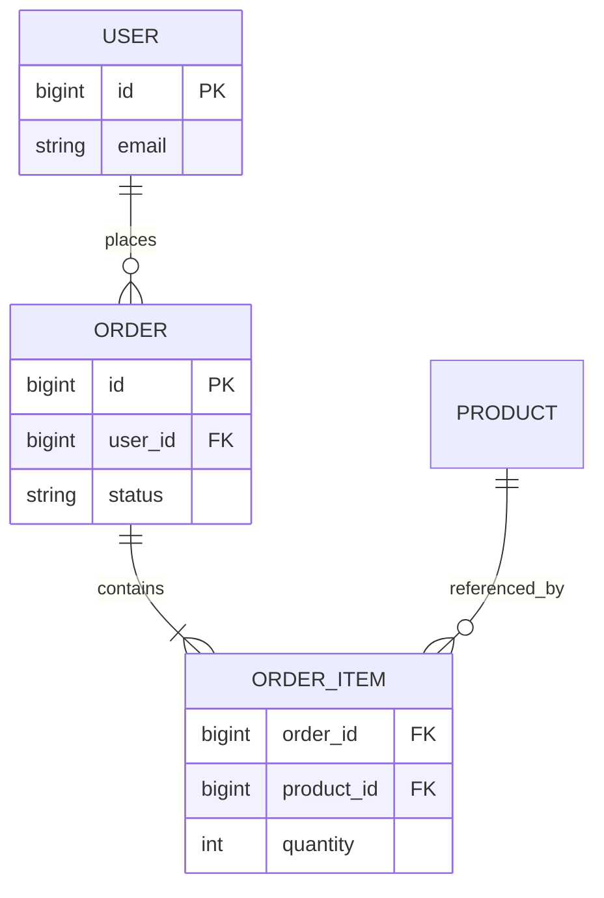
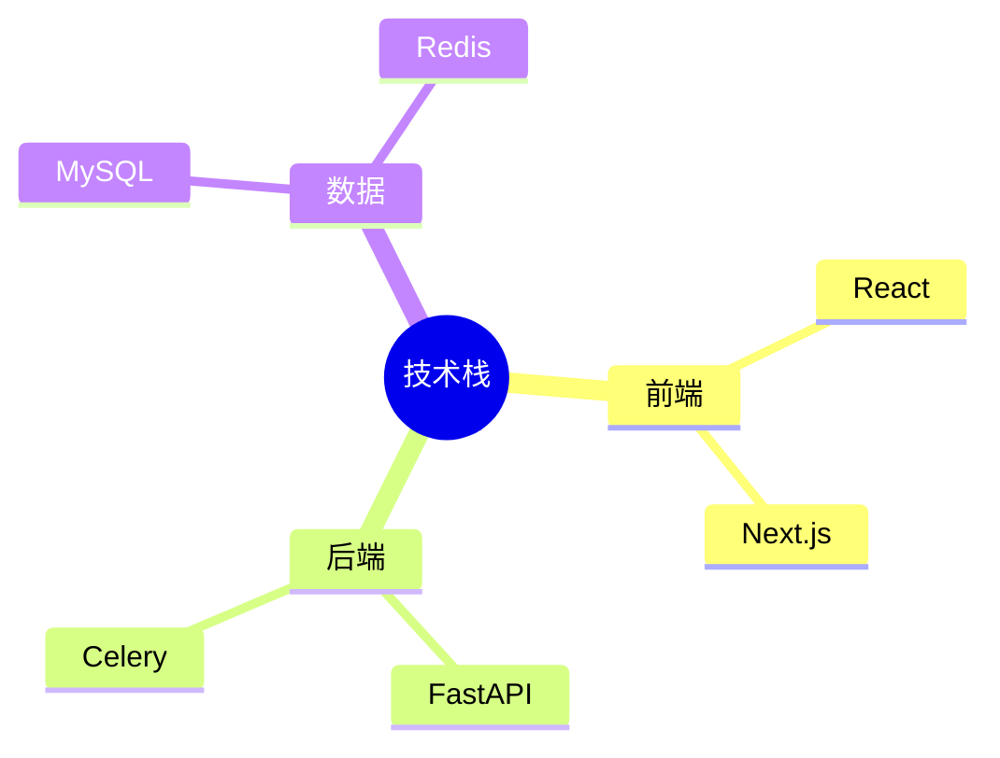
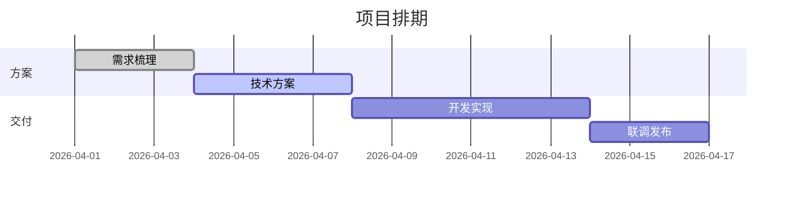
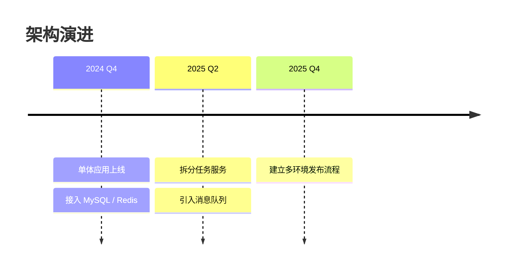

# Mermaid 样式风格速查

> 文档职责：按 Mermaid 语法类型统一维护可复用的样式语言、骨架写法和速查规则。  
> 适用场景：已经确定要画哪一种图，下一步需要快速决定“该用什么 Mermaid 语法、怎么排版、怎么上轻样式”时使用。  
> 阅读目标：把样式从各单图文档中抽离，形成按 Mermaid 类型复用的统一入口。  
> 目标读者：需要维护项目分析出图规范和 Mermaid 风格一致性的人。

## 1. 使用原则

- 图文档负责回答“这张图表达什么、何时使用、不能混入什么”。
- 本文档只回答“用哪种 Mermaid 语法、推荐什么布局、允许哪些轻样式”。
- 同一种 Mermaid 语法可以服务多种图；样式是复用层，不是建模标准本身。
- 单图文档中的样式说明应尽量收敛为一句话或一个短表，详细规则统一回到本文档。

## 2. Mermaid 类型总表

| Mermaid 类型 | 典型适用图 | 主要关注点 |
|--------------|------------|------------|
| `flowchart` | 系统上下文图、整体架构图、接口地图、分层能力结构图、核心组件图、模块依赖图、部署图、构建与发布流程图、核心业务链路图（流程型） | 方向、分组、节点形状、连线语义、`linkStyle` |
| `sequenceDiagram` | 核心业务链路图（时序型） | 参与者数量、同步/异步箭头、`Note`、异常分支 |
| `classDiagram` | 代码图 | 类/接口/实现关系、成员暴露粒度、关系箭头语义 |
| `stateDiagram-v2` | 状态机图 | 状态命名、迁移标签、入口/出口、异常终态 |
| `erDiagram` | 数据模型图 | 实体命名、关系基数、字段粒度、主外键表达 |
| `mindmap` | 技术栈图（总览型） | 根节点、技术域分层、关键词密度 |
| `gantt` | 甘特图 | 时间粒度、阶段分段、依赖、关键路径 |
| `timeline` | 时间线图 | 时间粒度、里程碑密度、阶段标签 |

## 3. `flowchart`

适用：当前优先完整覆盖 `mermaid-A-系统认知层.md` 中使用 `flowchart` 的三类图，即系统架构图、分层能力结构图、端到端流程图。

### 3.1 `flowchart` 下的三种典型图型

| 你真正想看什么 | 在 `flowchart` 下应优先选择 | 视角 | 节点代表 | 箭头代表 | 常用方向 |
|----------------|-----------------------------|------|----------|----------|----------|
| 系统里有哪些服务、组件、存储，它们怎么连接 | 系统架构图 | 静态结构视图 | 服务 / 组件 | 调用 / 部署关系 | `TB` |
| 方案按哪些阶段、能力域或生产环节分层展开 | 分层能力结构图 | 分层总览视图 | 层内并列能力块 | 主线推进关系 | `TB` / `LR` |
| 一个请求或任务从开始到结束怎么同步流转 | 端到端流程图 | 动态流程视图 | 处理步骤 | 数据流转顺序 | `LR` |

常见误判：

- “分了很多层”不一定是系统架构图；如果重点是能力域、阶段组织和总览排布，通常更适合分层能力结构图。
- “有箭头连接”不一定是流程图；如果箭头只表达大阶段主线推进，通常仍然是分层能力结构图。
- “看起来像系统全景”不一定就该画平台分层图；如果重点是服务、组件、存储及连接关系，应优先系统架构图。

### 3.2 `flowchart` 风格速查

| 样式项 | 速查规则 |
|--------|----------|
| 图型先选 | 先判断当前问题更接近“系统怎么组成”“方案如何分层展开”还是“请求怎么走”，再在 `flowchart` 下选系统架构图、分层能力结构图或端到端流程图。 |
| 配色语义 | 按职责或阶段区分颜色：入口/客户端可用深灰（`#1f2937`），平台/编排可用蓝（`#1d4ed8`），生成/核心处理可用青蓝（`#0891b2`）或红（`#dc2626`），治理与编辑可用琥珀（`#d97706`），存储与分发可用绿（`#059669`），注记节点用低饱和暖色（`#fffbeb`）。 |
| 流程方向 | 系统架构图常用 `TB`；端到端流程图常用 `LR`；分层能力结构图按图面选择 `TB` 或 `LR`，但层内统一 `direction LR` 横排。 |
| 分层能力结构图 | 优先表达“层”和“层内并列能力块”；层间只保留主线箭头，不默认补技术调用边。 |
| `subgraph` 分组 | 用 `subgraph` 将同职责节点归组；每个子图对应一个处理层级；`class SubgraphName layerStyle` 统一背景色区分层级。 |
| 起止节点突出 | 端到端流程图中的起始节点和终止节点应使用最高对比度颜色（如 `#1e40af` 深蓝），与中间处理节点形成视觉区分。 |
| 连接线语义 | `-->` 表示同步调用；`-.->` 表示异步调用或可选路径；`==>` 表示关键/强制路径；连接线标签应简明描述数据内容或操作语义。 |
| `linkStyle` 索引精准计数 | `linkStyle N` 按边的声明顺序从 `0` 开始；必须避免 `A & B --> C` 这种隐式展开，并在样式定义前补 `%% 边索引：0-N，共 X 条` 注释强制核对。 |
| 节点形状语义 | `["text"]` 矩形表示服务或处理步骤；`[("text")]` 圆柱体表示持久化存储（DB、向量库、文件等）。 |
| 节点换行 | 换行用 ` `；首行写中文业务名，` ` 后补英文技术名，兼顾可读性和技术精确性。 |
| `NOTE` 注记 | 用 `NOTE -.- 核心节点` 悬浮挂载关键路径说明，与主流程连接线视觉隔离；不要把整段解释塞进主节点。 |
| 中英双语 | 节点文本和连接线标签可适度中英双语，如 `"语义检索 Semantic Search"`，用于兼顾业务语义和技术精确性。 |
| 图面控制 | 分层能力结构图先看“层”，再看层内并列能力块，最后看主线推进；系统架构图不要被能力层误导，端到端流程图不要被静态结构噪声稀释。 |

## 4. `sequenceDiagram`

适用：关键请求如何一步步流转、同步与异步怎么分、哪里会失败或回调。

| 样式项 | 速查规则 |
|--------|----------|
| 编号 | `autonumber` 默认开启，便于在正文中精确引用步骤。 |
| 参与者命名 | 优先使用 `participant 英文ID as 中文名（技术标识）`；英文 ID 保持简短，括号里补技术细节。 |
| 参与者数量 | 优先控制在 `4-6` 个；复杂异步链路可放宽到 `5-8` 个，再长就应拆阶段。 |
| 箭头语义 | `->>` 表示同步调用；`-->>` 表示异步消息、推送或回调；`-)` / `--)` 可用于异步投递。 |
| 阶段注记 | 在每个逻辑阶段开始前使用 `Note over A,B: ① 阶段名`，让读者能把 `autonumber` 步骤和阶段区间对应起来。 |
| 步骤注记 | 关键消息之后可用 `Note over 单参与者: 说明` 补充性能目标、幂等性或约束；注记尽量控制在 1 行。 |
| 分支与循环 | `loop` 表示重复消息；`alt / else` 表示互斥路径；`opt` 表示可选路径；只保留关键分支，不展开所有补偿逻辑。 |
| 文本 | 动作名用动宾结构，如“创建任务”“返回结果”“异步回调”。 |
| 重点信息取舍 | 宁可省略次要字段，也要保留谁发起、谁阻塞、谁异步回推这三类关键信息。 |
| 图型边界 | 时序图只表达跨参与者消息流转；不要混入 `classDef`、`linkStyle`、`subgraph` 这类 `flowchart` 语法。 |
| 拆图原则 | 一条链路同时覆盖“请求接入 + 异步执行 + 回调落库 + 推送前端”时，优先拆成两张阶段图，而不是强行压成一张超长图。 |

## 5. `classDiagram`

适用：代码图、核心类关系、接口与实现关系、分层代码骨架。

| 样式项 | 速查规则 |
|--------|----------|
| 关注层级 | 优先表达类/接口关系，不把完整实现细节搬进图里。 |
| 成员粒度 | 每类优先保留 `1-3` 个关键方法；字段只写理解关系所必需的部分。 |
| 关系语义 | `-->` 依赖；`..|>` 实现；`--|>` 继承；语义要稳定。 |
| 类数量 | 单图控制在 `5-9` 个类；超过后按模块拆图。 |
| 命名 | 类名保持代码真实命名，方法名保持 API 级别，不写局部变量。 |

## 6. `stateDiagram-v2`

适用：任务状态、订单状态、审批流状态、异步作业生命周期。

| 样式项 | 速查规则 |
|--------|----------|
| 状态命名 | 状态名用名词或过去分词，如 `Pending`、`Running`、`Succeeded`。 |
| 迁移标签 | 标签写触发条件或动作，如 `start`、`timeout`、`retry`。 |
| 起止节点 | 必须显式保留 `[*]` 入口；有终态时补 `[*]` 出口。 |
| 图面复杂度 | 单图优先 `5-8` 个状态；太复杂时按主链和异常链拆分。 |
| 说明方式 | 关键规则优先放迁移标签，补充说明才用 `note`。 |

## 7. `erDiagram`

适用：数据模型图、表关系图、核心实体结构图。

| 样式项 | 速查规则 |
|--------|----------|
| 实体命名 | 表或实体名用系统真实名；必要时统一大写或驼峰，但全图一致。 |
| 字段粒度 | 只保留主键、外键和关键业务字段，不把整表字段清单搬进来。 |
| 关系表达 | 优先用 Mermaid 原生基数语法，不手写“1 对多”文本。 |
| 适用边界 | 如果重点是表关系，优先 `erDiagram`；如果重点是数据流或读写路径，不用它。 |

## 8. `mindmap`

适用：技术栈总览、概念域总览、轻量认知图。

| 样式项 | 速查规则 |
|--------|----------|
| 根节点 | 根节点只保留一个中心主题，不要做多中心。 |
| 层级 | 优先控制在 `2-3` 层，超过后可切回 `flowchart`。 |
| 文本长度 | 每个节点尽量短词化，避免整句。 |
| 适用边界 | 适合总览和盘点，不适合表达依赖、流程和时序。 |

## 9. `gantt`

适用：阶段排期、里程碑、依赖、并行计划。

| 样式项 | 速查规则 |
|--------|----------|
| 时间格式 | 统一设置 `dateFormat`，避免读者自行猜测日期格式。 |
| 分段 | 用 `section` 表达阶段，不要把所有任务堆在一个区块里。 |
| 任务数 | 单图优先控制在 `6-12` 个任务，超出应按阶段拆分。 |
| 状态 | `done`、`active`、`crit` 只标关键任务，不要全图乱用强调色。 |

## 10. `timeline`

适用：架构演进、版本里程碑、产品阶段变化。

| 样式项 | 速查规则 |
|--------|----------|
| 时间粒度 | 年、季度、月份三选一，单图保持一致。 |
| 事件密度 | 每个时间点优先 `1-3` 条事件，避免写成长段说明。 |
| 表达目标 | 只回答“何时发生了什么变化”，不解释完整因果链。 |
| 适用边界 | 如果重点是阶段依赖或排期，用 `gantt`；不是 `timeline`。 |

## 11. 使用建议

- 先去 [README.md](./README.md) 判断“该画哪一种图”，再回本文档决定“该用哪种 Mermaid 类型和样式”。
- 如果某张图的样式规则已经能被本文档覆盖，单图文档里只保留最小必要速查，不重复维护完整样式体系。
- 后续新增 Mermaid 类型时，优先先补本文档，再决定是否在单图文档里加局部特例。
