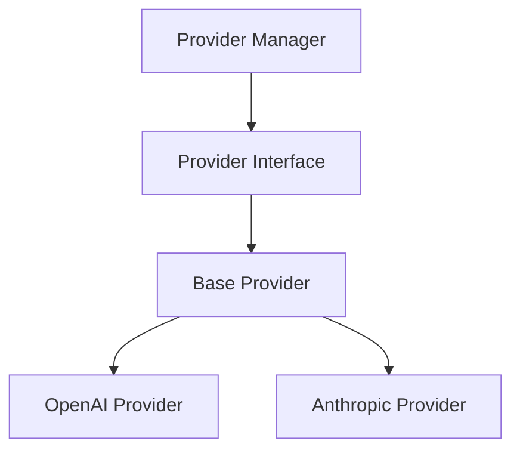
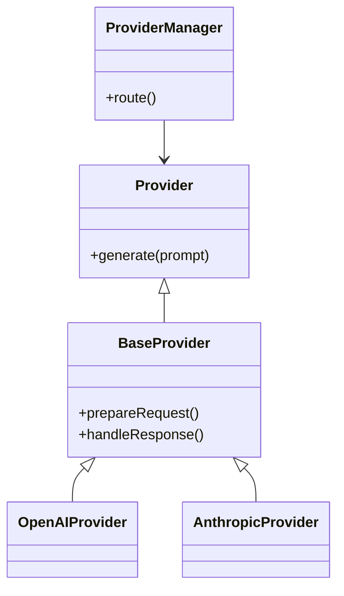

# 代码图

> 文档职责：定义代码图在项目分析中的用途、边界和最小输出要求。
> 适用场景：需要继续深入某个核心组件的代码结构时使用。
> 阅读目标：明确这张图为什么通常不是首轮项目分析的默认图。
> 目标读者：需要做代码深潜、设计分析或二轮专项分析的人。

## 1. 标准定位

- 上位标准：`C4 Model Level 4 / UML Class`
- Mermaid 实现建议：可使用类层级图、模块结构图等近似表达
- 与现有 Mermaid 参考的关系：通常更接近 `B 代码深潜层`

## 2. 这张图回答什么问题

- 某个核心组件内部的代码结构如何组织
- 哪些是类、接口、抽象层和具体实现
- 关键依赖和扩展点在哪里

不回答：

- 整个系统静态全貌
- 项目的主要容器分工
- 关键请求的运行时链路

## 3. 最小出图要求

- 锁定一个核心组件
- 只保留最关键的抽象层和实现层
- 不把整个代码库硬塞进一张图

## 4. 参考图 1：C4 Model Level 4

## 5. 参考图 2：UML Class

## 6. 使用边界

- 对多数项目分析任务来说，这张图是按需补图，不是默认必画
- 如果项目分析目标只是建立全貌，通常停在 C4-L2 就够了
- 如果要解释设计模式、继承关系或核心扩展点，再考虑画这张图
