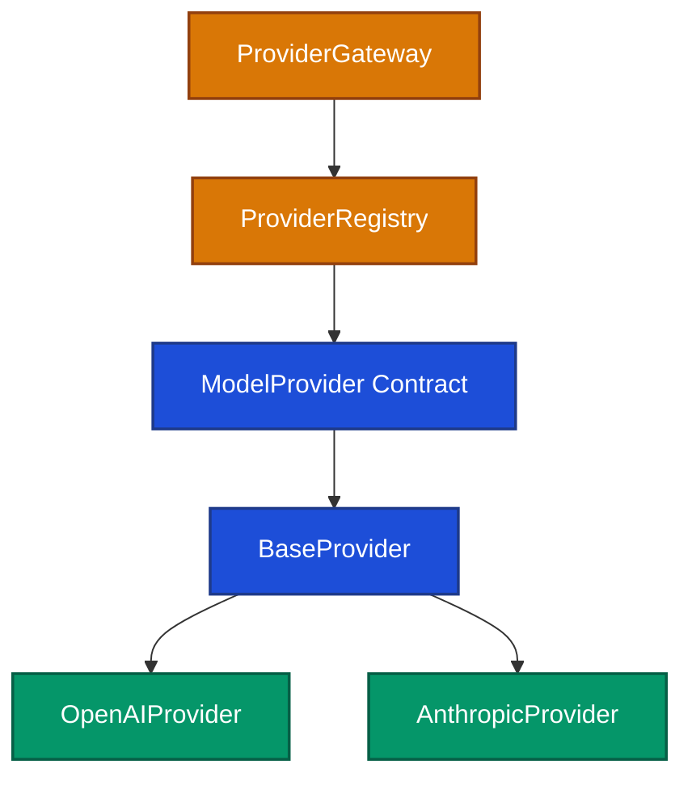
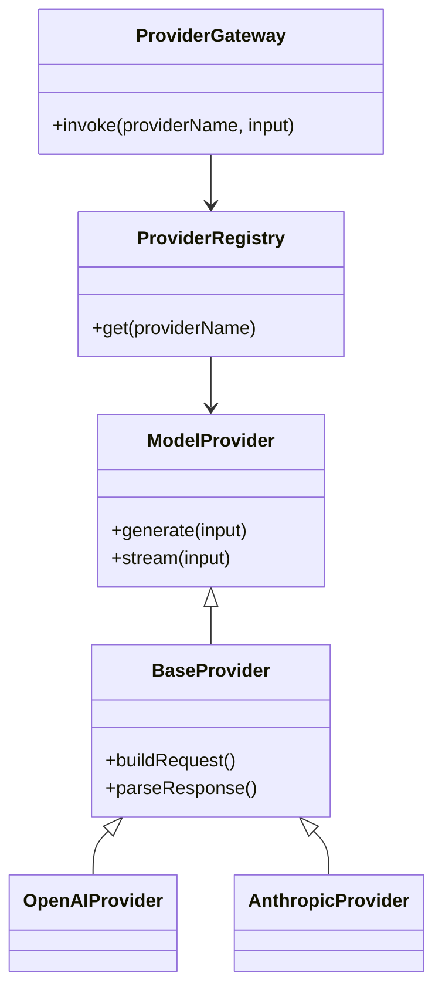

# 代码图

> 文档职责：定义代码图的用途、边界、必要信息要素和参考图。
> 适用场景：需要继续深入某个核心组件的代码结构时使用。
> 阅读目标：判断何时使用这张图，并理解它与核心组件图、数据模型图的边界。
> 目标读者：需要做代码深潜或设计分析的人。

## 1. 标准定位

- 上位标准：`C4 Model Level 4 / UML Class`
- Mermaid 常见写法：`flowchart` / `classDiagram`

## 2. 这张图回答什么问题

- 某个核心组件内部的代码结构如何组织
- 哪些是类、接口、抽象层和具体实现
- 关键依赖和扩展点在哪里

不回答：

- 整个系统静态全貌
- 项目的主要容器分工
- 关键请求的运行时链路

## 3. 必要信息要素

- 锁定一个核心组件
- 只保留最关键的抽象层和实现层
- 不把整个代码库硬塞进一张图

## 4. 节点表达规则

- 应写：类、接口、抽象基类、实现类、代码模块及关键依赖关系。
- 不应写：外部用户、运行容器、业务流程步骤、部署区域或数据实体关系。
- 禁止混入：系统级服务分层、接口入口、运行时时序。

## 5. 参考图 1：代码骨架图

## 6. 参考图 2：UML Class

## 7. 使用边界

- 对多数项目分析任务而言，该图属于按需补充图，不属于默认首批图。
- 如果分析目标只是建立项目全貌，通常停在整体架构图即可。
- 如果需要解释设计模式、继承关系或扩展点，再使用该图。
