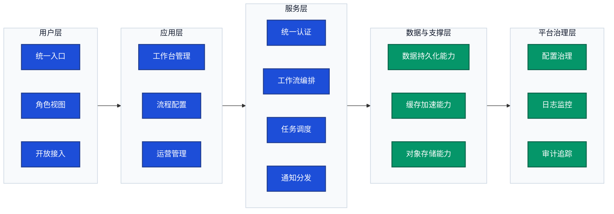
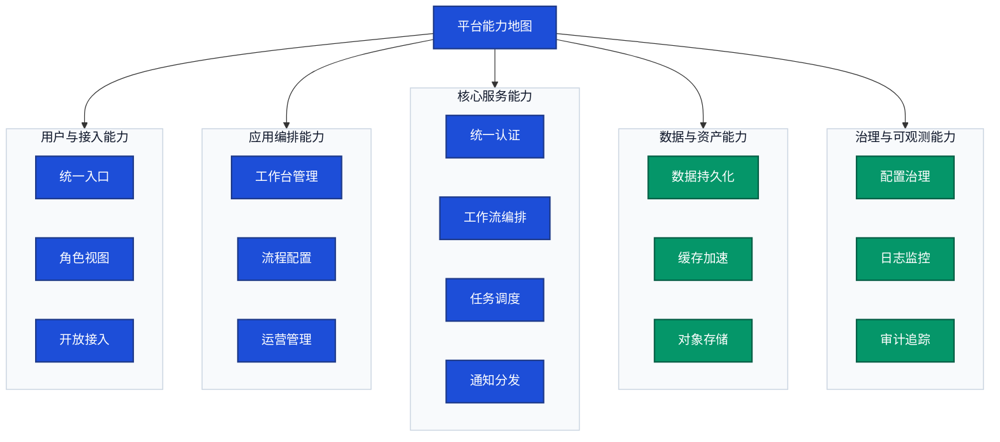

# 分层能力结构图

> 文档职责：定义分层能力结构图的用途、边界、必要信息要素和参考图。
> 适用场景：需要从能力视角说明系统分层和模块归属时使用。
> 阅读目标：判断何时使用这张图，并掌握本图的节点表达规则和适用边界。
> 目标读者：需要讲清系统能力全貌和分层边界的人。

## 1. 标准定位

- 上位标准：`Layered Capability Map`
- Mermaid 常见写法：`flowchart`

## 2. 这张图回答什么问题

- 系统按哪些层次承载核心能力
- 每层有哪些关键能力
- 能力分别归属哪些模块或平台
- 哪些能力面向用户，哪些能力属于底层支撑与治理

不回答：

- 具体服务调用时序
- 代码类和接口结构
- 部署节点和网络拓扑

## 3. 必要信息要素

- 4-6 层能力分层
- 每层保留 3-5 项关键能力
- 能看出上下层支撑关系

## 4. 节点表达规则

- 应写：能力、职责、功能模块及能力归属层次。
- 不应写：框架、中间件、数据库、平台工具、服务实例或调用步骤。
- 禁止混入：技术组件清单、部署层级、运行单元拓扑。
- 如果采用分层表达，“层”只表示能力层，不表示技术部署层或运行单元层。

## 5. 最佳实践速查

- 分层原则：优先按用户层、应用层、服务层、数据与支撑层、治理层这类能力层次组织；不要把技术组件误塞进能力层。
- 层内表达：每层保留 3-5 个并列能力块，名称尽量是能力词或职责词，不用技术名和服务实例名。
- 图面方向：需要强调阶段推进时用 `LR`；需要表达总览能力地图时用 `TB`；层内统一 `direction LR`。
- 连线控制：层间只保留主支撑关系，不展开技术调用边；能力图不是调用拓扑图。
- 颜色语义：核心业务能力同色，支撑与治理能力可用第二颜色；同层背景尽量统一浅色。
- PPT 适配：优先保证标题、层级和主线清晰，适合汇报场景的一页展示。

## 6. 参考图 1：横向能力分层图

## 7. 参考图 2：纵向能力地图

## 8. 使用边界

- 该图用于展示能力分层，不用于展示服务通信关系。
- 该图适合用于汇报、方案宣讲和 PPT 场景下的能力全貌表达。
- 如果重点转为技术组件清单和分类，不属于本图范围。
- 如果重点转为系统内部容器分工或技术分层，不属于本图范围。
