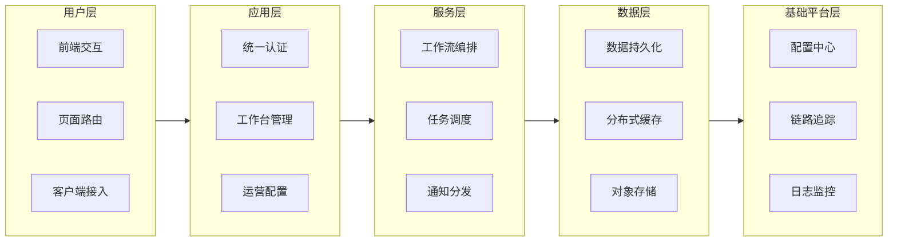

# 分层能力结构图

> 文档职责：定义分层能力结构图在项目分析中的用途、边界和最小输出要求。
> 适用场景：需要从能力视角说明系统分层和模块归属时使用。
> 阅读目标：区分“能力分层”与“技术栈分类”或“容器架构”的差异。
> 目标读者：需要讲清系统能力全貌和分层边界的人。

## 1. 标准定位

- 上位标准：`Layered Capability Map`
- Mermaid 实现建议：优先使用 `flowchart`
- 与现有 Mermaid 参考的关系：更接近能力地图，不等同于 C4 容器图

## 2. 这张图回答什么问题

- 系统按哪些层次承载核心能力
- 每层有哪些关键能力
- 能力分别归属哪些模块或平台

不回答：

- 具体服务调用时序
- 代码类和接口结构
- 部署节点和网络拓扑

## 3. 最小出图要求

- 4-6 层能力分层
- 每层保留 3-5 项关键能力
- 能看出上下层支撑关系

## 4. 标准示例

## 5. 使用边界

- 这张图讲“能力怎么分层”，不讲“服务怎么通信”
- 如果重点是技术选型清单，应改画技术栈图
- 如果重点是系统内部容器分工，应改画整体架构图
