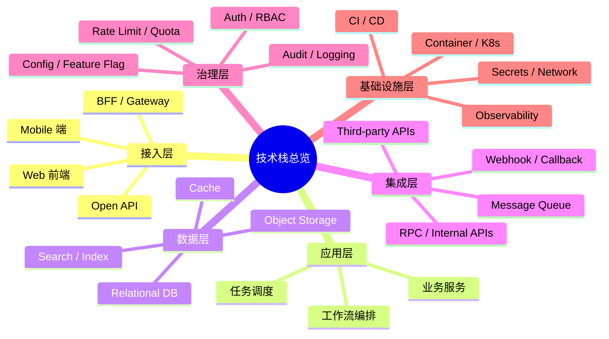

# 技术栈图

> 文档职责：定义技术栈与模块地图在项目分析中的用途、边界和最小输出要求。
> 适用场景：需要快速建立“这个项目由哪些技术域、模块域、能力域组成”的总体认知时使用。
> 阅读目标：区分这张图和 C4 容器图、部署视图、数据视图的职责差异。
> 目标读者：希望先看结构分类，再决定深入方向的读者。

## 1. 标准定位

- 上位标准：知识地图 / 能力地图 / 模块分层图
- Mermaid 实现建议：优先使用 `mindmap`
- 与现有 Mermaid 参考的关系：可映射到 `E 知识结构层`

## 2. 这张图回答什么问题

- 技术栈由哪些部分构成
- 项目主要模块如何归类
- 哪些是接入层、应用层、数据层、基础设施层

不回答：

- 模块之间的详细调用关系
- 请求顺序
- 部署位置

## 3. 最小出图要求

- 1 个中心主题
- 4-8 个一级分类
- 每个一级分类下只保留最关键的叶子节点

## 4. 标准示例

## 5. 使用边界

- 这张图适合作为“项目分析入口总览图”
- 如果需要讲依赖关系，优先用 C4-L2 或专项依赖图
- 如果需要讲时间和交互，优先用动态视图
