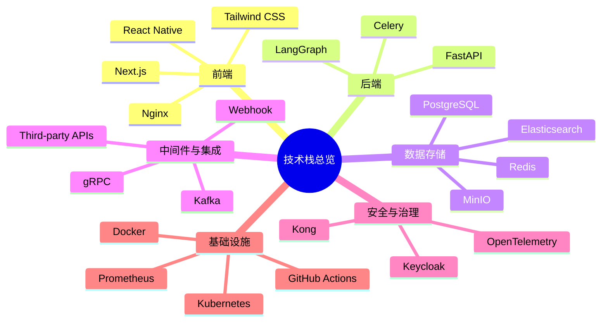
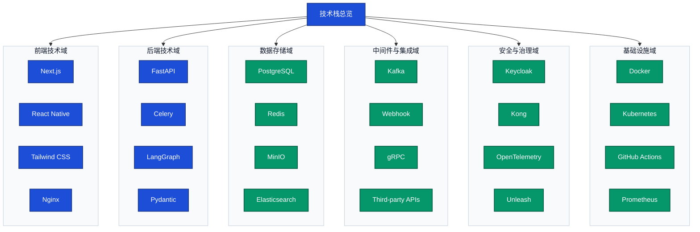

# 技术栈图

> 文档职责：定义技术栈图的用途、边界、最小出图要求和参考图。
> 适用场景：需要快速建立“项目采用了哪些技术组件、这些组件属于哪些技术域”的总体认知时使用。
> 阅读目标：判断何时使用这张图，并掌握本图的节点表达规则和适用边界。
> 目标读者：希望先看技术全貌再决定深入方向的人。

## 1. 标准定位

- 上位标准：`Tech Stack Diagram`
- Mermaid 常见写法：`mindmap` / `flowchart`

## 2. 这张图回答什么问题

- 技术栈由哪些部分构成
- 采用了哪些核心技术组件
- 这些技术组件分别属于哪些技术域

不回答：

- 模块之间的详细调用关系
- 请求顺序
- 部署位置
- 系统按能力如何分层

## 3. 最小出图要求

- 1 个中心主题
- 4-8 个一级分类
- 每个一级分类下只保留最关键的技术项

## 4. 节点表达规则

- 应写：技术组件、框架、语言、数据库、中间件、平台工具及技术域分类。
- 不应写：业务能力、职责名称、功能模块、服务调用步骤或部署拓扑。
- 禁止混入：能力分层节点、运行时链路节点、系统角色节点。

## 5. 最佳实践速查

- 分类原则：优先按前端、后端、数据存储、中间件与集成、安全治理、基础设施等技术域分类，不再使用易与能力图混淆的“应用层 / 服务层”表达。
- 节点命名：叶子节点优先写具体技术名、框架名、产品名；不要写能力词、业务词或流程动作。
- 图型选择：需要快速总览时优先 `mindmap`；需要做汇报型展示时可用 `flowchart` 做技术域分组。
- 图面控制：一级分类控制在 4-8 个；每个分类只保留最核心技术项，避免技术清单失控。
- 颜色语义：技术域背景统一浅色；核心技术组件与支撑组件可分两类配色，但不要每个技术项都换色。
- 说明边界：技术栈图只回答“用了什么技术”，不回答“这些能力怎么协作”。

## 6. 参考图 1：技术域思维导图

这张图的重点是：

- 中心只有一个主题：`技术栈总览`
- 第一层是技术域分类，不是能力层级
- 叶子节点是技术项，不是业务步骤

## 7. 参考图 2：技术域分类图

## 8. 使用边界

- 该图适合作为项目分析的入口总览图。
- 如果需要展示依赖关系，应改用整体架构图或模块依赖图。
- 如果需要展示时间顺序或交互过程，应改用核心业务链路图或状态机图。
- 如果需要展示系统能力归属和职责分层，应改用分层能力结构图。
