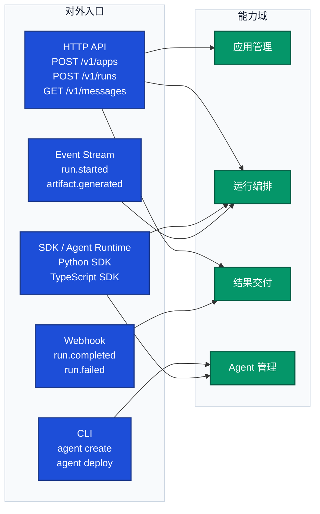

# 接口地图

> 文档职责：定义接口地图的用途、边界、必要信息要素和参考图。
> 适用场景：需要快速说明系统对外提供哪些 API、CLI、事件入口或 webhook 时使用。
> 阅读目标：判断何时使用这张图，并掌握本图的节点表达规则和适用边界。
> 目标读者：需要快速理解系统对外能力面的人。

## 1. 标准定位

- 上位标准：`Interface Map / API Surface Map`
- Mermaid 常见写法：`flowchart`

## 2. 这张图回答什么问题

- 系统对外暴露了哪些入口
- 哪些入口属于 HTTP API、CLI、Webhook、消息事件
- 不同入口分别对应哪些核心能力域

不回答：

- 系统内部容器如何拆分
- 单条业务链路如何逐步流转
- 数据实体之间如何关联

## 3. 必要信息要素

- 1 个系统主体
- 3-8 个对外入口
- 明确入口类型或分组
- 能看出入口与能力域的映射关系

## 4. 节点表达规则

- 应写：HTTP API、CLI、Webhook、消息事件、SDK 入口及其映射的能力域。
- 不应写：数据库、中间件、内部组件实现、容器拆分或部署区域。
- 禁止混入：运行时顺序、实体关系、内部服务依赖。

## 5. 参考图

## 6. 使用边界

- 该图用于展示系统对外接口面，不用于展示系统内部结构。
- 如果重点是内部容器和服务划分，应改用整体架构图。
- 如果重点是接口调用在运行时如何流转，应改用核心业务链路图。
