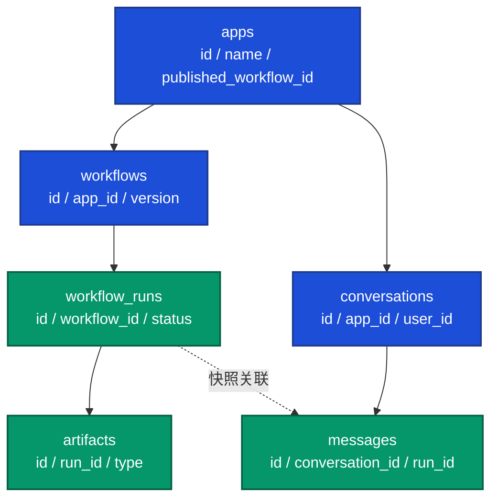
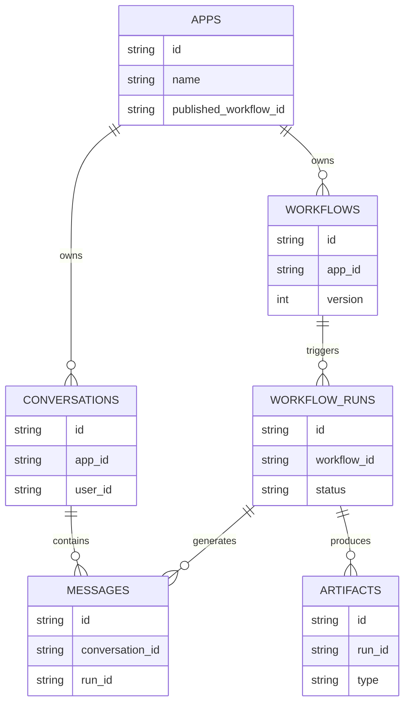

# 数据模型图

> 文档职责：定义数据模型图的用途、边界、最小出图要求和参考图。
> 适用场景：需要讲清核心实体、表关系或数据快照设计时使用。
> 阅读目标：判断何时使用这张图，并理解它与整体架构图、代码图的边界。
> 目标读者：需要理解数据结构设计的人。

## 1. 标准定位

- 上位标准：`Data Model / ERD`
- Mermaid 常见写法：`flowchart` / `erDiagram`

## 2. 这张图回答什么问题

- 核心实体或表有哪些
- 它们如何关联
- 哪些字段承担关键引用或快照作用

不回答：

- 请求顺序
- 服务调用关系
- 代码抽象层级

## 3. 最小出图要求

- 3-7 个核心实体
- 明确主从关系或引用关系
- 只保留关键字段，不展开全字段清单

## 4. 节点表达规则

- 应写：实体、表、关键字段、引用关系、快照关系及核心约束。
- 不应写：流程步骤、服务角色、运行环境区域、接口入口或代码类结构。
- 禁止混入：请求顺序、部署边界、系统角色关系。

## 5. 参考图 1：Data Model

## 6. 参考图 2：ERD

## 7. 使用边界

- 该图用于展示数据关系，不用于展示调用关系。
- 如果重点是代码抽象和继承关系，应改用代码图。
- 如果项目分析仍处于全貌阶段，该图通常不属于首批输出图。
