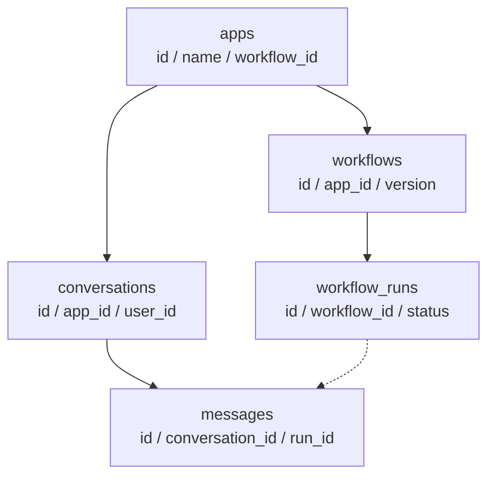

# 数据模型图

> 文档职责：定义数据模型图在项目分析中的用途、边界和最小输出要求。
> 适用场景：需要讲清核心实体、表关系或数据快照设计时使用。
> 阅读目标：区分这张图与 C4 静态结构图的职责边界。
> 目标读者：需要深入理解数据结构设计的人。

## 1. 标准定位

- 上位标准：`Data Model / ERD`
- Mermaid 实现建议：使用 `flowchart` 做简化关系表达
- 与现有 Mermaid 参考的关系：可映射到 `B 代码深潜层`

## 2. 这张图回答什么问题

- 核心实体或表有哪些
- 它们如何关联
- 哪些字段承担关键引用或快照作用

不回答：

- 请求顺序
- 服务调用关系
- 代码抽象层级

## 3. 最小出图要求

- 3-7 个核心实体
- 明确主从关系或引用关系
- 只保留关键字段，不展开全字段清单

## 4. 参考图 1：Data Model

## 5. 参考图 2：ERD

```mermaid
erDiagram
    APPS ||--o{ WORKFLOWS : owns
    APPS ||--o{ CONVERSATIONS : owns
    WORKFLOWS ||--o{ WORKFLOW_RUNS : triggers
    CONVERSATIONS ||--o{ MESSAGES : contains
    WORKFLOW_RUNS ||--o{ MESSAGES : generates

    APPS {
      string id
      string name
      string workflow_id
    }
    WORKFLOWS {
      string id
      string app_id
      int version
    }
    WORKFLOW_RUNS {
      string id
      string workflow_id
      string status
    }
    CONVERSATIONS {
      string id
      string app_id
      string user_id
    }
    MESSAGES {
      string id
      string conversation_id
      string run_id
    }
```

## 6. 使用边界

- 这张图只做数据关系，不做调用关系
- 如果重点是代码抽象和继承关系，应改画 C4-L4 或类层级图
- 如果项目分析还停留在全貌阶段，这张图通常不是第一批必出图
