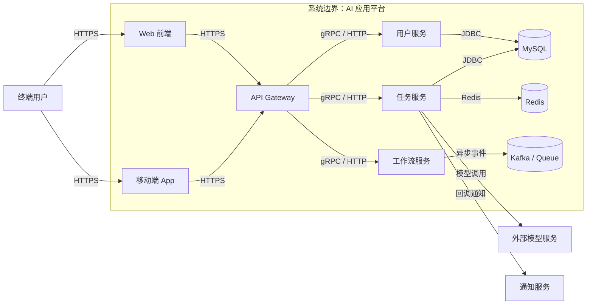

# 整体架构图

> 文档职责：定义 C4 Level 2 在项目分析中的用途、边界和最小输出要求。
> 适用场景：已经知道系统上下文，下一步要回答“系统内部有哪些主要容器/服务/存储”时使用。
> 阅读目标：明确这张图和上下文图、部署图、动态视图的边界。
> 目标读者：需要构建项目全貌图谱的人。

## 1. 标准定位

- 上位标准：`C4 Model Level 2 (Container Diagram)`
- Mermaid 实现建议：优先使用 `flowchart`
- 与现有 Mermaid 参考的关系：可映射到 `A 系统认知层`

## 2. 这张图回答什么问题

- 系统内部有哪些主要运行单元
- 容器之间如何通信
- 哪些是应用、哪些是存储、哪些是网关或异步中间件

不回答：

- 单个服务内部组件怎么拆
- 请求在每一步的详细交互顺序
- 真实机器或 K8s 拓扑如何部署

## 3. 最小出图要求

- 前端 / 接入层
- 2-6 个主要容器或服务
- 1-3 个核心存储或中间件
- 必要的外部依赖

## 4. 标准示例

## 5. 使用边界

- 这是项目分析中的“系统内部全貌图”
- 如果重点变成“关键请求一步步怎么走”，应切换到动态视图
- 如果重点变成“某个核心服务内部怎么拆”，应切换到 C4-L3
