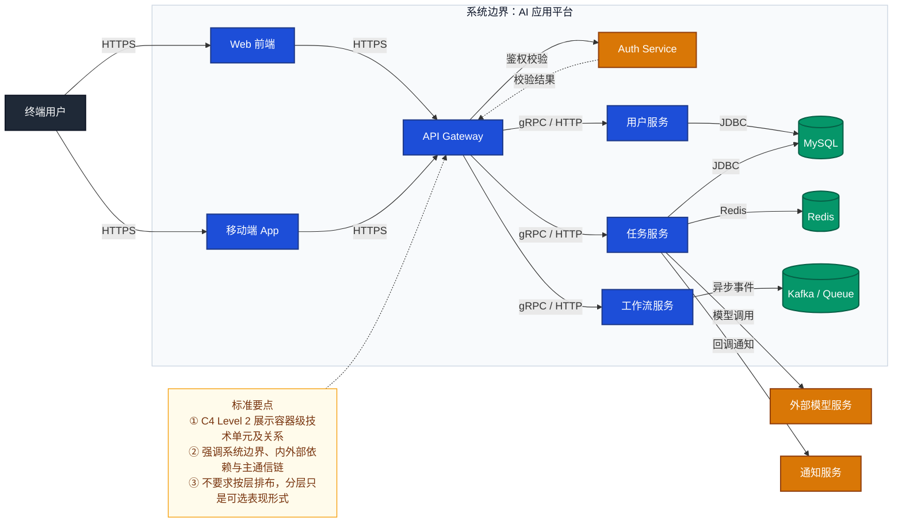
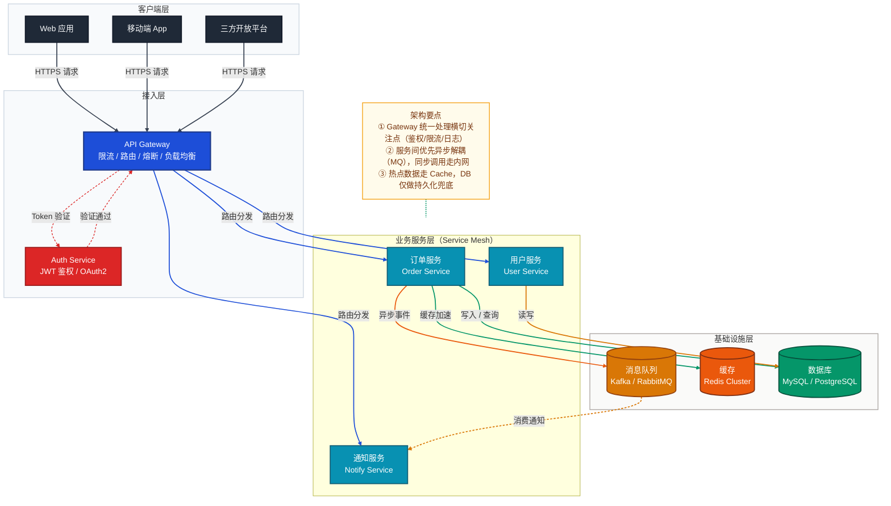

# 整体架构图

> 文档职责：定义整体架构图的用途、边界、最小出图要求和参考图。
> 适用场景：已经知道系统上下文，下一步要回答“系统内部有哪些主要容器、服务和存储”时使用。
> 阅读目标：判断何时使用这张图，并理解它与系统上下文图、部署图、核心组件图的边界。
> 目标读者：需要构建项目全貌图谱的人。

## 1. 标准定位

- 上位标准：`C4 Model Level 2`
- Mermaid 常见写法：`flowchart`

## 2. 这张图回答什么问题

- 系统内部有哪些主要运行单元
- 容器之间如何通信
- 哪些是应用、哪些是存储、哪些是网关或异步中间件
- 当需要按层讲清技术结构时，是否可以采用分层架构型表达

不回答：

- 单个服务内部组件怎么拆
- 请求在每一步的详细交互顺序
- 真实机器或 K8s 拓扑如何部署

## 3. 最小出图要求

- 前端 / 接入层
- 2-6 个主要容器或服务
- 1-3 个核心存储或中间件
- 必要的外部依赖

## 4. 节点表达规则

- 应写：前端、网关、服务、存储、中间件、外部依赖等技术单元及其主通信关系。
- 不应写：用户角色、能力名称、代码类结构、数据库字段或逐步流程动作。
- 禁止混入：能力分层节点、运行时步骤、部署区域或主机级拓扑。
- 如果采用分层架构型，“层”只表示技术结构层，不表示能力层。

## 5. 最佳实践速查

> 引入自 `Mermaid作图规范参考/references/mermaid-A-系统认知层.md` 的系统认知层最佳实践，并按整体架构图场景收敛。

| 设计原则 | 说明 |
|----------|------|
| **配色语义** | 入口/客户端可用深灰（`#1f2937`），网关与平台编排可用蓝（`#1d4ed8`），核心服务可用青蓝（`#0891b2`），数据与中间件可用绿（`#059669`）或橙（`#d97706`），注记节点用低饱和暖色（`#fffbeb`）；同类节点同色，不要一节点一色。 |
| **流程方向** | 标准 `C4 Model Level 2` 容器图常用 `LR` 或 `TB`；分层架构型常用 `TB`，且层内统一 `direction LR` 横排。方向服务于图面清晰度，不是标准定义的一部分。 |
| **分组方式** | 容器图优先按系统边界内外、服务、存储、外部依赖分组；分层架构型可按接入层、服务层、数据与中间件层分组；不要把部署区域和技术结构层混在一张图里。 |
| **分层 `subgraph`** | 用 `subgraph` 将同职责节点归组；每个子图只表达一个结构层级；`class SubgraphName layerStyle` 统一背景色，帮助读者识别层次。 |
| **连接线语义** | `-->` 表示主同步调用；`-.->` 表示异步事件、弱依赖或鉴权回跳；连接线标签只写简明协议或动作语义，如 `HTTPS`、`JDBC`、`异步事件`。 |
| **`linkStyle` 索引精准计数** | `linkStyle N` 按边的声明顺序从 `0` 开始编号；索引越界会导致渲染失败。凡使用 `linkStyle` 时，避免 `A & B --> C` 这种隐式展开写法，并在样式定义前补 `%% 边索引：0-N，共 X 条` 注释。 |
| **节点形状语义** | `["text"]` 矩形表示前端、网关、服务等运行单元；`[("text")]` 圆柱体表示数据库、对象存储、消息队列、缓存等持久化或中间件资源。 |
| **节点换行** | 换行统一使用 ` ` 或 ` `；首行优先写中文业务名，需要补技术精确性时再在下一行写英文或实现说明。 |
| **NOTE 注记** | 用 `NOTE` 节点补充边界、主链或阅读提示，采用 `NOTE -.- 核心节点` 的悬挂方式；不要把大段解释塞进节点正文。 |
| **图面控制** | 只保留主通信关系，不展开低价值辅助边；单图节点数量优先控制在 `8-14` 个之间，超出后应拆图或下钻到组件图/链路图。 |

## 6. 参考图 1：C4 Model Level 2 标准容器图

## 7. 参考图 2：分层架构型

> 说明：参考图 1 是 `C4 Model Level 2` 的标准容器表达；参考图 2 是在同一信息密度下采用“分层架构”方式组织图面，属于可选表现，不是 C4 Level 2 的定义本身。

## 8. 使用边界

- 该图用于展示系统内部的整体结构，不用于展示运行时顺序。
- 该图允许采用容器连接型或分层架构型，两者都属于整体架构图。
- 如果重点转为关键请求的逐步流转，应改用核心业务链路图。
- 如果重点转为单个核心服务的内部拆分，应改用核心组件图。
