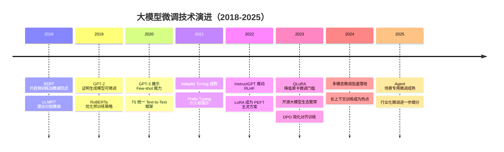

# 时间线图

> 文档职责：定义时间线图的用途、边界、必要信息要素和参考图。
> 适用场景：需要说明产品、技术或架构演进脉络时使用。
> 阅读目标：判断何时使用这张图，并理解它与甘特图、整体架构图的边界。
> 目标读者：需要表达演进脉络和关键节点的人。

## 1. 标准定位

- 上位标准：`Timeline`
- Mermaid 常见写法：`timeline`

## 2. 这张图回答什么问题

- 系统经历了哪些阶段性演进
- 每个阶段引入了什么关键能力
- 重要节点之间的先后关系是什么

不回答：

- 当前系统内部模块如何依赖
- 请求链路如何流转
- 具体排期和任务工期

## 3. 必要信息要素

- 4-8 个时间节点
- 每个节点只保留 1-2 个关键信息
- 能看出清晰演进主线

## 4. 节点表达规则

- 应写：时间点、里程碑事件、阶段性变化及演进节点。
- 不应写：系统组件、接口路径、数据库字段、部署区域或调用关系。
- 禁止混入：任务依赖、系统拓扑、实体关系。

## 5. 参考图

## 6. 使用边界

- 该图用于展示演进过程，不用于展示当前结构全貌。
- 如果需要表达排期，应改用甘特图。
- 如果需要表达当前架构，应改用整体架构图。
