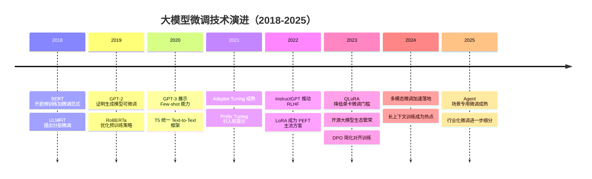

# 时间线图

> 文档职责：定义时间线图在项目分析中的用途、边界和最小输出要求。
> 适用场景：需要说明产品、技术或架构演进脉络时使用。
> 阅读目标：区分“演进节点”与“项目排期”的不同。
> 目标读者：需要表达版本演进和关键里程碑的人。

## 1. 标准定位

- 上位标准：`Timeline`
- Mermaid 实现建议：使用 `timeline`
- 与现有 Mermaid 参考的关系：更接近演进视图，不属于系统静态结构主图

## 2. 这张图回答什么问题

- 系统经历了哪些阶段性演进
- 每个阶段引入了什么关键能力
- 重要节点之间的先后关系是什么

不回答：

- 当前系统内部模块如何依赖
- 请求链路如何流转
- 具体排期和任务工期

## 3. 最小出图要求

- 4-8 个时间节点
- 每个节点只保留 1-2 个关键信息
- 能看出清晰演进主线

## 4. 标准示例

## 5. 使用边界

- 这张图讲演进过程，不讲当前结构全貌
- 如果需要表达排期，应改画甘特图
- 如果需要表达当前架构，应改画整体架构图
