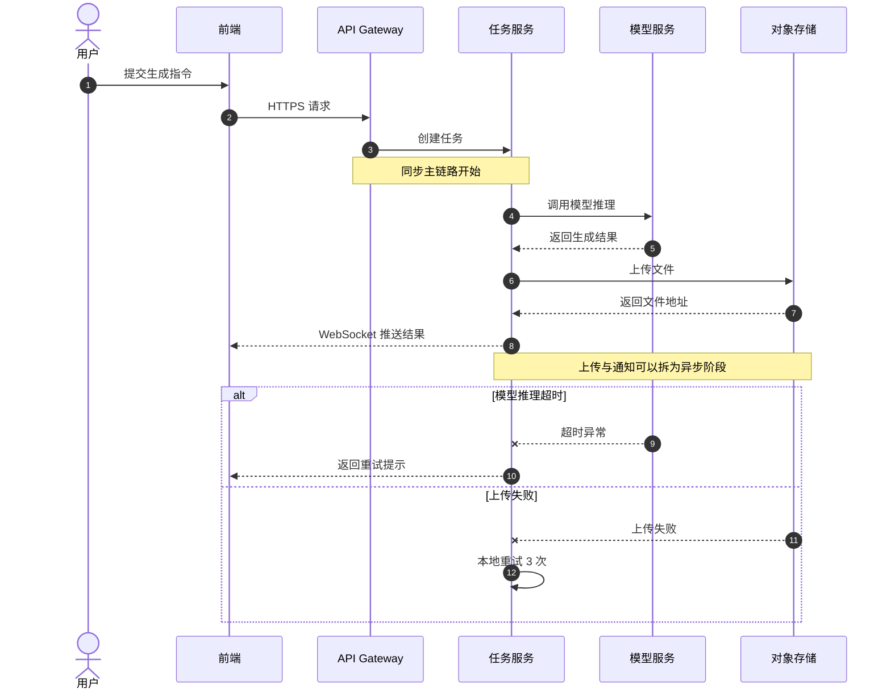
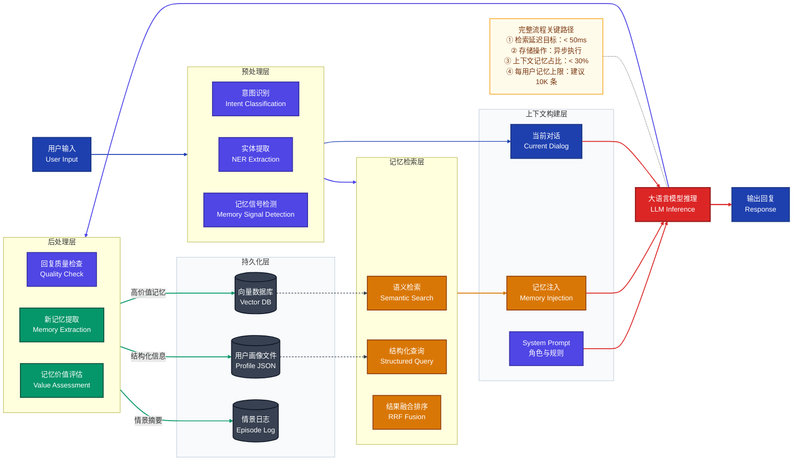

# 核心业务链路图

> 文档职责：定义核心业务链路图的用途、边界、必要信息要素和参考图。
> 适用场景：需要讲清一个关键请求如何跨组件流转，尤其涉及同步或异步协作时使用。
> 阅读目标：判断何时使用这张图，并理解它与整体架构图、状态机图的边界。
> 目标读者：需要把关键链路讲清楚的人。

## 1. 标准定位

- 上位标准：`UML Sequence / Flow Diagram`
- Mermaid 常见写法：`sequenceDiagram` / `flowchart`

## 2. 这张图回答什么问题

- 一个关键请求如何跨组件流转
- 谁发起，谁等待，谁异步回调
- 哪些步骤是同步，哪些步骤是异步

不回答：

- 系统内部所有容器的静态全貌
- 数据表之间的关系
- 部署拓扑

## 3. 必要信息要素

- 1 个发起方
- 3-6 个核心参与者
- 1 条完整关键链路
- 必要时包含 1 个异常分支或异步回调

## 4. 节点表达规则

- 应写：参与者、服务节点、流程步骤、关键动作及有限异常分支。
- 不应写：数据库字段、代码类名、静态部署区域或与主链路无关的旁支细节。
- 禁止混入：系统静态结构全貌、实体关系图、主机或网络拓扑。

## 5. 最佳实践速查

- 主链原则：一张图只保留一条主链路；异常分支控制在 1-2 条，避免把所有补偿逻辑都塞进去。
- 分阶段表达：流程图优先按“接入 / 编排 / 推理 / 后处理 / 交付”这类阶段分组，不按技术部署层分组。
- 颜色语义：入口与用户相关节点用深色，处理流程用蓝色，推理或核心执行用红色，结果与存储用绿色，风险节点用红色或虚线强调。
- 虚线规则：虚线只用于失败、异步、重试、回调或弱关联关系；主流程一律走实线。
- 时序图规则：`autonumber` 必开；参与者优先控制在 4-6 个；`Note` 只标关键断点，不做长段解释。
- 图面控制：流程图优先让读者一眼看清起点、主干、终点，再补异常分支和注记。

## 6. 参考图 1：UML Sequence

## 7. 参考图 2：端到端流程图

## 8. 使用边界

- 该图用于展示关键链路，不用于展示系统静态结构全貌。
- 单张图应只覆盖一条主链路。
- 如果重点不是时序或流程，而是结构分层，应改用整体架构图。
