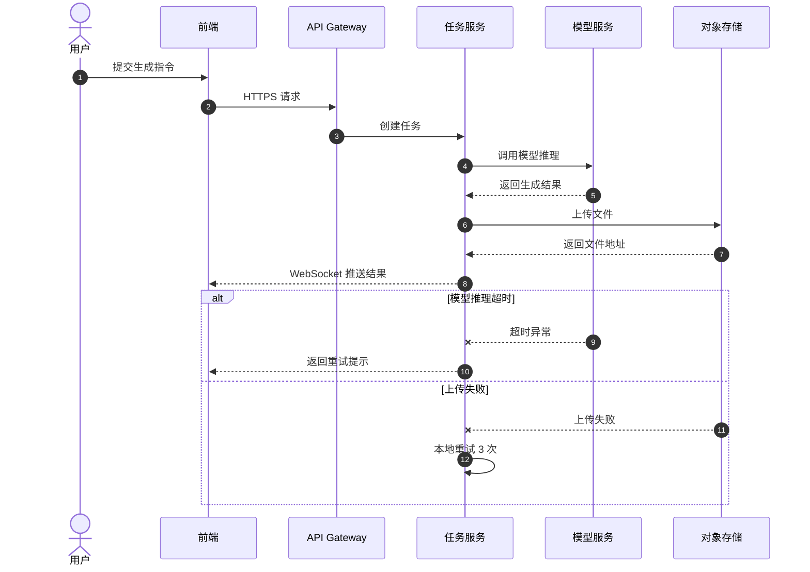
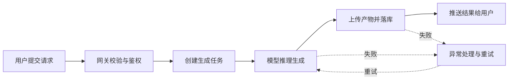

# 核心业务链路图

> 文档职责：定义核心业务链路图在项目分析中的用途、边界和最小输出要求。
> 适用场景：需要讲清一个关键请求如何跨组件流转，尤其涉及同步/异步协作时使用。
> 阅读目标：明确这张图和 C4 静态结构图的职责差异。
> 目标读者：需要把“链路”讲清楚的人。

## 1. 标准定位

- 上位标准：`UML Sequence / Business Flow`
- Mermaid 实现建议：可使用 `sequenceDiagram` 或 `flowchart`
- 与现有 Mermaid 参考的关系：可映射到 `C 运行时行为层`

## 2. 这张图回答什么问题

- 一个关键请求如何跨组件流转
- 谁发起，谁等待，谁异步回调
- 哪些步骤是同步，哪些步骤是异步

不回答：

- 系统内部所有容器的静态全貌
- 数据表之间的关系
- 部署拓扑

## 3. 最小出图要求

- 1 个发起方
- 3-6 个核心参与者
- 1 条完整关键链路
- 必要时包含 1 个异常分支或异步回调

## 4. 参考图 1：UML Sequence

## 5. 参考图 2：Business Flow

## 6. 使用边界

- 这是项目分析中的“关键链路标准图”
- 一张图只讲一条主链路
- 如果重点不在时序，而在结构分层，优先用 C4-L2
