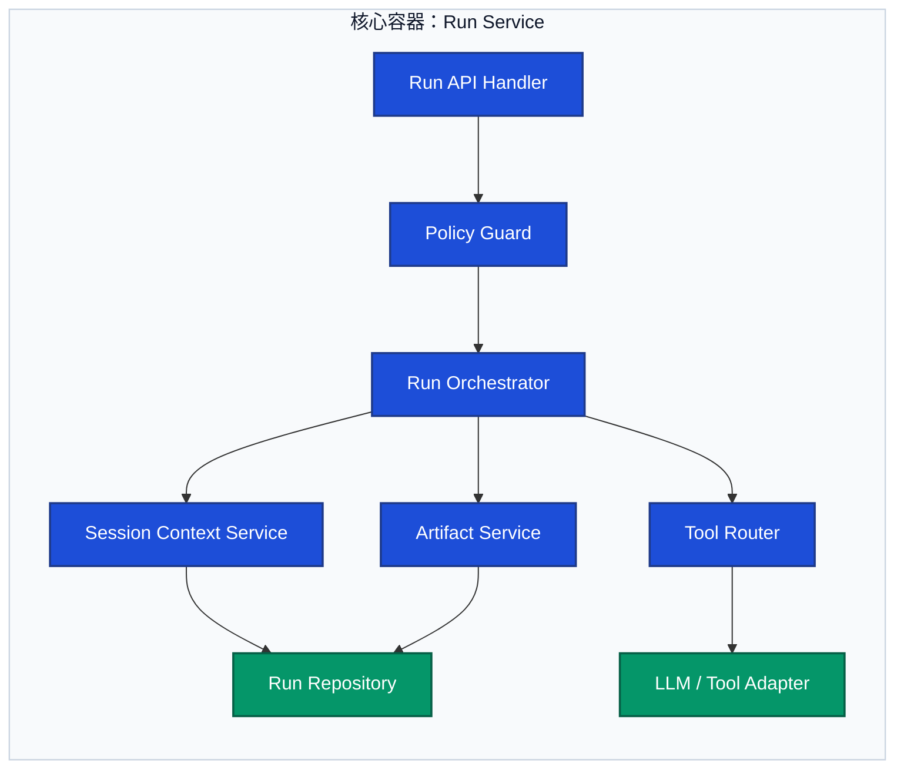

# 核心组件图

> 文档职责：定义核心组件图的用途、边界、最小出图要求和参考图。
> 适用场景：已经确定某个核心容器值得深潜，需要回答“这个容器内部有哪些核心组件”时使用。
> 阅读目标：判断何时使用这张图，并理解它与整体架构图、代码图的边界。
> 目标读者：需要从系统级分析继续深入到服务内部结构的人。

## 1. 标准定位

- 上位标准：`C4 Model Level 3`
- Mermaid 常见写法：`flowchart`

## 2. 这张图回答什么问题

- 某个核心容器内部有哪些组件
- 这些组件之间如何协作
- 哪些组件承担接入、编排、持久化或适配职责

不回答：

- 整个系统所有模块如何分类
- 代码类和接口的细粒度继承结构
- 生产部署拓扑

## 3. 最小出图要求

- 明确一个被分析的核心容器
- 3-7 个核心组件
- 组件之间的主要调用或依赖关系

## 4. 节点表达规则

- 应写：核心容器内部的组件、适配器、领域服务、仓储、编排器等职责单元。
- 不应写：外部系统、数据库字段、目录树、具体类继承结构或运行时步骤。
- 禁止混入：跨系统边界的角色节点、代码级类图细节、部署区域。

## 5. 参考图

## 6. 使用边界

- 单张图应只深潜一个核心容器。
- 如果开始展开类、接口或抽象基类，说明问题已经切换到代码图的范围。
- 对多数首轮项目分析而言，该图通常不属于默认必画图。
