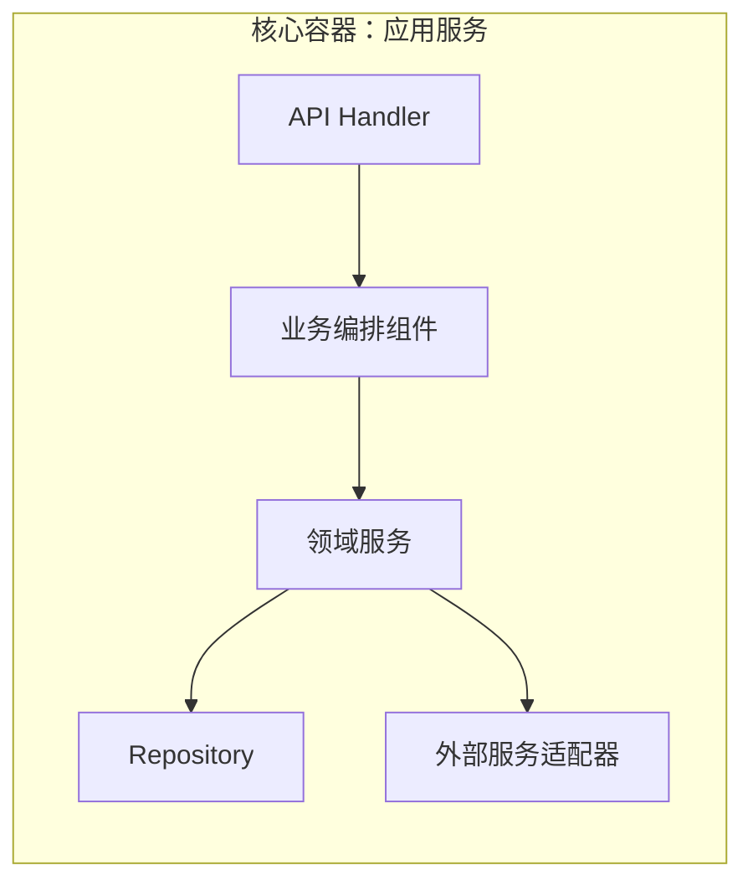

# 核心组件图

> 文档职责：定义 C4 Level 3 在项目分析中的用途、边界和最小输出要求。
> 适用场景：已经确定某个核心容器值得深潜，需要回答“这个容器内部有哪些核心组件”时使用。
> 阅读目标：明确这张图只针对单个核心容器，而不是整个项目。
> 目标读者：需要从系统级分析继续深入到服务内部结构的人。

## 1. 标准定位

- 上位标准：`C4 Model Level 3 (Component Diagram)`
- Mermaid 实现建议：优先使用 `flowchart`
- 与现有 Mermaid 参考的关系：可借用 `A` 或 `B` 的表达方式，但仍以 C4-L3 的问题边界为准

## 2. 这张图回答什么问题

- 某个核心容器内部有哪些组件
- 这些组件之间如何协作
- 哪些组件承担接入、编排、持久化或适配职责

不回答：

- 整个系统所有模块如何分类
- 代码类和接口的细粒度继承结构
- 生产部署拓扑

## 3. 最小出图要求

- 明确一个被分析的核心容器
- 3-7 个核心组件
- 组件之间的主要调用或依赖关系

## 4. 标准示例

## 5. 使用边界

- 一张图只深潜一个核心容器
- 如果你开始画类/接口/抽象基类，说明已经切换到 C4-L4 或类图问题域
- 对大多数首轮项目分析来说，这张图通常不是默认必画
