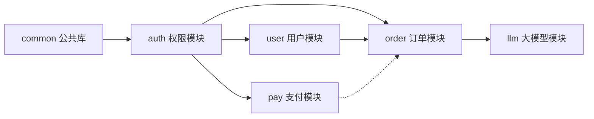

# 模块依赖图

> 文档职责：定义模块依赖图在项目分析中的用途、边界和最小输出要求。
> 适用场景：需要讲清模块依赖方向、公共层边界和潜在循环依赖时使用。
> 阅读目标：区分“目录结构”与“依赖关系”这两个不同问题。
> 目标读者：需要审视代码组织和模块耦合的人。

## 1. 标准定位

- 上位标准：`Module Dependency Diagram`
- Mermaid 实现建议：优先使用 `flowchart`
- 与现有 Mermaid 参考的关系：更接近结构深潜图，不等同于 C4-L3

## 2. 这张图回答什么问题

- 模块之间如何依赖
- 哪些模块是公共层、领域层、适配层
- 是否存在反向依赖或循环依赖风险

不回答：

- 目录树长什么样
- 运行时请求顺序
- 生产环境部署位置

## 3. 最小出图要求

- 4-8 个核心模块
- 明确依赖方向
- 标识 1 个公共基础模块

## 4. 标准示例

## 5. 使用边界

- 这张图只讲依赖，不讲运行顺序
- 如果你需要说明目录分层，应改画目录结构图
- 如果你需要说明某个服务内部组件划分，应改画核心组件图
