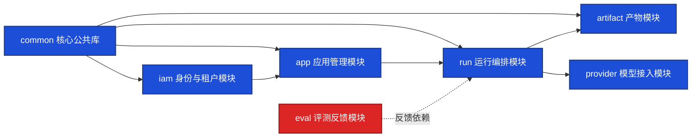

# 模块依赖图

> 文档职责：定义模块依赖图的用途、边界、必要信息要素和参考图。
> 适用场景：需要讲清模块依赖方向、公共层边界和潜在循环依赖时使用。
> 阅读目标：判断何时使用这张图，并理解它与目录结构图、核心组件图的边界。
> 目标读者：需要审视代码组织和模块耦合的人。

## 1. 标准定位

- 上位标准：`Module Dependency Diagram`
- Mermaid 常见写法：`flowchart`

## 2. 这张图回答什么问题

- 模块之间如何依赖
- 哪些模块是公共层、领域层、适配层
- 是否存在反向依赖或循环依赖风险

不回答：

- 目录树长什么样
- 运行时请求顺序
- 生产环境部署位置

## 3. 必要信息要素

- 4-8 个核心模块
- 明确依赖方向
- 标识 1 个公共基础模块

## 4. 节点表达规则

- 应写：模块、包、子系统、公共库及其依赖方向。
- 不应写：目录注释、运行时步骤、数据库实体、接口入口或部署区域。
- 禁止混入：调用顺序、文件树层级、实体关系。

## 5. 参考图

## 6. 使用边界

- 该图用于展示依赖关系，不用于展示运行顺序。
- 如果需要说明目录分层，应改用目录结构图。
- 如果需要说明单个服务的内部组件划分，应改用核心组件图。
