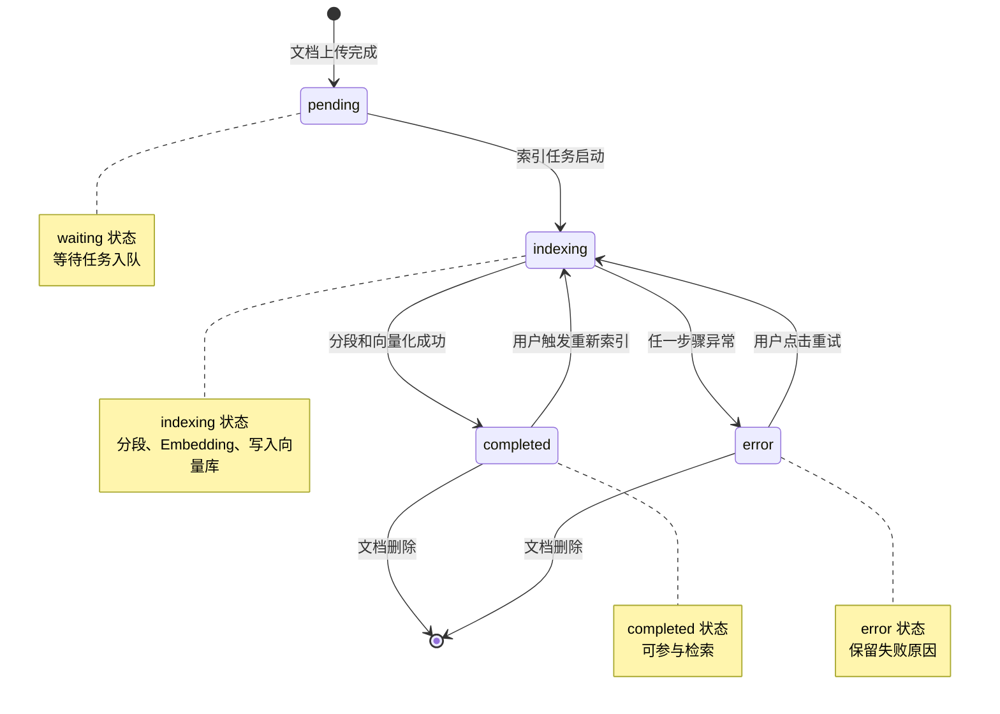

# 状态机图

> 文档职责：定义状态机图在项目分析中的用途、边界和最小输出要求。
> 适用场景：需要说明核心实体或异步任务的状态变化时使用。
> 阅读目标：区分“状态迁移”与“请求时序”的分析重点。
> 目标读者：需要解释流程状态演进和触发条件的人。

## 1. 标准定位

- 上位标准：`UML State Machine`
- Mermaid 实现建议：优先使用 `stateDiagram-v2`
- 与现有 Mermaid 参考的关系：可映射到运行时行为层

## 2. 这张图回答什么问题

- 某个核心对象有哪些状态
- 状态之间如何迁移
- 哪些事件或条件触发迁移

不回答：

- 服务之间的交互顺序
- 系统边界和容器结构
- 数据实体之间的关系

## 3. 最小出图要求

- 1 个明确的起始状态
- 4-8 个关键状态
- 关键迁移动作或触发条件

## 4. 标准示例

## 5. 使用边界

- 这张图讲状态演进，不讲跨服务链路
- 如果重点是“谁调用谁”，应改画核心业务链路图
- 如果重点是数据结构，应改画数据模型图
