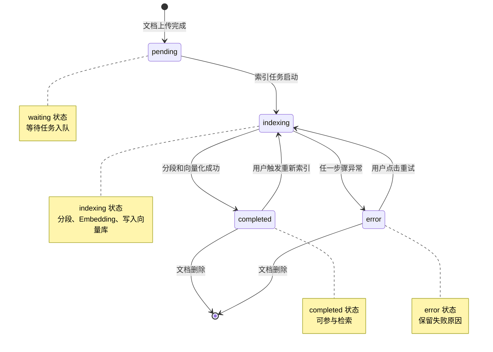

# 状态机图

> 文档职责：定义状态机图的用途、边界、必要信息要素和参考图。
> 适用场景：需要说明核心实体或异步任务的状态变化时使用。
> 阅读目标：判断何时使用这张图，并理解它与核心业务链路图、数据模型图的边界。
> 目标读者：需要解释状态演进和触发条件的人。

## 1. 标准定位

- 上位标准：`UML State Machine`
- Mermaid 常见写法：`stateDiagram-v2`

## 2. 这张图回答什么问题

- 某个核心对象有哪些状态
- 状态之间如何迁移
- 哪些事件或条件触发迁移

不回答：

- 服务之间的交互顺序
- 系统边界和容器结构
- 数据实体之间的关系

## 3. 必要信息要素

- 1 个明确的起始状态
- 4-8 个关键状态
- 关键迁移动作或触发条件

## 4. 节点表达规则

- 应写：状态、迁移事件、触发条件及必要状态注记。
- 不应写：服务组件、接口入口、数据库表结构、系统拓扑或流程阶段分组。
- 禁止混入：参与者消息、实体关系、部署区域。

## 5. 参考图

## 6. 使用边界

- 该图用于展示状态演进，不用于展示跨服务链路。
- 如果重点是参与者之间的调用关系，应改用核心业务链路图。
- 如果重点是数据结构和实体关系，应改用数据模型图。
