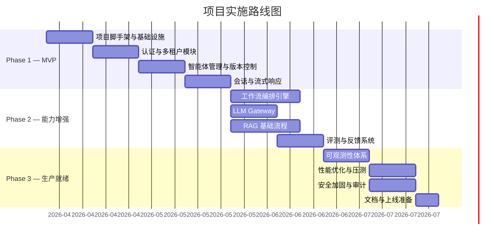

# 甘特图

> 文档职责：定义甘特图的用途、边界、最小出图要求和参考图。
> 适用场景：需要说明项目阶段排期、任务依赖和并行关系时使用。
> 阅读目标：判断何时使用这张图，并理解它与时间线图、整体架构图的边界。
> 目标读者：需要表达排期和交付节奏的人。

## 1. 标准定位

- 上位标准：`Gantt`
- Mermaid 常见写法：`gantt`

## 2. 这张图回答什么问题

- 项目分几个阶段推进
- 每个任务何时开始和结束
- 哪些任务存在前后依赖或并行关系

不回答：

- 系统由哪些模块组成
- 核心链路如何流转
- 部署边界如何划分

## 3. 最小出图要求

- 2-4 个阶段
- 每阶段 2-4 个关键任务
- 至少标出 1 组任务依赖

## 4. 节点表达规则

- 应写：阶段、任务、里程碑、持续时间及依赖关系。
- 不应写：业务实体、系统组件、接口入口、数据字段或部署拓扑。
- 禁止混入：系统结构、运行时链路、实体关系。

## 5. 参考图

## 6. 使用边界

- 该图面向计划安排，不面向系统结构。
- 如果重点是架构或技术认知，不应使用该图。
- 只有在需要表达里程碑和排期时，才补充该图。
