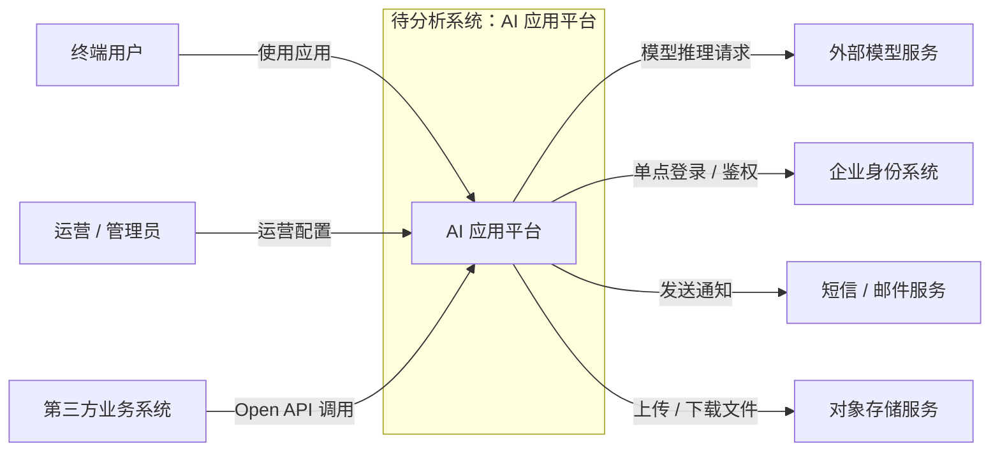

# 系统上下文图

> 文档职责：定义 C4 Level 1 在项目分析中的用途、边界和最小输出要求。
> 适用场景：第一次分析一个项目，需要先回答“系统处在什么环境里、谁与它交互”时使用。
> 阅读目标：明确这张图的标准来源、该画什么、不该画什么，以及最小可用结构。
> 目标读者：需要为项目分析建立统一首图标准的维护者和使用者。

## 1. 标准定位

- 上位标准：`C4 Model Level 1 (System Context Diagram)`
- Mermaid 实现建议：优先使用 `flowchart`
- 与现有 Mermaid 参考的关系：可映射到 `A 系统认知层`，但 `A` 只是渲染实现，不是顶层标准

## 2. 这张图回答什么问题

- 谁在使用这个系统
- 这个系统依赖哪些外部系统
- 系统在更大业务环境里的位置是什么

不回答：

- 系统内部微服务如何拆分
- 核心请求在内部如何流转
- 数据模型如何设计

## 3. 最小出图要求

- 1 个系统边界
- 1-3 类主要使用者
- 1-5 个主要外部系统
- 只保留高层交互关系，不展开内部容器

## 4. 标准示例

## 5. 使用边界

- 这是项目分析的首选起点图
- 如果当前任务只允许出一张图，优先考虑这张
- 一旦开始画系统内部服务，就说明已经切换到 C4-L2 的问题域
