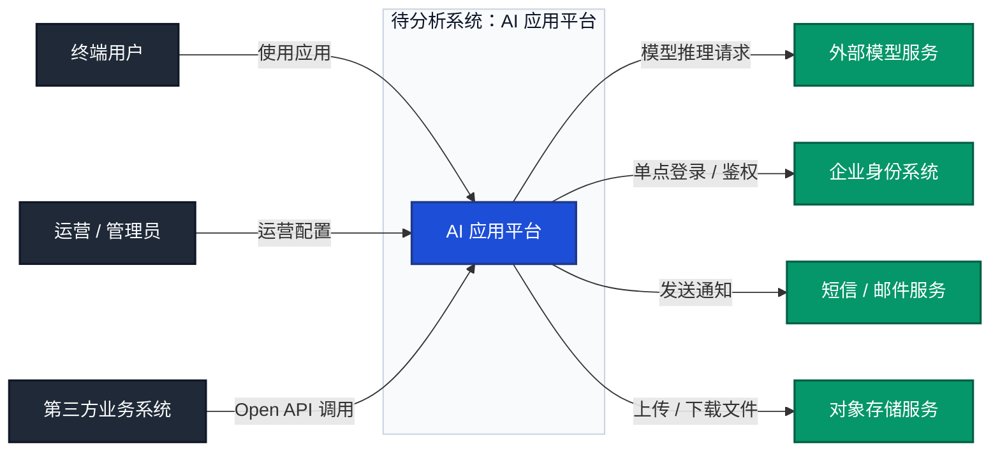

# 系统上下文图

> 文档职责：定义系统上下文图的用途、边界、最小出图要求和参考图。
> 适用场景：第一次分析项目，需要先回答“系统处在什么环境里、谁与它交互”时使用。
> 阅读目标：判断何时使用这张图，并理解它与整体架构图、数据模型图的边界。
> 目标读者：需要建立项目首图标准的人。

## 1. 标准定位

- 上位标准：`C4 Model Level 1`
- Mermaid 常见写法：`flowchart`

## 2. 这张图回答什么问题

- 谁在使用这个系统
- 这个系统依赖哪些外部系统
- 系统在更大业务环境里的位置是什么

不回答：

- 系统内部微服务如何拆分
- 核心请求在内部如何流转
- 数据模型如何设计

## 3. 最小出图要求

- 1 个系统边界
- 1-3 类主要使用者
- 1-5 个主要外部系统
- 只保留高层交互关系，不展开内部容器

## 4. 节点表达规则

- 应写：用户、角色、外部系统、系统主体及高层交互关系。
- 不应写：内部服务、数据库、缓存、代码组件或实现细节。
- 禁止混入：系统内部容器拆分、运行时顺序、数据模型字段。

## 5. 参考图

## 6. 使用边界

- 该图是项目分析的优先起点图。
- 如果当前任务只允许输出一张图，应优先输出该图。
- 如果开始展开系统内部服务和存储，说明问题已经切换到整体架构图的范围。
