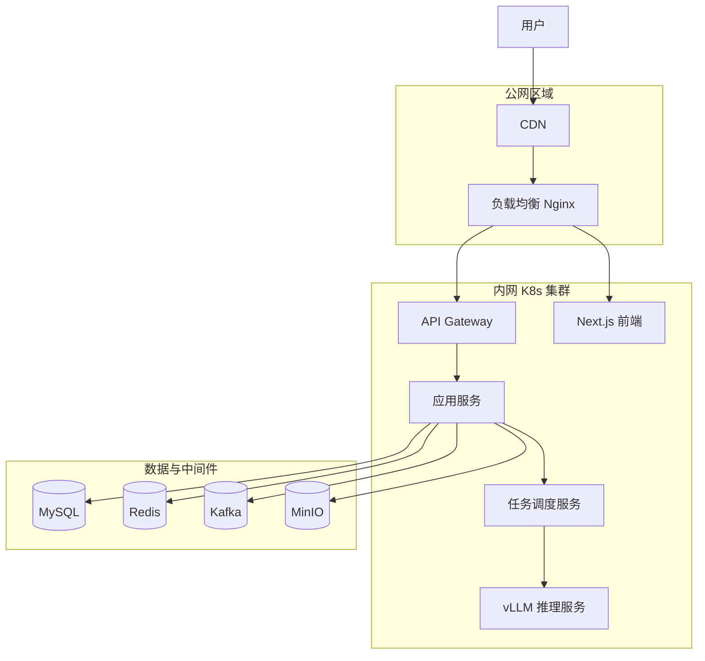

# 部署图

> 文档职责：定义部署视图在项目分析中的用途、边界和最小输出要求。
> 适用场景：需要讲清系统如何在运行环境中部署、网络边界如何划分时使用。
> 阅读目标：区分部署视图和 C4-L2 容器图的边界。
> 目标读者：需要面向生产落地或基础设施分析的人。

## 1. 标准定位

- 上位标准：`C4 Deployment Diagram`
- Mermaid 实现建议：优先使用 `flowchart`
- 与现有 Mermaid 参考的关系：可借用 `A 系统认知层` 的渲染方式

## 2. 这张图回答什么问题

- 系统部署在哪些环境或节点上
- 哪些组件位于公网、内网、集群或中间件区域
- 网络入口和主要部署边界如何划分

不回答：

- 服务内部组件拆分
- 核心链路时序
- 数据模型关系

## 3. 最小出图要求

- 1 个入口区域
- 1 个计算区域
- 1 个数据 / 中间件区域
- 保留主要流量方向

## 4. 标准示例

## 5. 使用边界

- 这张图面向运行环境，不面向代码结构
- 如果当前只需要讲系统内部服务分层，优先画 C4-L2，不必急着画部署视图
- 只有项目确实涉及生产拓扑、网络边界或基础设施方案时，这张图才是高优先级
