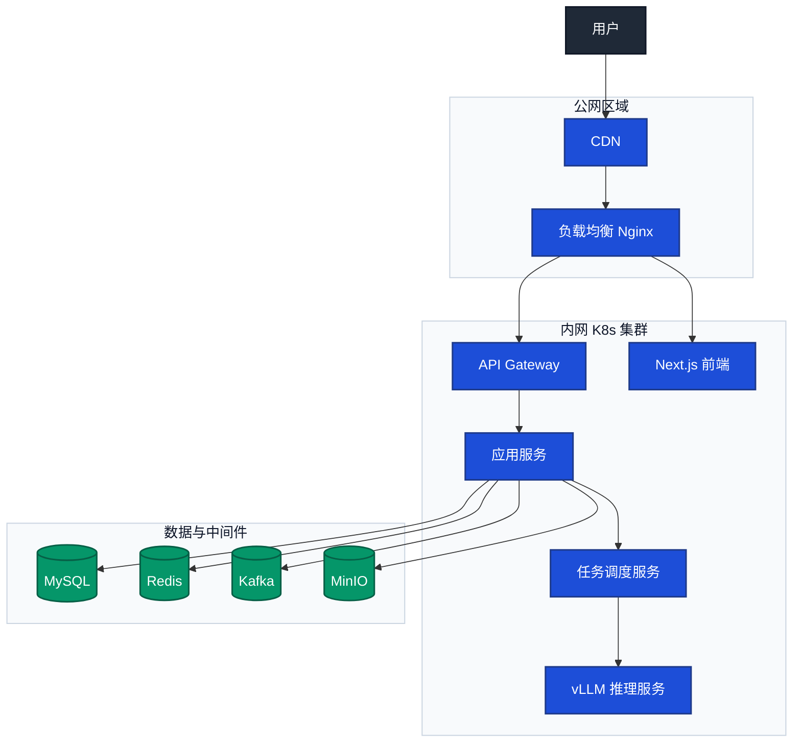

# 部署图

> 文档职责：定义部署图的用途、边界、最小出图要求和参考图。
> 适用场景：需要讲清系统如何在运行环境中部署、网络边界如何划分时使用。
> 阅读目标：判断何时使用这张图，并理解它与整体架构图、核心业务链路图的边界。
> 目标读者：需要做基础设施或生产落地分析的人。

## 1. 标准定位

- 上位标准：`C4 Deployment`
- Mermaid 常见写法：`flowchart`

## 2. 这张图回答什么问题

- 系统部署在哪些环境或节点上
- 哪些组件位于公网、内网、集群或中间件区域
- 网络入口和主要部署边界如何划分

不回答：

- 服务内部组件拆分
- 核心链路时序
- 数据模型关系

## 3. 最小出图要求

- 1 个入口区域
- 1 个计算区域
- 1 个数据 / 中间件区域
- 保留主要流量方向

## 4. 节点表达规则

- 应写：环境区域、计算节点、网关、存储、中间件及网络边界。
- 不应写：业务能力、代码类名、表字段、流程步骤或接口入口。
- 禁止混入：能力分层、类继承、实体关系。

## 5. 参考图

## 6. 使用边界

- 该图面向运行环境，不面向代码结构。
- 如果当前只需要说明系统内部服务分层，应优先使用整体架构图。
- 只有在涉及生产拓扑、网络边界或基础设施方案时，该图才属于高优先级图。
