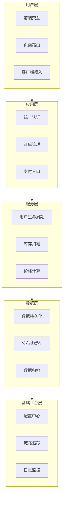

## 分层能力结构图（横向逻辑层）

```mermaid
graph TD
    subgraph 用户层
        U1[前端交互]
        U2[页面路由]
        U3[客户端接入]
    end
    
    subgraph 应用层
        A1[统一认证]
        A2[订单管理]
        A3[支付入口]
    end
    
    subgraph 服务层
        S1[用户生命周期]
        S2[库存扣减]
        S3[价格计算]
    end
    
    subgraph 数据层
        D1[数据持久化]
        D2[分布式缓存]
        D3[数据归档]
    end
    
    subgraph 基础平台层
        P1[配置中心]
        P2[链路追踪]
        P3[日志监控]
    end
    
    用户层 --> 应用层 --> 服务层 --> 数据层 --> 基础平台层
```