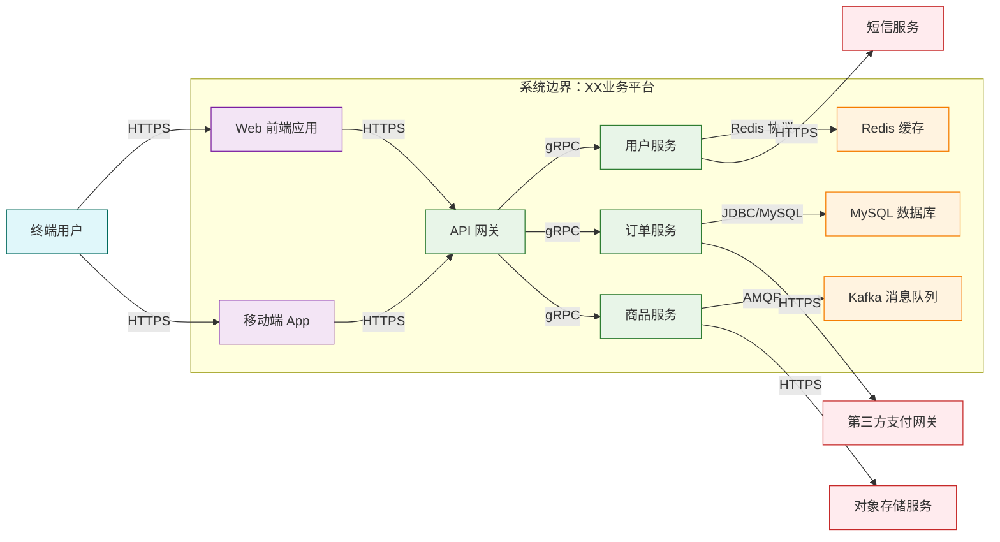
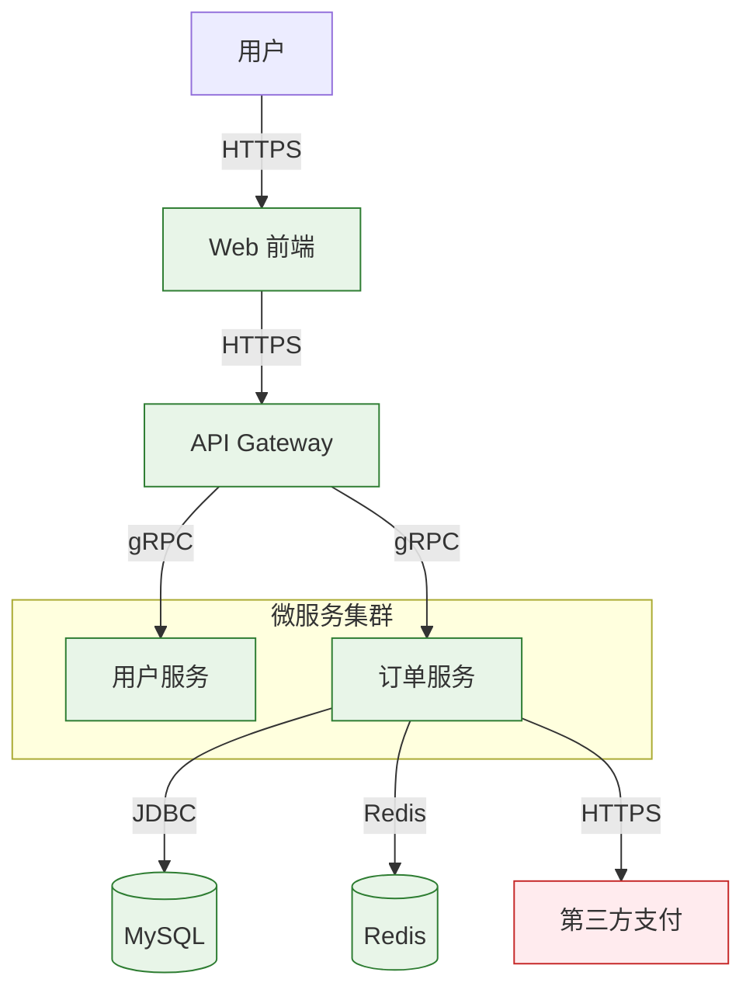

## Mermaid 架构图（C4 Level 2 容器层）
C4 Level 2 聚焦：单个系统内部的容器（服务、应用、数据存储） + 外部交互 + 通信协议

```mermaid
graph LR
    %% 定义样式（贴合C4模型规范）
    classDef actor fill:#e0f7fa,stroke:#00695c,rounded:true
    classDef system fill:#f3e5f5,stroke:#7b1fa2,rounded:true
    classDef coreService fill:#e8f5e8,stroke:#2e7d32,rounded:true
    classDef dataStore fill:#fff3e0,stroke:#f57c00,rounded:true
    classDef external fill:#ffebee,stroke:#c62828,rounded:true

    %% 1. 外部参与者（Actor）
    User[终端用户]:::actor

    %% 2. 系统边界：核心业务系统
    subgraph 核心业务系统 [系统边界：XX业务平台]
        direction TB
        %% 接入层子系统
        WebApp[Web 前端应用]:::system
        MobileApp[移动端 App]:::system
        Gateway[API 网关]:::coreService

        %% 核心微服务子系统
        UserService[用户服务]:::coreService
        OrderService[订单服务]:::coreService
        GoodsService[商品服务]:::coreService

        %% 数据存储子系统
        Redis[Redis 缓存]:::dataStore
        MySQL[MySQL 数据库]:::dataStore
        MQ[Kafka 消息队列]:::dataStore
    end

    %% 3. 外部依赖系统
    PayGateway[第三方支付网关]:::external
    SmsService[短信服务]:::external
    OSS[对象存储服务]:::external

    %% 4. 交互链路 + 协议标注
    User -->|HTTPS| WebApp
    User -->|HTTPS| MobileApp
    WebApp & MobileApp -->|HTTPS| Gateway
    Gateway -->|gRPC| UserService
    Gateway -->|gRPC| OrderService
    Gateway -->|gRPC| GoodsService

    %% 服务内部交互
    UserService -->|Redis 协议| Redis
    OrderService -->|JDBC/MySQL| MySQL
    GoodsService -->|AMQP| MQ

    %% 服务与外部依赖交互
    OrderService -->|HTTPS| PayGateway
    UserService -->|HTTPS| SmsService
    GoodsService -->|HTTPS| OSS
```
##  整体架构图（C4 Level 2）

```mermaid
graph TD
    classDef container fill:#e8f5e8,stroke:#2e7d32
    classDef external fill:#ffebee,stroke:#c62828
    
    User[用户]
    Web[Web 前端]:::container
    Gateway[API Gateway]:::container
    
    subgraph 微服务集群
        UserSvc[用户服务]:::container
        OrderSvc[订单服务]:::container
    end
    
    DB[(MySQL)]:::container
    Redis[(Redis)]:::container
    Pay[第三方支付]:::external
    
    User -->|HTTPS| Web
    Web -->|HTTPS| Gateway
    Gateway -->|gRPC| UserSvc
    Gateway -->|gRPC| OrderSvc
    OrderSvc -->|JDBC| DB
    OrderSvc -->|Redis| Redis
    OrderSvc -->|HTTPS| Pay
```