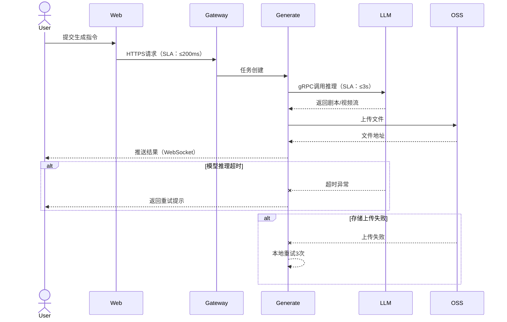

## 核心业务链路图（Key Business Flow Diagram）

```mermaid
sequenceDiagram
    actor User
    participant Web
    participant Gateway
    participant Generate
    participant LLM
    participant OSS

    %% 正常流程
    User->>Web: 提交生成指令
    Web->>Gateway: HTTPS请求（SLA：≤200ms）
    Gateway->>Generate: 任务创建
    Generate->>LLM: gRPC调用推理（SLA：≤3s）
    LLM-->>Generate: 返回剧本/视频流
    Generate->>OSS: 上传文件
    OSS-->>Generate: 文件地址
    Generate-->>User: 推送结果（WebSocket）

    %% 异常分支
    alt 模型推理超时
        LLM--xGenerate: 超时异常
        Generate-->>User: 返回重试提示
    end
    alt 存储上传失败
        OSS--xGenerate: 上传失败
        Generate-->>Generate: 本地重试3次
    end
```