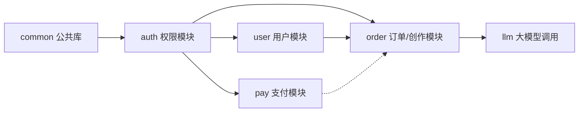

## 2. 模块依赖图（Module Dependency）
比目录树更重要：展示模块间依赖关系、禁止循环依赖

```mermaid
graph LR
    Common[common 公共库]
    Auth[auth 权限模块]
    User[user 用户模块]
    Order[order 订单/创作模块]
    Pay[pay 支付模块]
    LLM[llm 大模型调用]

    Common --> Auth
    Auth --> User & Order & Pay
    User --> Order
    Order --> LLM
    Pay -.-> Order
```