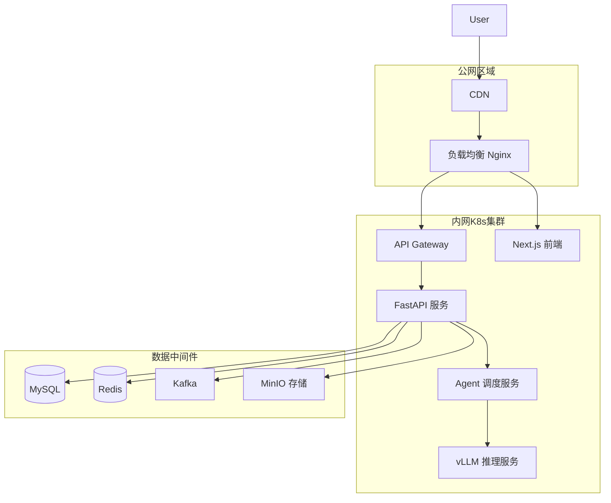

## 部署架构图（Deployment Diagram）C4 Level 3

```mermaid
graph TB
    subgraph 公网区域
        CDN[CDN]
        LB[负载均衡 Nginx]
    end

    subgraph 内网K8s集群
        Gateway[API Gateway]
        Frontend[Next.js 前端]
        Backend[FastAPI 服务]
        Agent[Agent 调度服务]
        LLM[vLLM 推理服务]
    end

    subgraph 数据中间件
        MySQL[(MySQL)]
        Redis[(Redis)]
        Kafka[Kafka]
        MinIO[MinIO 存储]
    end

    User --> CDN --> LB --> Frontend & Gateway
    Gateway --> Backend --> Agent --> LLM
    Backend --> MySQL & Redis & Kafka & MinIO
```