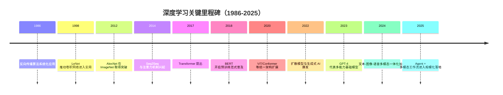

```mermaid
timeline
    title 深度学习关键里程碑（1986-2025）
    1986 : 反向传播算法系统化应用
    1998 : LeNet 推动卷积网络进入实用
    2012 : AlexNet 在 ImageNet 取得突破
    2014 : Seq2Seq 与注意力机制兴起
    2017 : Transformer 提出
    2018 : BERT 开启预训练范式普及
    2020 : ViT/Conformer 等统一架构扩展
    2022 : 扩散模型与生成式 AI 爆发
    2023 : GPT-4 代表多能力基础模型
    2024 : 文本-图像-语音多模态一体化加速
    2025 : Agent + 多模态工作流进入规模化落地
```