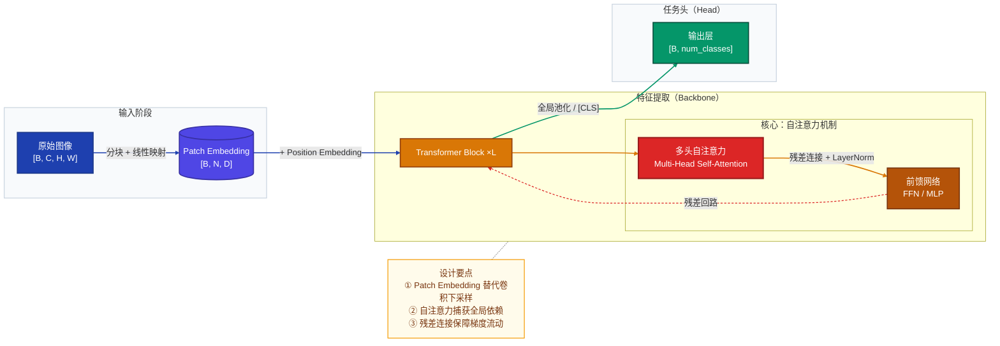

## 模型架构 Mermaid 作图风格参考

> 在模型架构分析中使用 Mermaid 图表时，可参考以下风格规范。
> 这是一份风格参考而非硬性要求，根据图表复杂度灵活取舍。

### 模型架构图示例

> 展示图像输入 → Patch Embedding → Transformer Backbone → 任务头的标准 ViT 分层架构

---

## 最佳实践速查

| 设计原则 | 说明 |
|----------|------|
| **配色与样式定义** | 通过 `classDef` 预定义各类节点的颜色和边框样式，使不同阶段的模块在视觉上易于区分；主流程用饱和深色（白色文字），辅助/注记用低饱和暖色（`#fffbeb`） |
| **分层布局** | 使用 `subgraph` 对节点进行逻辑分组，体现架构的层次关系；外层用 `class SUBGRAPH layerStyle` 统一背景色；数据管道用 `LR`，分层系统用 `TB` |
| **连接线区分** | 通过 `linkStyle` 对不同类型的连接线设置颜色和粗细，区分数据流类型；`-->` 主流程，`==>` 关键路径，`-.->` 残差/可选；关键路径加粗 |
| **`linkStyle` 索引精准计数** | `linkStyle N` 按边的**声明顺序**从 0 开始编号，索引越界会触发渲染崩溃。两条规避守则：① **展开 `&`**：`A & B --> C` 会展开为两条独立边各占一个索引，凡使用 `linkStyle` 的图一律拆成独立行 `A --> C` / `B --> C`；② **注释标注边总数**：在连接线声明结束后、`linkStyle` 之前插入 `%% 边索引：0-N，共 X 条` 注释强制核对，如 `%% 边索引：0-9，共 10 条` |
| **连接线标签说明** | 连接线上使用简明标签描述操作语义（如变换类型、数据形状等） |
| **节点形状语义** | 用形状传递组件类型：`["text"]` 矩形表示计算模块；`[("text")]` 圆柱体表示 Embedding / 存储等节点；形状与颜色双重编码，一眼区分职责 |
| **维度标注** | 在节点标签中标注关键张量维度（如 `[B, N, D]`），帮助理解数据形状变化 |
| **节点换行** | 节点文本内换行须使用 ` ` 标签（如 `["组件名 副标题"]`），`\n` 和 ` ` 在大多数渲染器中无效；首行组件名，` ` 换行后补充职责描述 |
| **辅助NOTE节点注释** | 对核心计算或易混淆的设计要点，可通过 `Note` 节点附加说明；使用 `NOTE -.- 核心子图` 悬浮注记模式，避免干扰主流程 |
| **中英双语** | 节点文本和连接线标签适当使用中英双语（如 `"多头自注意力 Multi-Head Self-Attention"`），兼顾可读性与国际化 |
