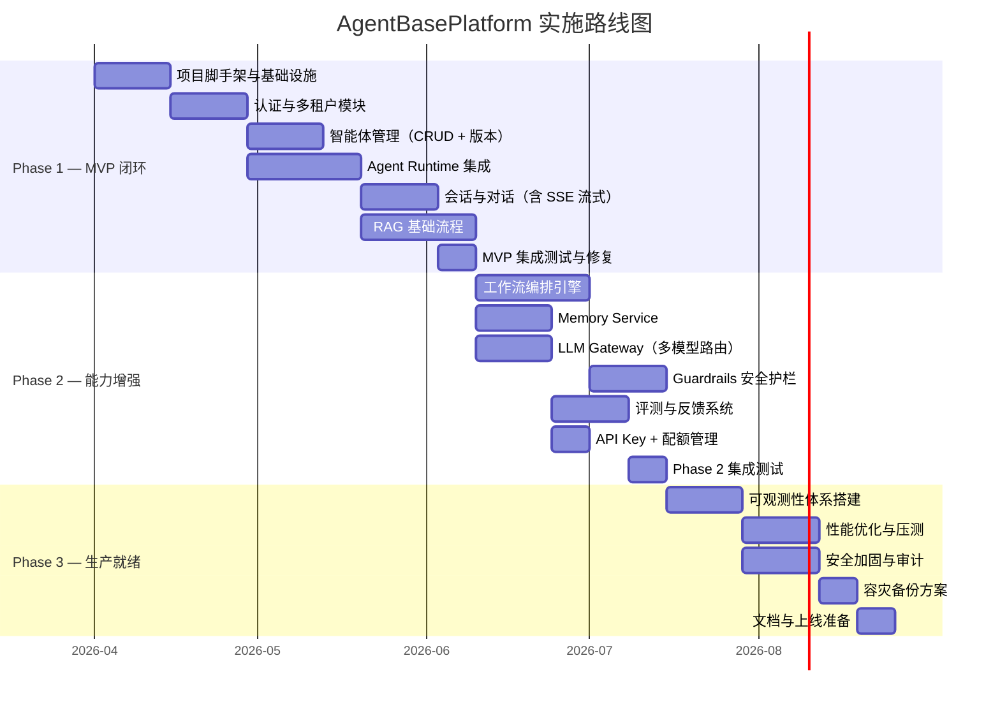

```mermaid
gantt
    title AgentBasePlatform 实施路线图
    dateFormat  YYYY-MM-DD
    axisFormat  %Y-%m

    section Phase 1 — MVP 闭环
    项目脚手架与基础设施          :p1_1, 2026-04-01, 2w
    认证与多租户模块              :p1_2, after p1_1, 2w
    智能体管理（CRUD + 版本）      :p1_3, after p1_2, 2w
    Agent Runtime 集成            :p1_4, after p1_2, 3w
    会话与对话（含 SSE 流式）      :p1_5, after p1_4, 2w
    RAG 基础流程                  :p1_6, after p1_4, 3w
    MVP 集成测试与修复             :p1_7, after p1_5, 1w

    section Phase 2 — 能力增强
    工作流编排引擎                :p2_1, after p1_7, 3w
    Memory Service                :p2_2, after p1_7, 2w
    LLM Gateway（多模型路由）      :p2_3, after p1_7, 2w
    Guardrails 安全护栏           :p2_4, after p2_1, 2w
    评测与反馈系统                :p2_5, after p2_2, 2w
    API Key + 配额管理            :p2_6, after p2_3, 1w
    Phase 2 集成测试              :p2_7, after p2_5, 1w

    section Phase 3 — 生产就绪
    可观测性体系搭建              :p3_1, after p2_7, 2w
    性能优化与压测                :p3_2, after p3_1, 2w
    安全加固与审计                :p3_3, after p3_1, 2w
    容灾备份方案                  :p3_4, after p3_2, 1w
    文档与上线准备                :p3_5, after p3_4, 1w
```