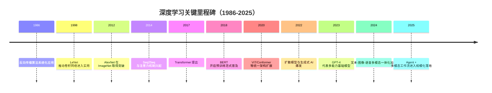
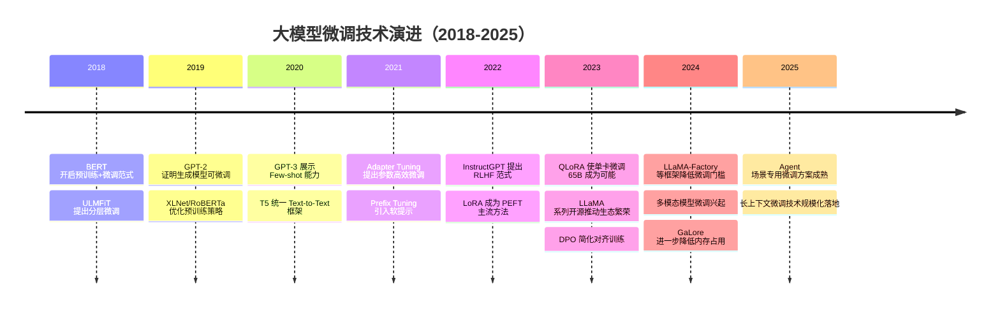

## 深度学习关键里程碑

```mermaid
timeline
    title 深度学习关键里程碑（1986-2025）
    1986 : 反向传播算法系统化应用
    1998 : LeNet 推动卷积网络进入实用
    2012 : AlexNet 在 ImageNet 取得突破
    2014 : Seq2Seq 与注意力机制兴起
    2017 : Transformer 提出
    2018 : BERT 开启预训练范式普及
    2020 : ViT/Conformer 等统一架构扩展
    2022 : 扩散模型与生成式 AI 爆发
    2023 : GPT-4 代表多能力基础模型
    2024 : 文本-图像-语音多模态一体化加速
    2025 : Agent + 多模态工作流进入规模化落地
```

### 微调技术发展时间线

```mermaid
timeline
    title 大模型微调技术演进（2018-2025）
    2018 : BERT 开启预训练+微调范式 : ULMFiT 提出分层微调
    2019 : GPT-2 证明生成模型可微调 : XLNet/RoBERTa 优化预训练策略
    2020 : GPT-3 展示 Few-shot 能力 : T5 统一 Text-to-Text 框架
    2021 : Adapter Tuning 提出参数高效微调 : Prefix Tuning 引入软提示
    2022 : InstructGPT 提出 RLHF 范式 : LoRA 成为 PEFT 主流方法
    2023 : QLoRA 使单卡微调 65B 成为可能 : LLaMA 系列开源推动生态繁荣 : DPO 简化对齐训练
    2024 : LLaMA-Factory 等框架降低微调门槛 : 多模态模型微调兴起 : GaLore 进一步降低内存占用
    2025 : Agent 场景专用微调方案成熟 : 长上下文微调技术规模化落地
```