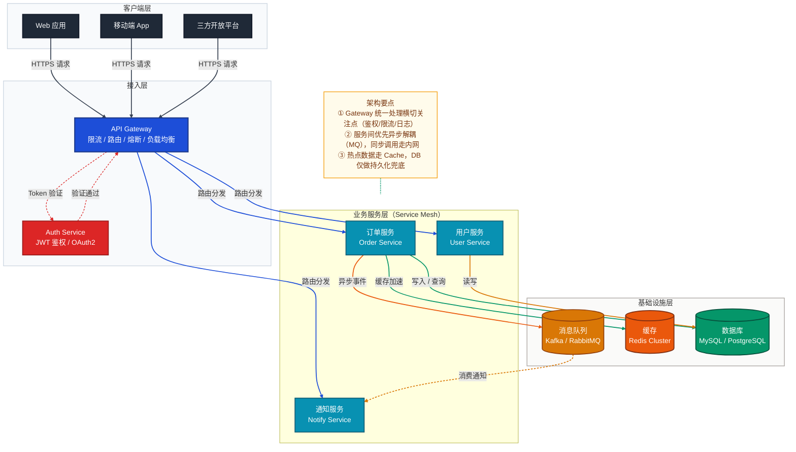
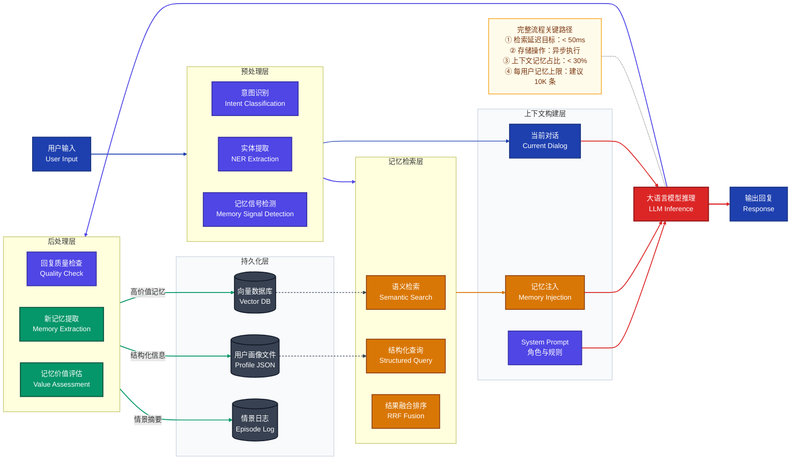
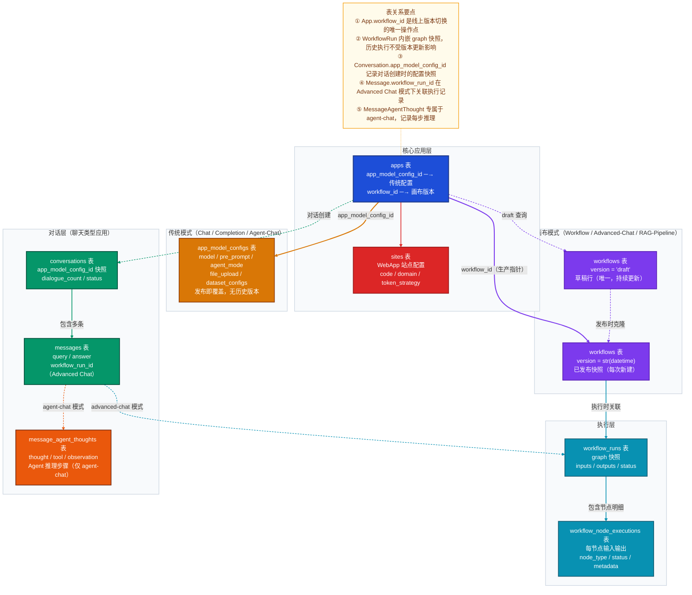

# Mermaid 作图风格完整指南

> 整合三种图表类型的区别说明、完整原图参考、最佳实践速查与提示词模板。

---

## 一、三种图表的区别与选择

### 对比表

三种图表**本质上不同**，各有明确的使用场景，不能互换。

| 维度 | 架构设计图（系统集成） | 端到端流程图（业务流程） | 数据模型关系图（表关系） |
|------|----------------------|----------------------|----------------------|
| **回答的问题** | 系统由哪些组件构成？它们如何部署和连接？ | 一个请求/数据如何在系统中流转？ | 数据如何组织和持久化？表与表之间如何关联？ |
| **视角** | 静态结构视图 | 动态流程视图 | 静态数据视图 |
| **流向** | `TB`（从上到下，强调分层） | `LR`（从左到右，强调时序/步骤） | `TB`（按业务领域分组，强调数据归属） |
| **关注点** | 组件、层级、依赖关系 | 触发源、处理步骤、数据转换、输出 | 表结构、外键引用、逻辑关联边界 |
| **节点代表** | 服务 / 组件 | 处理步骤 | **数据库表**（含核心字段） |
| **箭头代表** | 调用 / 部署关系 | 数据流转顺序 | **外键引用（实线）/ 逻辑关联（虚线）** |
| **类比** | 建筑平面图（房间布局） | 消防演练路线图（人怎么走） | 户型图（房间内部陈设与连通） |

### 架构关系
**架构图是上位**。架构图描述系统骨架，流程图描述骨架上的血脉流动，数据模型图描述骨架内部的存储结构：

```
架构图（全局结构）
    └── 端到端流程图（具体某个业务穿越架构的路径）
    └── 端到端流程图（另一个业务流程）
    └── 数据模型关系图（某个业务域的数据持久化结构）
    └── ...
```

### 组合使用

做完整项目分析时，三图配合使用，逐层深入：

```
第一步：架构图  →  建立系统全局认知（组件构成、层级职责、技术选型）
    ↓
第二步：流程图  →  深入关键业务路径（数据如何在架构中流转）
    ↓
第三步：数据模型图  →  理解数据存储边界（表结构、外键约束、版本快照设计）
```

**一个系统对应一张架构图，但可以有多张业务流程图和多张数据模型关系图**（按业务域拆分，如用户域、订单域、工作流域等各自独立梳理）。

---

## 二、架构设计图（系统集成）

### 2.1 适用场景

用于回答：这个项目有哪些服务？各层职责是什么？数据存在哪？如何部署？

首次接触一个项目需要理解系统整体构成时，或进行架构设计/评审时使用。

### 2.2 完整参考原图

> 展示客户端 → API 网关 → 服务网格 → 数据层的标准分层微服务架构



---

## 三、端到端流程图（业务流程梳理）

### 3.1 适用场景

用于回答：一个用户操作从发起到完成，经过了哪些步骤？数据如何被加工和传递？

梳理核心业务功能的完整处理链路、排查请求路径的性能瓶颈、向新成员讲解业务流程时使用。

### 3.2 完整参考原图

> 展示用户输入 → 预处理 → 记忆检索 → 上下文构建 → LLM 推理 → 后处理 → 持久化的完整 AI 对话记忆流程



---

## 四、数据模型关系图（表关系）

### 4.1 适用场景

用于回答：这个业务域有哪些数据库表？表与表之间是外键强约束还是逻辑关联？哪些字段是跨表的关键指针？

理解核心业务的数据持久化结构、分析版本快照设计、梳理多租户/多模式数据隔离边界时使用。

**与 ER 图的区别**：ER 图强调字段类型和规范化，数据模型关系图强调**业务语义和跨表关系的设计意图**，适合团队沟通而非数据库文档。

### 4.2 完整参考原图

> 展示 Dify 应用管理域：核心应用层 → 传统模式 / 画布模式 → 执行层 → 对话层的完整表关系



---

## 五、最佳实践速查

| 设计原则 | 说明 |
|----------|------|
| **配色与样式定义** | 通过 `classDef` 预定义各阶段节点的颜色和边框样式，按业务职责区分：输入/输出用深蓝（`#1e40af`），处理/路由用靛蓝（`#4f46e5`），检索用琥珀（`#d97706`），核心推理用红色（`#dc2626`），存储写入用绿色（`#059669`），数据库用深灰（`#374151`）；注记节点用低饱和暖色（`#fffbeb`） |
| **流程方向选择** | 线性主流程用 `LR`（从左到右），强调分层纵向关系时用 `TB`；子图内使用 `direction LR` 保持内部水平排列，增强可读性 |
| **分层 subgraph** | 使用 `subgraph` 将同阶段节点归组，体现流程的阶段划分；每个子图对应一个处理职责（如预处理、检索、推理等）；`class SubgraphName layerStyle` 统一背景色区分层级 |
| **起止节点突出** | 流程的起始节点（用户输入）和终止节点（输出回复）使用最高对比度颜色（`#1e40af`深蓝），与中间处理节点形成视觉区分，一眼识别流程边界 |
| **连接线区分** | `-->` 表示主流程同步调用 / 外键强约束引用；`-.->` 表示异步调用、可选路径或逻辑关联（运行时关系，无 FK 约束）；`==>` 表示关键/强制路径；连接线标签简明描述数据内容或操作语义（如 `"高价值记忆"`、`"workflow_id（生产指针）"`） |
| **`linkStyle` 索引精准计数** | `linkStyle N` 按边的**声明顺序**从 0 开始编号，索引越界会触发渲染崩溃。两条规避守则：① **展开 `&`**：`A & B --> C` 会展开为多条独立边，凡使用 `linkStyle` 的图一律拆成独立行 `A --> C` / `B --> C`；② **注释标注边总数**：在连接线声明结束后、`linkStyle` 之前插入 `%% 边索引：0-N，共 X 条` 注释强制核对 |
| **节点形状语义** | `["text"]` 矩形表示处理节点/服务/数据库表；`[("text")]` 圆柱体表示持久化存储（DB、向量库、文件等）；形状与颜色双重编码，直观区分计算与存储职责 |
| **节点换行** | 节点文本内换行须使用 `<br>` 标签（如 `["组件名<br>副标题"]`）；首行写中文业务名，`<br>` 后补英文技术名或核心字段，兼顾业务可读性与技术精确性 |
| **辅助 NOTE 注记** | 对关键路径的性能指标、约束条件或设计决策，通过 `NOTE` 节点附加说明；使用 `NOTE -.- 核心节点` 悬浮注记模式，与主流程连接线视觉隔离；数据模型关系图中用 `①②③④⑤` 序号逐条说明跨表关系的设计意图 |
| **中英双语** | 节点文本和连接线标签适当中英双语（如 `"语义检索<br>Semantic Search"`），兼顾业务可读性与技术国际化 |
| **表关系图专用：节点内容** | 数据模型图的节点首行写**表名**，`<br>` 后列出 2-4 个**核心字段或外键字段**，末行可附加一句关键业务约束说明（如 `"发布即覆盖，无历史版本"`） |
| **表关系图专用：subgraph 分组** | 按**业务领域**（而非处理阶段）分组：将同一领域的表归入同一 subgraph（如核心层、执行层、对话层）；同一 subgraph 内关系密切的表用 `direction LR` 横排，跨 subgraph 用纵向主流向 `TB` |
| **表关系图专用：箭头颜色含义** | 用 `linkStyle` 为不同业务线的关联边着色：同一业务主线用同一颜色（如工作流相关边统一用紫色 `#7c3aed`，对话相关边用绿色 `#059669`），颜色区分帮助读者快速跟踪某条业务线的完整关系链 |

---
